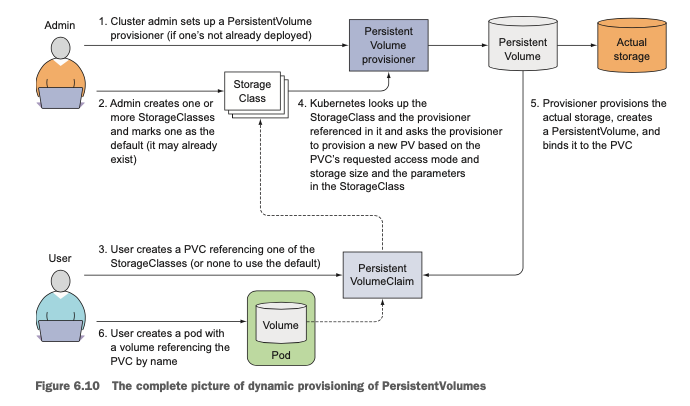
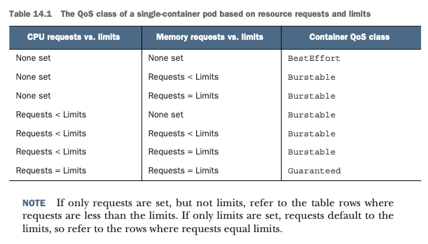
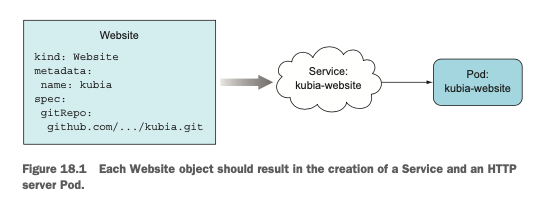

# Kubernetes In Action

### Installation
___

Install minikube, as described here [install guide](https://minikube.sigs.k8s.io/docs/start) and use Docker as the driver as shown in this [driver guide](https://minikube.sigs.k8s.io/docs/drivers).

Alternatively, you can refer to this [github_issue](https://github.com/kubernetes/minikube/issues/9070#issuecomment-679314271).

Modify permissions on the downloaded file and move it to `/usr/local/bin` and start the cluster.

Docker build an image using multistage builds

Running the application using kubectl run, and deploying the app

> `kubectl run mydeployment --image=onebsv/rustui:v1 --port=8080`

This creates a replication controller which runs the application inside a pod. The pod runs the container, and exposes an IP address and the application on the specified port.

#### Introducing pods
___
The pod is one or more tightly related containers which will always run together on the same node.
The pod is a separate logical machine with its own ip address, hostname, processes and so on
The app can be a single process running inside a single container or it can be multiple processes each running inside their own respective containers
All containers within a pod will appear to be running on the same logical machine whereas containers in other pods, even if they are on the same node will appear to be on different machines.


#### Listing pods
___
`kubectl get pods` gives you a list of pods that are running in the system
The replication controller created a pod which was scheduled to run on a worker node by the scheduler.

`kubectl describe pods` can be used to display more details about the same

#### Understanding pods
___
- Kubernetes achieves this by configuring Docker to have all containers of a pod share the same set of Linux namespaces instead of each container having its own set.
- Because all containers of a pod run under the same Network and UTS namespaces (we’re talking about Linux namespaces here), they all share the same hostname and network interfaces. Similarly, all containers of a pod run under the same IPC namespace and can communicate through IPC.
- In the latest Kubernetes and Docker versions, they can also share the same PID namespace, but that feature isn’t enabled by default.
same Network namespace, they share the same IP address and port space. This means processes run- ning in containers of the same pod need to take care not to bind to the same port number
- So, they only share network, uts and IPC namespaces but not PID namespaces
The filesystem of each container is fully isolated from other containers, its possible to have them share directories using a concept called ‘Volume’


#### Port Forwarding
___
- The api server can forward a port on any pod, to the current machine using the port-forward command

> `kubectl port-forward <container> 8888:8080`


#### Labelling pods
___
Can be attached to any resource created by Kubernetes, and can be used by filters such as ‘label selectors’ which can be used to select pods.

> `kubectl get po --show-labels`

> `kubectl get po -L creation_method,env (listing pods with the labels enabled)`

> `kubectl label po <container> creation_method=manual (adding labels) `

> `kubectl label po <container> creation_method=auto --overwrite (modifying labels)`

> `kubectl get po -l env (using a label selector)`

> `kubectl get po -l '!env' (selecting pods that don’t have the ‘env’ label)`


#### Pod Scheduling using Node labels
___
Nodes can be labelled with certain details so that pods can be scheduled on them
In the pod spec a ‘nodeSelector’ field can be used to deploy the pod only on nodes containing the label or a specified combination of labels.

Annotating pods
___
Pods can contain metadata other than labels called annotations.
Annotations can be added at creation time under metadata.annotations
They can be added or modified at a later time as well using the annotate command

> `kubectl annotate pod kubia-manual mycompany.com/someannotation="foo bar"`

#### Namespacing
___
- This is done in order to separate resources into non-overlapping groups, which means that clones of different architectures for different environments such as develop, QA, prod

Discovering pods in given namespaces

> `kubectl get po --namespace kube-system`

Creating a namespace

> `kubectl create namespace custom-namespace`

- Managing objects in other namespaces can be done by adding -n or --namespace to a command, otherwise kubectl operates on the default namespace
- Network isolation between namespaces depends on the networking solution that is deployed. If the solution does not provide inter-namespace isolation pods can communicate between namespaces


#### Deleting Pods
___

> `kubectl delete po -l creation_method=manual (delete pods by label selectors)`

> `kubectl delete ns custom-namespace (delete all pods in a namespace)`

> `kubectl delete po --all (delete all pods)`


Note that deleting pods can cause them to respawn, unless the pod management layer (deployment, repl controller) is removed.
`kubectl delete all --all` (deletes all resources in the current namespace) (secrets and certain resources won’t be deleted and need to be explicitly deleted)


#### Replication Controllers / Deploying Managed Pods
___
Kubernetes monitors the containers automatically and then restarts them, when they are managed by a replication controller / deployment or some other management resource
Keeping pods healthy is another responsibility, If the container’s main process crashes, the Kubelet will restart the container. If your application has a bug that causes it to crash every once in a while, Kubernetes will restart it automatically
The application health must be monitored from outside in case it falls into a deadlock or infinite loop and does not depend on the app to do it internally.
Can check if a container is still alive using liveness probes, we can specify a liveness probe for each container in the pod spec. There is another concept called readiness probes


#### Kubernetes Probing Mechanisms
___
* Types of Probes
  * HTTP GET probe: (2xx and 3xx) are success probes
  * TCP Socket probe: try to establish tcp connection -> success if est.
  * Exec probe: arbit command & check status code, if zero, success

Obtain logs of the previous container that crashed:

> `kubectl logs mypod --previous`

#### Properties of a liveness probe
___
- Beside the liveness probe options you specified explicitly, you can also see additional properties, such as delay, timeout, period, and so on. The delay=0s part shows that the probing begins immediately after the container is started. The timeout is set to only 1 second, so the container must return a response in 1 second or the probe is counted as failed. 
- The container is probed every 10 seconds (period=10s) and the container is restarted after the probe fails three consecutive times (#failure=3). to set the initial delay, add the initialDelaySeconds property to the live- ness probe as shown in the following listing
a better liveness check, you’d configure the probe to perform requests on a specific URL path (`/health`, for example) and have the app perform an internal status check of all the vital components running inside the app to ensure none of them has died or is unresponsive. `( this health endpoint should not require auth, otherwise the liveness probe will always fail)`
- The probes should not take up excess computational resource and should not take a long time to exec, since they are executed often
- Do not implement retry loops in your probes, even if the failure threshold is set to 1, k8s will retry the probe several times
- Don’t implement exec probes while running a jvm container, `(it spins up a whole new jvm)`
- Kubelet restarts the container if liveness probes fail, if the node itself crashes, then the control plane must spawn the pods on a different node

## POD MANAGEMENT

#### Replication Controller
___
The replication controller constantly monitors the running pods and makes sure that the actual number of pods of a type matches the desired number, always.
A ReplicationController has three essential parts:
 - A label selector, which determines what pods are in the ReplicationController’s scope  A replica count, which specifies the desired number of pods that should be running  A pod template, which is used when creating new pod replicas
 - It makes sure a pod (or multiple pod replicas) is always running by starting a new pod when an existing one goes missing.
 - When a cluster node fails, it creates replacement replicas for all the pods that were running on the failed node (those that were under the Replication- Controller’s control).
 - It enables easy horizontal scaling of pods both manual and automatic (see horizontal pod auto-scaling in chapter 15).
Note: pod instance is never relocated to another node. Instead, the ReplicationController creates a completely new pod instance that has no relation to the instance it’s replacing.

`kubectl get rc` -> gives you info. About the replication controller

`kubectl describe rc <rc-name>` -> verbose info about replication controller


#### Understanding the replication controller
___
- The replication controller depends on the master api server to detect the number of pods present in the system. When a pod is deleted, a notification is sent to the API server and it checks the number of pods in the system and replenishes them.
- This is a level triggered system
- Node failure: The controller checks for node failure and if it can’t reach it for a few minutes, then it marks the status as ‘Not Ready’ and the pod status as ‘Unknown’ and reschedules a new pod on a different node. When the node comes back online, it’s status is marked as ‘Ready’ and the pod whose status was ‘Unknown’ is deleted.
- Moving pods in and out of scope of a replication controller: An RC manages pods that match its label, if the pod’s label is changed, it can be added or removed from the scope of its RC. The pod references the RC it belongs to under the ‘metadata.ownerReferences’ field.
- The RC does not care if you add additional labels to the pod, as long as you don’t change the label that matches the pod. If you change the label that is used by the labelSelector of the RC to identify the pod, then that pod will run independently while the RC spins up a new pod.
- Changing the labelSelector of the RC: It creates a complete set of new pods, and all the old pods fall out of scope of the RC.
- Changing the pod template: If you change the pod template while the RC is operating, you need to delete all the existing pods that it manages so that it can create new ones with the new template. The RC does not automatically delete all the old pods that are using the old template.
- Horizontally scaling pods: Scaling the RC can be done by changing the num. Of replicas in the RC resource yaml.


> `kubectl scale rc <name> --replicas=n` -> can move the number up/down

> `kubectl edit rc <name>` -> change the replicas number to n

- Scaling down: can use the kubectl scale command or the kubectl edit command
- Deleting the RC: using the kubectl delete command, the pods are also deleted. However, it is possible to delete just the RC without affecting the pods running.
- When deleting a ReplicationController with kubectl delete, you can keep its pods running by passing the --cascade=false option to the command. Try that now

> `$ kubectl delete rc kubia --cascade=false`

- ReplicaSets can be used to replace RCs, this is designed to replace the RC entirely.


#### Replica Sets (always use ReplicaSet in preference to a ReplicationController)
___
- ReplicaSet’s selector also allows matching pods that lack a certain label or pods that include a certain label key, regardless of its value.
- A single ReplicationController can’t match pods with the label env=production and those with the label env=devel at the same time. It can only match either pods with the env=production label or pods with the env=devel label. But a sin- gle ReplicaSet can match both sets of pods and treat them as a single group.
- The replica set has a matchLabels selector which is much like an RCs labelSelector and it is not part of the v1 API, its part of v1beta2 so the version needs to be specified in the resource yaml correctly.
- Creating a replica set: The replica set can be created using the kubectl create command. Then the kubectl get rs and kubectl describe rs can be used to list out the replica set.
- You can add additional expressions to the selector. As in the example, each expression must contain a key, an operator, and possibly (depending on the operator) a list of values. You’ll see four valid operators:
 In -> Label’s value must match one of the specified values.
 NotIn -> Label’s value must not match any of the specified values.
 Exists -> Pod must include a label with the specified key (the value isn’t import-
ant). When using this operator, you shouldn’t specify the values field.
 DoesNotExist -> Pod must not include a label with the specified key. The values
property must not be specified.
- If you specify multiple expressions, all those expressions must evaluate to true for the selector to match a pod. If you specify both matchLabels and matchExpressions, all the labels must match and all the expressions must evaluate to true for the pod to match the selector.
- Deleting replica set: `kubectl delete rs <name>`


#### Daemon Set
___
- RCs and ReplicaSets are used for running a specified number of pods on a cluster, however daemon sets are used to run one instance of a certain type of pod on every node.
- DaemonSet doesn’t recreate a pod on another node if the node goes down. It doesn’t have a notion of replica count, because exactly one replica runs on each node.
- Unless the pods should run on a subset of nodes, the DaemonSet runs a pod on each node of the cluster. A subset of the nodes can be specified by a nodeSelector property 
- When a node is marked ‘NotReady’, a DaemonSet will deploy pods to such nodes, because the unschedulable attribute is only used by the Scheduler, whereas pods managed by a DaemonSet bypass the Scheduler completely. This is usually desirable, because DaemonSets are meant to run system services, which usually need to run even on unschedulable nodes.
- Example: The cluster administrators have added the disk=ssd label to all such nodes, so you’ll create the DaemonSet with a node selector that only selects nodes with that label.
- Create one with the `kubectl create -f <daemonset.yaml>`; kubectl get IDs to list all daemon sets. 
- If you change the label of the node to something that is not in the nodeSelector of the pod template in the DaemonSet, then it terminates the pod that is running on it.


#### Jobs
___
- Jobs run pods that perform completable tasks, and not restart containers when the task is completed.
- The pods on a node that are managed by a Job will be rescheduled to other nodes the way ReplicaSet pods are, and if the process fails, the job can be configured to restart the container or not controlled by ‘restartPolicy’. You can set this to ‘OnFailure’ or ‘Never’.
`kubectl get jobs` (the pod starts up immediately)
`kubectl logs <batch-job-name>` (examine its logs when the pod isn’t deleted)
`kubectl get jobs` (lists all the jobs running)
‘completions’ can be used to run a job sequentially n times
‘parallelism’ can be used to run multiple pods in parallel, a job can ensure upto x pods run in parallel
- If both parameters are set, it will ensure that n pods complete successfully with x running in parallel
You can even change a Job’s parallelism property while the Job is running. This is similar to scaling a ReplicaSet or ReplicationController, and can be done with the kubectl scale command:
`kubectl scale job multi-completion-batch-job --replicas 3`


#### CronJobs 
___
- CronJobs are a kind of Job resource that can be scheduled to run periodically
The cron schedule format consists of `MINUTE HOUR DAY_OF_MONTH MONTH DAY_OF_WEEK (sunday (0) to sat(7))`
In the example, you want to run the job every 15 minutes, so the schedule needs to be "0,15,30,45****", which means at the 0, 15, 30 and 45 minutes mark of every hour (first asterisk), of every day of the month (second asterisk), of every month (third asterisk) and on every day of the week (fourth asterisk). This can also be written as `*/15 * * * *`
If, instead, you wanted it to run every 30 minutes, but only on the first day of the month, you’d set the schedule to"0,30*1**", and if you want it to run at 3AM every Sunday, you’d set it to `0 3 * * 0` (the last zero stands for Sunday). Also, `*/30 * 1 * *`
- You can specify a deadline for pod creation at the time of execution of a CronJob using the ‘startingDeadlineSeconds’ param. This would indicate the job as failed if the pod didn’t start within the specified no. of seconds


#### Services
___
- A resource which allows you to make a single constant point of entry to a set of pods which may be serving a frontend service. The service has an IP:port which is held constant, and the service doesn’t need to know the location of individual pods, allowing them to be moved around the cluster.
- Say a service is composed of a bunch of frontend and backend pods, access to each set of them can be exposed using a service.
A service can be tied to a set of pods using a ‘selector’; A replication controller / ReplicaSet uses labelSelector/matchSelector, first create an RC and then create a service which contains a selector which is the same as the labelSelector/matchSelector in the RC/RS. Use `kubectl create -f <service-yaml>` to post the resource to the api server.
- There are two ports in the service, a container port (8080) that the service will forward to and the port that the service is exposed on (80).
Kubectl get svc (lists all services in the specified namespace)


#### Using kubectl exec to test the service
___
- Can exec a curl command using kubectl exec by running it on one of the pods and running a curl command to the service IP address.

`$ kubectl exec kubia-7nog1 -- curl -s http://10.111.249.153` 

(double dash signifies end of options for kubectl and the following is a command string to be executed in a pod, however it is not necessary)

- The kubernetes service proxy gets the request generated from curl and forwards it to a random pod. The pod sends a response which is printed to stdout and is again intercepted by the service ip, which then forwards it back to the client.
- Session affinity: In case you want the same client to pick the same pod each time in order to maintain a session, then set the ‘sessionAffinity’ property in the service to ‘ClientIP’ instead of the default ‘None’. This will emulate sticky sessions, but it doesn’t have ‘http cookie based’ sticky sessions because kubernetes doesn’t operate at the http level, services interact only at L4 and don't care about the payload that is carried.
- A service can be used to expose multiple ports, for example http & https, however the ‘selector’ applies to the whole service, so all the replicas must expose the same target port (8443) for a service which exposes https (443).
- Named ports: Give a name to each pod’s port and refer to it by name in the service spec
- Discovering services: Kubernetes exposes a set of env variables pointing to the Service host IP and service port inside the pods. You can observe this by doing a `kubectl exec <pod> env`. NOTE: only the pods which are created AFTER the service has been created will see these env variables, you will need to do a `kubectl delete po --all` to recreate all pods after creating a service.
- Turning back to the frontend-backend example we started this chapter with, when you have a frontend pod that requires the use of a backend database server pod, you can expose the backend pod through a service called backend-database and then have the frontend pod look up its IP address and port through the environment variables `BACKEND_DATABASE_SERVICE_HOST` and `BACKEND_DATABASE_SERVICE_PORT`.


#### Discovering Services through DNS
___
- When listing the pods in the kube-system namespace, one of them was called kube-dns. The pod runs a dns server which all other pods in the namespace are configured to use. (Kubernetes automatically configures this by modifying each container’s resolv.conf)
- Each service gets a DNS entry in the internal DNS server and client pods that know the name of the service can access it through its FQDN. It is possible to configure if the pod uses the kube-dns server or another external server using the ‘dnsPolicy’ property in each pod spec.

FQDN: `backend-database.default.svc.cluster.local`

backend-database corresponds to the service name, default stands for the namespace the service is defined in, and `svc.cluster.local` is a configurable cluster domain suffix
- Connecting to a service is simple, omit the svc.cluster.local and when the frontend pod is in the same namespace as the database pod, you can refer to the service as ‘backend-database’, omitting all other parts of the FQDN
- Kubectl exec can be used to run a shell inside a pod container `kubectl exec -it kubia-3inly bash`. You can hit the service by using the service name, or the `service_name.namespace.svc.cluster.local` (`svc.cluster.local` is a configurable domain suffix), or using service_name.namespace or just using the service_name. Ex: `# curl http://kubia.default or # curl http://kubia` or `# curl http://kubia.default.svc.cluster.local`
- Understanding why you can’t ping a service: That’s because the service’s cluster IP is a virtual IP, and only has meaning when combined with the service port.

#### Connecting to services outside the cluster
___
- An Endpoints resource is a list of ip addresses and ports that the cluster would like to expose to the outside world.
The service’s endpoints decoupled from the service allows them to be configured and updated manually. 
- A service and an endpoint resource need to be created. The service is first created without a selector and the  Endpoints object needs to have a metadata -> name similar to the service name and contain the list of target IP addresses and ports for the service. Containers / pods created after the service is created will have the env variables for the service and all connections to the IP:port pair will be load balanced by the endpoints.
- Creating an alias for an external service: create a service that serves as an alias for an external service, you create a Service resource with the type field set to ExternalName


#### Exposing Services to external clients
___
- Service type NodePort: For a NodePort service, each cluster node opens a port on the node and redirects traffic received to the underlying service. All the node IPs are exposed externally along with the service IP
`kubectl get svc kubia-nodeport`
- Allow access to the port 30123 through each node IP, this is done using iptables


Service type LoadBalancer: (extension of NodePort) service is accessible through a dedicated load balancer provisioned from the Kubernetes infrastructure. LB redirects traffic to the NodePort across all the nodes, clients connect to the service through the load balancer IP


- The LB will have its own unique public IP address and will redirect connections to your service, you can access the service through the load balancer’s IP
- An additional network hop is required to reach the pod, but this may not always be desirable.
You can prevent this additional hop by configuring the service to redirect external traffic only to pods running on the node that received the connection. This is done by setting the externalTrafficPolicy field in the service’s spec. This will however split the traffic based on the number of pods on each node. Each node receives (1/n) traffic which is further split into (1/npod)
The connection is received through a node port, the packets’ source IP is changed, because Source Network Address Translation (SNAT) is performed on the packets

`kubectl get svc kubia-loadbalancer` 


#### Ingress resource
___
Exposing multiple services through an IP address: Operates at the HTTP level, and can offer more features than layer 4 services can run
They provide cookie based services such as session affinity which services cannot


`kubectl get ingresses (gives you the IP of the ingress)`
- The client then sent an HTTP request to the Ingress controller and specified `kubia.example.com` in the Host header. From that header, the controller determined which service the client is trying to access, looked up the pod IPs through the Endpoints object associated with the service, and forwarded the client’s request to one of the pods.
- You’ll see that both rules and paths are arrays, so they can contain multiple items. An Ingress can map multiple hosts and paths to multiple services, and also based on the host in the HTTP request instead of (only) the path, as shown in the next listing. HTTP request host header takes precedence then it can be further routed in a fine grained manner using the path.
- A cert and private key can be attached to the Ingress so that it takes care of everything related to TLS. The two are stored in a Secret which is ref. In the Ingress manifest. The connection between the client and the controller is encrypted but the connection between the controller and the backend pods need to be protected by the Ingress using its Secret resource. 


> NOTE: The application running in the pod does not need to support TLS.

> Readiness Probes: Signalling when a pod is allowed to accept connections

- Readiness probe is invoked periodically, and determines whether the container can start accepting requests

* Types of readiness probes

  * Exec probe: A process is executed and success or failure is determined by the exit code

  * HTTP GET probe: the http response code determines if the container is ready or not
  
  * TCP Socket probe: opens TCP connection to specified port and if the connection is established then the container is ready.

- Pods wait for a considerable amount of time before a readiness check, and after that it invokes the probe periodically and acts based on the result of the readiness probe

- Unlike liveness probes, a readiness probe won’t cause a Pod to be killed or restarted. A readiness probe makes sure clients only talk to those healthy pods and never notice there’s anything wrong with the system.

- A readiness probe can be added to a ReplicationController’s Pod template in the yaml. It can be observed by listing pods and checking the READY column in the kubectl get po command.

`DO NOT INCLUDE POD SHUTDOWN LOGIC INTO YOUR READINESS PROBES`

#### Headless Service For Discovering Individual Pods
___
- Kubernetes allows clients to discover pod IPs through DNS lookups, usually when you perform a DNS lookup for a service, it returns a single IP, which is the ClusterIP. If you set ClusterIP to None in the service spec, the DNS server will return all the pod IPs

- Instead of returning a single A record, the DNS server will return multiple A records for the service each pointing to the IP of an individual pod backing the service, clients can do a simple DNS A record lookup and get IPs of all pods

* Headless service: Setting the ClusterIP field to None makes the service headless, you can use kubectl get svc and kubectl describe svc to list all the endpoints of the service

#### Discovering pods through DNS
___
- With your pods ready, you can now try performing a DNS lookup to see if you get the actual pod IPs or not. You’ll need to perform the lookup from inside one of the pods.
- Running a pod without a yaml manifest: 

`kubectl run dnsutils --image=tutum/dnsutils --generator=run-pod/v1 --command -- sleep infinity`

`kubectl exec dnsutils nslookup kubia-headless`

The dns server will return two different IPs for the kubia-headless.svc.cluster.local FQDN, those are IPs of the two pods that report being ready. You can confirm this by kubectl get pods -o wide. On the other hand the non-headless services can return the service’s cluster IP.
Discovering all the pods including ones that aren’t ready
You have to resort to querying the Kubernetes API server, you can find the unready pods by using the following annotation
annotations:
service.alpha.kubernetes.io/tolerate-unready-endpoints: "true"
Don’t bother pinging the service IP to figure out if the service is accessible (remember, the service’s cluster IP is a virtual IP and pinging it will never work).
If you’ve defined a readiness probe, make sure it’s succeeding; otherwise the pod won’t be part of the service.
To confirm that a pod is part of the service, examine the corresponding Endpoints object with kubectl get endpoints.
If you’re trying to access the service through its FQDN or a part of it (for exam- ple, myservice.mynamespace.svc.cluster.local or myservice.mynamespace) and it doesn’t work, see if you can access it using its cluster IP instead of the FQDN.
Try connecting to the pod IP directly to confirm your pod is accepting connections on the correct port.


## VOLUMES
#### Introduction
___
- Containers do not persist file changes which are written to them, containers in pods get restarted and the new container will not have a copy of something written to the previous one. 
- Volumes are a component which are defined in a pod’s spec, just like a container, they aren’t a standalone Kubernetes object, they are part of a pod and share the pod’s lifecycle. The volume is destroyed when the pod is deleted. The volume will persist across container restarts, however not Pod restarts.
- A volume is available to all containers in the pod, but it needs to be mounted into the container(s) that need to access it.

* Available volume types
  * emptyDir - simple dir for storing transient data
  * hostPath - Used for mounting directories from the worker node’s filesystem onto the pod.
  * gitRepo - volume initialized by the contents of a git repo
  * nfs - An NFS share mounted onto the pod
  * gcePersistentDisk , awsElasticBlockStore, azureDisk - used for mounting cloud provider specific storage

- Cinder, cephfs, iscsi, flocker, glusterfs, quobyte, rbd, flexVolume, vsphereVolume, photonPersistentDisk, scaleIO - used for mounting other types of network storage
- configMap, secret, downwardAPI - special types of volumes used to expose certain Kubernetes resources and cluster info to the pod
  * persistentVolumeClaim - use a pre or dynamically provisioned persistent storage


#### EmptyDir
___
An empty dir volume starts out as an empty directory, and the app running inside the pod can write any files needed to it. Can be used for sharing files between containers running in the same Pod, this can be used if a container wants to write to disk temporarily such as performing a sort operation on a large dataset

- Container’s filesystem may not be writable, so writing to a mounted volume may be the only option. Example a container can have a script that writes to `/var/htdocs/index.html`
Example Pod Spec:
```yml
apiVersion: v1
kind: Pod
metadata:
 name: fortune
spec:
containers:
-  image: luksa/fortune 
   name: html-generator 
   volumeMounts:
     - name: html
       mountPath: /var/htdocs
-  image: nginx:alpine
   name: web-server 
    volumeMounts:
     -   name: html
         mountPath: /usr/share/nginx/html
         readOnly: true
  ports:
 containerPort: 80 
                 protocol: TCP
volumes:
       -	name: html
                emptyDir: {}
```

`kubectl port-forward fortune 8080:80`
(this exposes the pod’s port 80 on port 8080)

Can specify emptyDir.medium: Memory ( this will enable the files to be stored in the node’s memory)

#### Git Repo Volume
___

- A gitRepo volume is basically an emptyDir that gets populated by cloning a git repo and checking out a specific revision when the pod is starting up

- After the gitRepo is created, it isn’t kept in sync with the repo it is referencing, however you can push additional commits to the git repo. If you are using an RC to manage the Pod, then the new pod’s volume will then contain the latest commits.

- You need to delete the pod every time you need to push changes to the gitRepo and want to start serving a new version of the site.
Once you’ve created your fork, you can move on to creating the pod, and you’ll need only a single gitRepo volume in the pod,

```yml
volumes:
name: x
gitRepo:
	repository : https://...git
revision:  master
directory: .
```

- The git repo will now be cloned to the root (.) of the volume when the pod is created. Along with the repo, you want Kubernetes to checkout the revision the master branch is pointing to.
- You can run a process which periodically pushes commits to your git repo’s serving branch to keep changes in sync.


#### Sidecar Containers
___
A sidecar container augments the functioning of the pod, you add a sidecar to a pod so you can use an existing container image instead of cramming additional logic to the pod, which would make it overly complex and less reusable

- An image which keeps the local directory in sync with a git repo is called `git sync` and you can find this on docker hub.
If you set this container up correctly and mount the gitRepo volume to this container as well as the application container and configure it properly, you should see that the gitRepo volume is in sync.

- Using a gitRepo volume with private repos: If you want to clone a private Git repo into your container, you should use a git sync sidecar or a similar method instead of a gitRepo volume.

- Other types of volumes don’t create a new directory but mount an existing dir into the pod container’s filesystem. The contents of that volume can survive multiple pod instatiations.

#### Mounting from a Node, using hostPath volumes
___

The hostpath volume mounts a file or directory from a worker node into the container. These are the first types of persistent storage that is being introduced. If a pod is deleted and the next pod uses a hostPath volume pointing to the same path on the host, the new pod will see whatever was left behind by the previous pod, but only if it’s scheduled to the same node as the first pod.

Not a good idea if the pods will move around nodes, because the hostPath is local only to a single node
`kubectl describe po fluentd-kubia-4ebc2f1e-9a3e --namespace kube-system`

```yml
Name: 
... 
Namespace: kube-system
Volumes:
 varlog:
    Type:
    Path: fluentd-cloud-logging-gke-kubia-default-pool-4ebc2f1e-9a3e 
    Type: HostPath (bare host directory volume)
    Path:    /var/log
varlibdockercontainers:
   Type:       HostPath (bare host directory volume)
   Path:       /var/lib/docker/containers
```


#### Using Persistent Storage
___
After setting up suitable cloud storage, in this example we have created a pod using a google cloud persistent disk. You’ll start by creating the GCE persistent disk first. You need to create it in the same zone as your Kubernetes cluster.

```yml
apiVersion: v1
kind: Pod
metadata:
name: mongodb
spec:
volumes:
- name: mongodb-data
   gcePersistentDisk:
      pdName: mongodb
      fsType: ext4
containers:
- image: mongo
name: mongodb 
volumeMounts:
- name: mongodb-data
     mountPath: /data/db
 ports:
- containerPort: 27017
     protocol: TCP

```


- You can create a mongodb container, using this pod spec, write a document to it, delete and recreate the pod, and the document will persist.
You can use a volume to mount an nfs share, you need to only specify the NFS server, and the path exported by the server. A wide array of NFS technologies are supported.


- But does a developer need to know all this stuff? Should a developer, when creating a pod, have to deal with infrastructure-related storage details, or should that be left to the cluster administrator?
PersistentVolumes and PersistentVolumeClaims

- The idea is that the developer can be abstracted from the details of creating a NFS backed volume & the server that the NFS export is located on. The infrastructure details can be left to the cluster admin.

- The cluster admin sets up PersistentVolumes that describe the underlying storage, and when the dev needs to use it they create a PersistentVolumeClaim in their pods.


Claiming a PersistentVolume is a completely separate process from creating a pod, because you want the same PersistentVolumeClaim to stay available even if the pod is rescheduled  
`kubectl get pvc` (list the claims)  
`kubectl get pv` (list all the persistent volumes)  


#### PV spec + Corresponding PVC
___
```yml
apiVersion: v1 
kind: PersistentVolume 
metadata: 
  name: mongodb-pv 
  spec: 
    capacity: 
      storage: 1Gi 
    accessModes: 
      - ReadWriteOnce 
      - ReadOnlyMany 
    persistentVolumeReclaimPolicy: Retain 
    gcePersistentDisk: 
      pdName: mongodb 
      fsType: ext4
```
```yml
apiVersion: v1 
kind: PersistentVolumeClaim 
metadata: 
  name: mongodb-pvc 
  spec: 
    resources: 
      requests: 
        storage: 1Gi 
      accessModes: 
        - ReadWriteOnce 
      storageClassName: ""
```


#### PVC
___
Once the claim is created, Kubernetes finds an appropriate PV for the claim. The PV cap must be large enough to accommodate the claim, and the volumes access modes must include the access requested by the claim. If these conditions are satisfied, then the PV will be Bound to the PVC.

Access modes for PVCs

`RWO` - read write once, only a single node can mount the volume for reading  
`ROX` - read only many, many nodes can mount the volume for reading  
`RWX` - read write many, many nodes can use the volume to read and write

- Listing persistent volume claims, `kubectl get pvc` that can be used to see the state of your pvc. Listing persistent volumes,, you can see that the `PersistentVolume` is now `Bound` and no longer `Available` by inspecting it.

A claim is said to be Bound to a PVC pod spec:

```yml
apiVersion: v1 
kind: Pod 
metadata: 
  name: mongodb 
spec: 
  containers: 
    - image: mongo 
    name: mongodb 
    volumeMounts: 
      - name: mongodb-data 
        mountPath: /data/db 
        ports: 
          - containerPort: 27017 
            protocol: TCP 
    volumes: 
      - name: mongodb-data 
        persistentVolumeClaim: # referencing the pvc by name in the pod volume
          claimName: mongodb-pvc
```
The PVC is advantageous because now the dev only needs to mention the pvc name in the pod spec and k8s will find a corresponding PV match


#### Recycling PV
- The pvcs cannot be satisfied again until the PV has been cleaned up, when the PVC is over the current capacity of the PV.
The STATUS column shows the PersistentVolume as Released, not Available like before. Because you’ve already used the volume, it may contain data and shouldn’t be bound to a completely new claim without giving the cluster admin a chance to clean it up.

- A new pod using the same PV can read the data stored there by a prev. Pod, even if the claim is in a different namespace.
`persistentVolumeReclaimPolicy:` is set to `Retain` by default which exhibits this behavior because you don’t want to lose any data. The only way to `make the PV available again is by delete and recreate` at which time the cluster admin may backup the storage attached to the PV or just add more storage and leave the existing data so they may be used by the next pod.

- Two other reclaim policies exist like Recycle and Delete, the Delete policy issues an API delete request to the PV’s storage contents and makes it available again automatically, this is usually not recommended. The other policy can be `Recycle`, which does an `rm -rf *` on the volume. NFS and HostPath support recycling, however the clouds (AWS, GCE) support deletion.

TLDR: PVs get recycled at the end of a PVC’s lifetime. Before starting another PVC on the same PV, the admin has to perform actions based on the reclaim policy.


#### Dynamic Provisioning of Persistent Volumes using Storage Classes 

- PVs and PVCs abstract storage for a developer, however this still requires a cluster admin to intervene when the PVC’s lifetime ends (i.e. the PV is full). However, `StorageClasse`s can be used to do this automatically by dynamically provisioning PVs (this may cause heavy cloud bills).

- The cluster admin can create and deploy a `PersistentVolume` provisioner and define one or more StorageClass objects which let users choose what type of PV they want, the users can specify the storage class in the PVCs and the provisioner will take that into account when provisioning the persistent storage.
Similar to PVs, `StorageClasse`s are not namespaced and lie in the `kube-system`

- Most cloud providers offer their own PV provisioner, however if deployed on prem, then a custom provisioner needs to be written. `StorageClasse`s automatically request PVs each time one is requested by a PVC. It is impossible to run out of PVs, however you need to ensure that if this is an on prem storage, then you have enough storage space

- The `StorageClass` resource specifies which provisioner should be used for provisioning the PersistentVolume when a `PersistentVolumeClaim` requests this `StorageClass`. The parameters defined in the `StorageClass` definition are passed to the provisioner and are specific to each provisioner plugin.

`StorageClass` spec & PVC spec with `StorageClass`:
```yml
apiVersion: storage.k8s.io/v1
kind: StorageClass
metadata: 
  name: fast
  provisioner: kubernetes.io/gce-pd
  parameters:
    type: pd-ssd
    zone: europe-west1-b 

apiVersion: v1 
kind: PersistentVolumeClaim
metadata:
  name: mongodb-pvc
  spec:
    storageClassName: fast
    resources:
      requests:
      storage: 100Mi
      accessModes: 
        - ReadWriteOnce
```

- Your fast `StorageClass` is configured to use the kubernetes.io/gce-pd provisioner, which provisions GCE Persistent Disks
The abstraction provided by storage classes makes PVCs portable across clusters, as long as the name of the `StorageClass` remains constant because PVCs are tied to StorageClass names, which then manage the underlying PVs

`kubectl get sc` (list storage classes)

Annotation that marks the storage class as 

`default: storageclass.beta.kubernetes.io/is-default-class: "true"`

#### Dynamic Provisioning Without `StorageClass`

- Dynamic provisioning can be done without storage classes, the StorageClass key can be set to an empty string
create a PVC without specifying the storageClassName attribute, SOME cloud provisioners will provision a default disk for you
Empty string for `storageClassName: ""`;  the claim gets bound to a manually pre-provisioned PV

- In summary, the dev should create a PVC which references an appropriate `StorageClass`. The cluster admin should handle provisioning the PVs and the `StorageClass` resources on each of the worker nodes. The `StorageClass` name should be kept constant across clusters to enable PVCs to be Bound to different PVs which are dynamically provisioned by the `StorageClass`.
Phases that a Volume can be in
`Available` -- a free resource that is not yet bound to a claim
`Bound` -- the volume is bound to a claim
`Released` -- the claim has been deleted, but the resource is not yet reclaimed by the cluster
`Failed` -- the volume has failed its automatic reclamation
`emptyDir`, `gitRepo`, `hostPath`, `gcePersistentDisk`, `awsElasticBlockStore`, nfs can be specified in the volumes section of the pod spec, and mounted to a container as a volume mount at a particular path where the container writes data to.

- This can be replaced by a PVC, which then connects to a StorageClass which dynamically provisions a PV to satisfy the PVC, and the PVC gets Bound to the PV (Available -> Bound). When the PVCs lifetime ends, it moves to a Released state, the claim has been deleted but the resource hasn’t been reclaimed. (this is done by using an appropriate reclaim policy). Any errors while reclaiming the PVC, will lead to it being in the Failed state.



#### Chapter6 Summary

- Multi Container pods have the pod's containers operate on the same files by adding a volume to the pod and monitoring it in each container
- the `emptyDir` volume stores temporary files, non-persistent data
- the `gitRepo` volume easily populates a directory with contents of a git repository.
- the `hostPath` volume accesses files from the host node
- mount external storage in a volume to persist pod data across pod restarts
- Decouple pod from storage infra by using PVs and PVCs
- Have PVs of the desired (or default) storage class dynamically provisioned for each PVC
- Prevent the dynamic provisioner from interfering when you want the PVC to be bound to a pre-provisioned PV


## CONFIGMAPS and SECRETS
#### Introduction
___
- Applications require configuration data and (settings based on nodes, credentials, and access methods to external systems) etc. These were usually passed in as CLI arguments or through env variables.

- Mounting configuration files into containers through a special type of volume is the right way to do this. ConfigMap resource us the way to store config data, and Secret is a resource which can store credentials. Dockerfiles have `ENTRYPOINT` and `CMD` to specify the program that gets invoked upon container start and `CMD` lets you specify the arguments that need to be passed to the entrypoint, there are two forms of entrypoint called shell and exec, which defines if a command is invoked in a shell or not. 

- The exec form `CMD ["/bin/sh"]`  forks a process from the node directly and does not run it inside a shell with env variables. In the shell form the process will be created within the container’s namespace, with the env variables available to the container. The shell process is unnecessary, and you should always use the exec form of the `ENTRYPOINT`. In the Kubernetes pod spec the properties `command` and `args` override the `ENTRYPOINT` and `CMD` lines in the Dockerfile of the image. You don’t need to enclose string values in quotations marks (but you must enclose numbers). You can mention both command and args ; or either one independently

- Currently, environment variables can be specified for each container, this can be used in the container definition of the pod spec to define configuration variables that are used by the application process. Don’t forget that in each container, Kubernetes also automatically exposes environment variables for each service in the same namespace. These environment variables are basically auto-injected configuration.


```yml

kind: Pod 
spec: 
  containers: 
    - image: luksa/fortune:env 
      env: 
        - name: INTERVAL 
          value: "30"
      env: 
        - name: FIRST_VAR 
          value: "foo" 
        - name: SECOND_VAR 
          value: "$(FIRST_VAR)bar"

```

- Now, the use case for `ConfigMap` comes in when you need to compose Pod definitions for the prod and dev environment. You’ll need a different pod spec carrying different env variables for different environments. To keep the Pod spec constant across envs a ConfigMap is useful.

#### Decoupling Configuration with a ConfigMap
To keep an app’s config options that vary between envs or change frequently separate from the applications source code.


- `ConfigMap` is a map containing key/value pairs with the value ranging from short literals to full config files. The application doesn’t need to parse the config map, k8s passes the contents of the map as env variables or files into the container.
Environment variables can be referred to in CLI arguments as `$(ENV_VAR)` or you can also pass `ConfigMap` entries to processes as cli arguments

- You can store config maps with the same name for different envs which contain different values for variables in the dev environment vs the prod environment.


#### Creating a ConfigMap
You can create a configmap with a special command `kubectl create configmap`

`kubectl create configmap fortune-config --from-literal=sleep-interval=25`

- You can chain multiple from literal arguments, to create a config map that holds many entries. Alternatively, you can define this as a yaml file and post it to the api server using `kubectl create -f`


```yml
apiVersion: v1 
data: 
  sleep-interval: "25" 
  kind: ConfigMap 
  metadata: 
    creationTimestamp: 2016-08-11T20:31:08Z 
    name: fortune-config 
    namespace: default 
    resourceVersion: "910025" 
    selfLink: /api/v1/namespaces/default/configmaps/fortune-config 
    uid: 88c4167e-6002-11e6-a50d-42010af00237  
```

`kubectl create config-map my-config --from-file=config-file.conf` (config maps can be created from conf files)

`kubectl delete config-map my-config` (deletes the configmap)

`kubectl create config-map my-config --from-file=/path/to/dir`(config maps can be created from an entire directory of conf files)

> `kubectl create config-map my-config 

> --from-file=foo.json 

> --from-file=bar(k)=foobar.conf(v) 

> --from-file=config-opts/ 

> --from-literal=some(k)=thing(v)` 

(k: filename v: contents) 


#### Passing ConfigMaps into Pods
- As environment variables, with the config map defined as a part of the pod spec
```yml
containers: 
  - image: luksa/fortune:env 
    env: 
      - name: INTERVAL 
      valueFrom: 
        configMapKeyRef: 
          name: fortune-config 
          key: sleep-interval
```


- With non-existant configmaps, the container will fail to start, and once the configmap is created, the failed container will start without needing to restart the pod

- All entries of a config map can be passed into a container by using the envFrom key in the `pod.spec.containers` area, since it becomes tedious to create each env variable individually
```yml
spec: 
  containers: 
    - image: some-image 
      envFrom: 
        - prefix: CONFIG_ 
        configMapRef: 
          name: my-config-map
```

- In this example all the entries in the configmap are exported as env variables which are prefixed with the `CONFIG_KEYNAME`. The prefix is optional, so if it is omitted, the env variable will just be `KEYNAME`

- Initialize env variable from the `ConfigMap` and refer to the env variable that was created in the `pod.spec.containers..args`  field.

```yml
apiVersion: v1 
kind: Pod 
metadata: 
  name: fortune-args-from-configmap 
spec: 
  containers: 
    - image: luksa/fortune:args 
      env: 
      - name: INTERVAL 
      valueFrom: 
        configMapKeyRef: 
          name: fortune-config 
          key: sleep-interval args: ["$(INTERVAL)"] 
```


- Using a `configMap` volume: For variables that have large values, usually passing them in as files is better than env vars or CLI arguments. A volume called `configMap` will expose each of the ConfigMap entries as a file, and the process running in the container can read the contents of the corresponding file.
Example: Nginx Server Configuration

- Create a dir called `configmap-files/` and add all the config files into it, for example the nginx.conf file and other files that hold values

`kubectl create configmap fortune-config --from-file=configmap-files` ( this is the dir containing configmap files)


- The keys correspond to the actual names of the files and the values will contain the contents of the file. A volume can be mounted on the pod with the above configmap, for example nginx reads its config from `/etc/nginx/nginx.conf` or `/etc/nginx/conf.d/`

```yml
apiVersion: v1 
kind: Pod 
metadata: 
  name: fortune-configmap-volume 
  spec: 
  containers: 
    - image: nginx:alpine 
    name: web-server 
    volumeMounts: 
    - name: config 
    mountPath: /etc/nginx/conf.d 
    readOnly: true
    volumes:
    - name: config 
      configMap: 
        name: fortune-config
```


- To verify that the webserver is using the mounted config file, you can port-forward to the pod’s port 
`kubectl port-forward pod 8080:80` (gets forwarded to localhost:8080)


- You can also populate the configmap volume with only a part of the files in the directory rather than the whole dir, using an items list which contains a path for each key field
```yml
volumes: 
  - name: config 
    configMap: 
      name: fortune-config 
      items: 
        - key: my-nginx-config.conf 
          path: gzip.conf
```

- Say you have a configMap volume containing a `myconfig.conf` file, which you want to add to the /etc directory as someconfig.conf. You can use the subPath property to mount it there without affecting any other files in that directory. An additional `subPath` property on the volumeMount allows you to mount either a single file or a single directory from the volume instead of mounting the whole volume

```yml
spec: 
  containers: 
  - image: some/image 
  volumeMounts: 
    - name: myvolume 
      mountPath: /etc/someconfig.conf 
      subPath: myconfig.conf
```


The perms for files in the ConfigMap volume can be set while creating the volume
```yml
volumes: 
  - name: config 
    configMap: 
      name: fortune-config 
      defaultMode: "6600"
```

When you update a ConfigMap, the files in all the volumes referencing it are updated. It’s then up to the process to detect that they’ve been changed and reload them. K8s supports sending a signal to the container after updating the files so that the process can reload the conf. All the files are updated atomically, k8s stores the updates in a different dir and changes the symbolic links to the files, therefore the process will not pick up/ reload partially updated conf files

However, this still does not support adding a single file into the ConfigMap volume, however this can be achieved by mounting the volume to a different directory and creating a symlink to the new file there. Pods that are created after the ConfigMap is changed will use the new config, whereas the old pods will still use the old one. Therefore, if the app doesn’t reload its config automatically, modifying an existing ConfigMap (while pods are using it) may not be a good idea.

ConfigMaps can be edited, `kubectl edit configmap fortune-config` and the application can be signalled to reload the configmap after making changes `kubectl exec fortune-configmap -c web_server -- nginx -s reload`

## SECRETS

#### Introduction
___

- The config usually includes sensitive information such as credentials, private key, enc keys that need to be kept secure, the Secret Resource is ideal for this. Each secret is only distributed to the nodes that run the pods and secrets are always stored in memory and NEVER written to phy storage.

- Every pod has a secret volume attached to it, and `kubectl describe secrets` can show you how it looks. The command `kubectl describe <pod>` can show you where the secret volume is mounted. Secrets are similar to config maps such that the directory in which the secret volume is mounted will have the same set of files as the volume in the config map.

- Creating a secret: `kubectl create secret generic fortune-https --from-file=https.key --from-file=https.cert --from-file=foo`


- This creates a generic secret called fortune-https and includes two entries in it, and you can also create it using `--from-file=/path/to/node-dir` instead of specifying each file individually.

Secrets & ConfigMaps: `kubectl get secret` / `kubectl get configmap` , secrets output `base64` versions of themselves, vs configmaps are output in plaintext. The reason being that secrets usually contain binary data and it is easier to include them in yaml and json when they are encoded in base64
K8s also allows data in a stringData field, this can be used to encode non-binary secret data.

```yml
apiVersion: v1 
kind: Secret 
stringData: 
  foo: plain text 
data: 
  https.cert: xyzaaa
  https.key: zyxasdf
```

- Reading secret entry in a pod: when you expose the secret as a volume to a container, the value of the Secret entry is decoded and written to the file in actual form. The Secret entry can also be exposed as an env variable, and in both cases the app can read the secret directly

- You can configure nginx to read the Secret containing both the cert and key files, and you can modify the ConfigMap’s data in nginx to point to the secret directory.

Putting it all together

- Now, we can create a Pod spec by putting together Secret, ConfigMap, Volumes to create and run an nginx server
```yml
apiVersion: v1
kind: Pod
metadata:
name: fortune-https 
spec:
containers:
-  image: luksa/fortune:env
name: html-generator 
env:
- name: INTERVAL
  valueFrom:
    configMapKeyRef:
      name: fortune-config
      key: sleep-interval 
  volumeMounts:
    - name: html
      mountPath: /var/htdocs
- image: nginx:alpine 
  name: web-server 
volumeMounts:
- name: html
  mountPath: /usr/share/nginx/html
  readOnly: true
- name: config
  mountPath: /etc/nginx/conf.d
  readOnly: true
- name: certs
  mountPath: /etc/nginx/certs/
  readOnly: true
ports:
  - containerPort: 80
  - containerPort: 443 
volumes:
-  name: html
    emptyDir: {}
-  name: config
    configMap:
       name: fortune-config
       items:
        - key: my-nginx-config.conf
          path: https.conf
-  name: certs
    secret:
        secretName: fortune-https
```


- Instead of mounting the secret as a volume, they can be exposed as env variables just like ConfigMap variables
```yml
env:
- name: FOO_SECRET
  valueFrom:
    secretKeyRef:
      name: fortune-https
      key: foo #  only the key of the secret is needed to expose it
```

- Image pull secrets: When deploying a pod, whose container images reside in a private registry, Kubernetes needs to know the credentials required to pull the image, 
`kubectl create secret docker-registry mydockerhubsecret --docker-username=myusername --docker-password=mypassword --docker-email=my.email@provider.com`

This secret can be included as a pod definition using the key `imagePullSecrets`, and this secret is included under `pod.spec` and is used across all containers.
```yml
apiVersion: v1
kind: Pod
metadata:
  name: private-pod
spec:
  imagePullSecrets:
  - name: mydockerhubsecret 
containers:
- image: username/private:tag
  name: main
```

#### Chapter7 Summary

- Override the default command defined in a container image in the pod definition
- Pass cmd line args to the main container process. Set env variables for a container
- Decouple configuration from a pod spec and put it into ConfigMap
- Store sensitive data in a Secret and deliver it securely to containers
- Create a `docker-registry` Secret and use it to pull images from a private image registry


## ACCESSING POD META & OTHER RESOURCES FROM APPLICATIONS

### Introduction
- Downward API to pass information into containers, and exploring the k8s api and leaving authn and server verification to kubectl proxy

- Accessing API server from within a container, and understanding the ambassador pattern + using client libraries
We’ve seen how to pass config data to your applications through configMap or secret volumes.

The downward api enables you to expose the pod’s own metadata to the processes running inside that pod. Data that isn’t known till the pod is spawned like the pod’s IP, host node’s name and the pod’s own name, or the pod’s own labels and annotations can be passed through the k8s downward api, with metadata about the pod and its env through a ‘downwardAPI’ volume.


Yaml spec for defining env variables in a pod using downward API variables:
```yml
apiVersion: v1
kind: Pod
metadata:
     name: downward
spec:
  containers: 
  - name: main
    image: busybox
    command: ["sleep", "9999999"]
    resources:
      requests:
        cpu: 15m
        memory: 100Ki
      limits:
        cpu: 100m
        memory: 4Mi
 env:
  - name: POD_NAME
    valueFrom:
      fieldRef:
        fieldPath: metadata.name 
  - name: POD_NAMESPACE 
    valueFrom:
      fieldRef:
        sfieldPath: metadata.namespace
  - name: POD_IP
    valueFrom:
      fieldRef:
        fieldPath: status.podIP
  - name: NODE_NAME
    valueFrom:
      fieldRef:
        fieldPath: spec.nodeName
  - name: SERVICE_ACCOUNT
    valueFrom:
      fieldRef:
        fieldPath: spec.serviceAccountName
  - name: CONTAINER_CPU_REQUEST_MILLICORES
    valueFrom:
      resourceFieldRef: 
        resource: requests.cpu 
        divisor: 1m
  - name: CONTAINER_MEMORY_LIMIT_KIBIBYTES
    valueFrom:
      resourceFieldRef: 
        resource: limits.memory 
        divisor: 1Ki
```


- The divisor is used to get the value in the unit that you need, the CPU units are divided into units like 1m (one millicore) or 100m (hundred millicore) or 1 (one core) , RAM units are 1 (byte), 1k (kilobyte), 1Ki (kibibyte), 1M (megabyte), 1Mi (mebibyte)

```yml
apiVersion: v1
kind: Pod
metadata:
 name: downward
  labels:
   foo: bar
  annotations:
   key1: value1
    key2: |
     multi
      line
      value
spec: 
containers: 
- name: main
  image: busybox
  command: ["sleep", "9999999"]
  resources:
    requests:
      cpu: 15m
      memory: 100Ki
    limits:
      cpu: 100m
      memory: 4Mi
  volumeMounts:
    - name: downward 
      mountPath: /etc/downward # the downward volume is being mounted here
volumes:
- name: downward # define a volume with the name downward
  downwardAPI:
    items:
      - path: "podName"
        valueFrom:
          fieldRef:
            fieldPath: metadata.name 
      - path: "podNamespace"
        valueFrom:
          fieldRef:
            fieldPath: metadata.namespace
      - path: "labels"
        valueFrom:
          fieldRef:
            fieldPath: metadata.labels
      - path: "annotations"
        valueFrom:
          fieldRef:
            fieldPath: metadata.annotations
      - path: "containerCpuRequestMilliCores"
        valueFrom:
          resourceFieldRef:
            containerName: main 
            resource: requests.cpu 
            divisor: 1m
      - path: "containerMemoryLimitBytes"
        valueFrom:
          resourceFieldRef:
            containerName: main 
            resource: limits.memory 
            divisor: 1
```
- Passing metadata through files in a downward api volume , which can be mounted onto a container. The volume is called downward and you can mount it under `/etc/downward`. Each file corresponds to an item definition in the downward volume, so the files in the volume can be listed.


- While updating labels and annotations, its best to expose them as volumes, since Kubernetes updates files holding them, rather than env variables which k8s cannot update. Need to refer to container name while referring to container specific resource fields cause there can be multiple containers in a Pod.

- Use for the downward api is clear as it allows you to expose data to the application, without having to rewrite the application or wrap it in a shell script.

#### Talking to the Kubernetes API Server

- Sometimes, knowing information just about the Pod which is running currently is not enough, and information about services and pods can be obtained by looking at service related env variables through DNS.


- Exploring the Kubernetes REST api: `kubectl cluster-info` (gives the URL of the api server) However, the best way to talk to the server is through kubectl proxy, and this starts serving on a port on the client machine and it knows (API server URL, authn token, etc to connect to the master API server) You can `curl localhost:8001` to get a list of paths that are exposed by the proxy.

- You can talk to the api server by running a pod that runs kubectl proxy, and this needs the following

#### Location of the API server

- Verifies the API server cert, to avoid MITM attacks
authn with the server, otherwise it won’t let you see anything (HTTPS auth headers)

- Communication with the API server: A pod needs to talk to the API server and run a shell in the container, and we can use curl to access the API server from that container

```yml
apiVersion: v1
kind: Pod
metadata:
    name: curl
spec:
containers:
 - name: main
   image: tutum/curl
   command: ["sleep", "9999999"]
```
- The Kubernetes API server can be found using `kubectl get svc`, where a Service called ‘kubernetes’ is automatically exposed in the default namespace.

- Environment variables are configured for each service. You can get both the IP address and the port of the API server by looking up the `KUBERNETES_SERVICE_HOST` and `KUBERNETES_SERVICE_PORT` variables. Each service also gets a DNS entry so you can access the api server by doing `curl https://kubernetes/` and by default the server is listening on 443.

- Verifying Server Identity: Secret mounted on each container at `/var/run/secrets/kubernetes.io/serviceaccount/`, has the server CA cer, namespace and JWT. Authenticate with server: You need the token to access the API server

- Command to Disable RBAC
`kubectl create clusterrolebinding permissive-binding --clusterrole=cluster-admin --group=system:serviceaccounts`

- Get the namespace the pod is running in: The namespace file contains the NS env variable, which can be used to list all pods in the namespace

- How Pods talk to Kubernetes:  Verify if an API server’s cert is signed by the CA, who’s certificate is in the ca.crt file
The app authenticates itself by sending the Authorization header with the bearer token from the token file


- The namespace file should be used to pass the namespace to the API server when performing CRUD operations on API objects in the namespace 

`curl --cacert /var/run/secrets/kubernetes.io/serviceaccount/ca.crt https://kubernetes/`


`TOKEN=$(cat /var/run/secrets/kubernetes.io/serviceaccount/token)`

`curl -H "Authorization: Bearer $TOKEN" https://kubernetes/`

`NS=$(cat /var/run/secrets/kubernetes.io/serviceaccount/namespace)`

`curl -H "Authorization: Bearer $TOKEN" https://kubernetes/api/v1/namespaces/$NS/pods`

Simplifying comms with the Kubernetes API server using an ambassador container


## DEPLOYMENTS

### Introduction
- Deployments help you control a set of Pod s and move to a zero downtime deployment update process. This can be achieved through ReplicationControllers or ReplicaSets however Kubernetes provides a Deployment resource that sits on top of a ReplicaSet that enables declarative app updates.

- Updating apps in Pods: A set of pods provide a service to other pods or external clients. These can be backed by an RC or a ReplicaSet, and be exposed through a Service. To update the pods after pushing a new version of the container, you need to first update the RC template and then delete all the old pods and replace them with the new version.

- The updates can be done in a blue-green or rolling fashion, both have their benefits and drawbacks.

```yml
apiVersion: v1
kind: ReplicationController
metadata:
name: kubia-v1 
spec:
 replicas: 3
  template:
      metadata:
          name: kubia
          labels:
              app: kubia
spec:
    containers: 
        - image: luksa/kubia:v1
          name: nodejs
---
apiVersion: v1
kind: Service
metadata:
name: kubia
spec:
 type: LoadBalancer
  selector:
       app: kubia
  ports:
    - port: 80
        targetPort: 8080
```


- REPLICA SET is the current preferred way to create deployments, because of the new set based label matching rather than just equality based label matching. `kubectl get pods -l 'environment in (production),tier in (frontend)'` vs `kubectl get pods -l environment=production,tier=frontend`

```yml
apiVersion: apps/v1
kind: ReplicaSet
metadata:
  name: frontend
  labels:
    app: guestbook
    tier: frontend
spec:
  # modify replicas according to your case
  replicas: 3
  selector:
    matchLabels:
      tier: frontend
  template:
    metadata:
      labels:
        tier: frontend
    spec:
      containers:
      - name: php-redis
        image: gcr.io/google_samples/gb-frontend:v3
```

- Blue-Green: This takes more hardware resources, however it leads to a zero downtime deployment. First you will need to create a new RC yaml, after replacing only the container version in the Pod, and deploy a new version of the RC and ensure that all the pods are up. Now we can change the Service ‘s label selector and make sure that the Service now points to the new set of pods.


- Rolling Update: Doing this manually is error prone (scaling down the old RC and slowly scaling up a new RC), however the RC allows you to do it using kubectl. First the necessary updates are made to the container image and the new tag is pushed to docker hub. Make sure that the ‘imagePullPolicy’ is set to Always, and if the container refers to any other tag, the policy defaults to `IfNotPresent`.
`kubectl rolling-update kubia-v1 kubia-v2 --image=luksa/kubia:v2` (now obsolete)
^ This command is loaded, the RC you are replacing is specified and the image that is being used to replace the image from kubia-v1 is mentioned along with a name for the new RC to be created, with only the image field replaced.

- kubectl created this ReplicationController by copying the kubia-v1 controller and changing the image in its pod template. If you look closely at the controller’s label selector, you’ll notice it has been modified, too. It includes not only a simple `app=kubia` label, but also an additional deployment label which the pods must have in order to be managed by this ReplicationController. The deployment label would be added to the old RC’s label selector & to the labels of the old Pods as well, and this can be seen using kubectl describe rc kubia-v1, and `kubectl describe po`

- kubectl starts replacing pods by first scaling up the new controller to 1. The controller thus creates the first v2 pod. kubectl then scales down the old ReplicationController by 1. You start seeing a progressively bigger percentage of requests hitting v2 pods, as the update process deletes more of the v1 pods.

- Deployment is a high level resource for deploying applications and updating them declaratively, instead of doing it using RCs and ReplicaSets and using the `kubectl rolling-update ` command. When you create a deployment a replica set is created underneath. A deployment is also composed of a label selector, a desired replica count, and a pod template.

`kubectl create -f kubia-deployment-v1.yaml --record`

The `--record` switch records the command line in the revision history of the deployment, which will be useful later. kubectl get deployment and kubectl describe deployment can be used to see the status of deployments, 

- `kubectl rollout status deployment kubia` -> this command shows that the deployment was rolled out successfully and you should see the replicas running. The pods created by a deployment have a name-a number-unique string , the number attaches the pod to the ReplicaSet it belongs to, which is name-number (`kubectl get replicasets`) lists the replica set

The replicas created by this set, now use the service that was created because they match the Service’s label selector as well.


Updating a Deployment: When you ran an app using an RC, you had to tell k8s to perform the rolling update by running kubectl rolling-update , and specify the new name for the RC that should replace the old one; and this required continuous monitoring on the terminal
However, with a Deployment, the only thing you need to modify is the pod template in the deployment with kubectl edit.
```yml
apiVersion: apps/v1beta1
kind: Deployment
metadata:
    name: kubia
spec:
 replicas: 3
  template:
   metadata:
      name: kubia
      labels:
       app: kubia
    spec: 
        containers:
        - image: luksa/kubia:v1
          name: nodejs
```
- The default strategy for the Deployment is a RollingUpdate, and the alternative is the Recreate strategy (blue-green). The Recreate causes all the old pods to be deleted before the new ones are created, and when your application doesn’t support running multiple versions in parallel, the old version needs to be stopped completely before the new one is started. This does involve a short period of downtime for the app.

- The `RollingUpdate` strategy removes the pods one by one and adds new ones at the same time, and keeps the application available through the whole process. There is no drop in its capacity to handle requests, and this is the default strategy, this strategy is to be used only when it is okay to have both versions of the app operating at the same time.


- The `kubectl patch` command is useful for modifying a single property or a limited number of properties of a resource without having to edit its defi- nition in a text editor. The kubectl set image command, which allows changing the image of any resource that contains a container. `kubectl replace -f <deployment>.yaml`

- Controllers running as part of the Kubernetes control plane then performed the update. The process wasn’t performed by the kubectl client, like it was when you used `kubectl rolling-update`. After the update, the old replica set is still preserved, whereas the old RC is deleted after the rolling-update process. This is because with a Deployment, it is possible to rollback, and the reverse process is done when the deployment is rolled back.


##### Rolling back a deployment, by example

`kubectl set image deployment kubia nodejs=luksa/kubia:v3`
deployment "kubia" image updated
`kubectl rollout status deployment kubia` (this should show that the deployment was rolled out successfully)
`kubectl rollout undo deployment kubia` (this should undo the deployment rollout)


##### Displaying a Deployment Rollout History


- Deployment(s) keep a revision history, and the history is stored in underlying replica sets, 
kubectl rollout history deployment kubia ( this shows a revision log, with the change cause column containing the command that was used to cause the rollout)You can specify a particular revision to roll back to, by specifying it in the command, `kubectl rollout undo deployment kubia --to-revision=1`

- Having old ReplicaSets cluttering your ReplicaSet list is not ideal, so the length of the revision history is limited by the revisionHistoryLimit property on the Deployment resource


##### Controlling the Deployment Rollout rate

- When the strategy of the Deployment is Rolling update, a couple of parameters can be set to control it, which are `maxSurge`, and `maxUnavailable`

- `maxSurge` is the number of new Pods that can be created in one step of the rolling update, and maxUnavailable is used to set how many pods can be in the ‘creating’ state, OR how many of the old Pods can be removed in the step so that the system has at most `maxUnavailable` Pods offline; this means (replicaCount - maxUnavailable) pods online at every step.


- A deployment with 3 Pods will transition to a new set of 3 Pods  in seven steps with maxSurge set to one, and maxUnavailable set to 1.The same system can converge in four steps if maxSurge is 2 and maxUnavailable is 2.

```yml
apiVersion: apps/v1beta1
kind: Deployment
metadata:
    name: kubia
spec:
 replicas: 3
  template:
   metadata:
      name: kubia
      labels:
       app: kubia
     strategy:
       rollingUpdate:
          maxSurge: 1
          maxUnavailable: 0
      type: RollingUpdate
    spec: 
        containers:
        - image: luksa/kubia:v1
          name: nodejs
```
You can pause and resume the deployment rollout process while they happen by first providing a delay between the rolling update; `kubectl patch deployment kubia -p '{"spec": {"minReadySeconds": 10}}'`
`kubectl rollout pause deployment kubia ; kubectl rollout resume deployment kubia`

- The `minReadySeconds` property is used to prevent deployment malfunctions, and specifies how long a new Pod should be ready before the Pod is treated as available. Until the pod is available, the process will not continue due to the `maxUnavailable` property. 

> If the readiness probe of a Pod starts failing before `minReadySeconds`  have elapsed, then the pod will be treated as unavailable and the deployment will essentially be blocked.

- When the `maxUnavailable` is set to 0, the pods are replaced one by one, and if you set `minReadySeconds` to 10, this would give you 10 seconds each time a step is executed before the rollout proceeds to the next step. A readiness probe that is set to execute every second would allow the pod to determine functionality with a resolution of one second.


You can track the status of a rollout using the rollout status command

`kubectl rollout status deployment kubia`
Waiting for rollout to finish: 1 out of 3 new replicas have been updated..

- If you only define the readiness probe without setting `minReadySeconds` properly, new pods are considered available immediately when the first invocation of the readiness probe succeeds. If the readiness probe starts failing shortly after, the bad version is rolled out across all pods.

```yml
apiVersion: apps/v1beta1
kind: Deployment
metadata:
 name: kubia
spec:
 replicas: 3
  minReadySeconds: 10
  strategy:
   rollingUpdate:
      maxSurge: 1
      maxUnavailable: 0
   type: RollingUpdate
  template:
   metadata:
      name: kubia
      labels:
       app: kubia
    spec:
containers:
- image: luksa/kubia:v3
       name: nodejs
        readinessProbe:
         periodSeconds: 1
          httpGet:
             path: /
             port: 8080
```


- Rollout Deadline: If a rollout cannot make progress after 10 mins, it is considered failed. The `ProgressDeadlineExceeded` condition is the one that shows this under `kubectl describe deploy <name>`. The time it takes to come to this state can be set using the ‘progressDeadlineSeconds’ parameter.

- Aborting a bad Rollout: The way to undo a bad rollout is by using the command, `kubectl rollout undo deployment <name>`. The rollout will be aborted automatically if a step exceeds the ‘progressDeadlineSeconds’ parameter.


## STATEFUL SETS
### Introduction
- You know how to run single instance and replicated pods, and stateful pods utilizing persistent storage. We have seen the pattern where we run several web servers with a single database pod instance that uses persistent storage provided through pod volumes or through PVs bound by a PVC.

- However, we would like to replicate the database pod as well, in a ReplicaSet fashion, such that each web-server replica has access to its own corresponding database replica.  Providing separate storage for each instance of a replicated pod, Guaranteeing a stable name and hostname for pod replicas and Starting and stopping pod replicas in a predictable order.  Discovering peers through DNS SRV records.


##### Replicating Stateful Pods
- ReplicaSets create multiple pod replicas from a single pod template. The replicas don’t differ from each other, apart from their name and IP address. The pod template includes a volume which refers to a PVC. However, this can’t be used to run a distributed data store, and each instance needs its own separate storage, by some other strategy


- Multiple directories in the same volume: All pods can use the same PersistentVolume, but have a separate file directory inside the volume for each Pod. This is really hard to do because it does require coordination between all of the pods and it also makes the shared storage volume the bottleneck


- Providing a stable identity for each Pod: Pods can be killed from time to time and replaced with new ones, the ReplicaSet replaces a pod, and the new pod is completely new with a new hostname and IP. 
Using a dedicated service for each Pod (service A1, service A2, service A3), then using one replica set per pod as well as one PVC and PV per pod and tying this whole system to a single Service (service A), is the only way to do this. However, this is not only ugly but also the Pods don’t know which Service they are exposed through and they don’t have a stable IP, and can’t self register in other pods using that IP.

- This example illustrates the need for a special Kubernetes resource called StatefulSet
Non-Fungible-Instances → StatefulSet (each operating Pod has a stable name and state, however, the Pod can be deleted and recreated many times)


- ReplicaSet vs StatefulSet: The new Pod instance that is created by a stateful set must have the same state and identity as the previous one. However, in replica sets, you can replace the Pod easily and there is no requirement to save the same name, hostname  and PVC.

- Each Pod created by the StatefulSet is assigned an ordinal index (zero-based) which is used to derive the pod’s hostname and name and to attach stable storage to the pod. Unlike regular pods, stateful pods sometimes need to be addressable by their hostname, whereas stateless pods don’t.


- A StatefulSet requires you to create a corresponding governing headless Service that’s used to provide the actual network identity to each pod. Through this Service, each pod gets its own DNS entry If the governing service belongs to the default namespace and it is called foo, and one of the pods is called A-0, then you can reach it at `a-0.foo.default.svc.cluster.local` ; and we can use DNS to look up all the StatefulSet pod names using SRV records for `foo.default.svc.cluster.local`

- Replacing Pods: Unlike replica sets, each replacement pod gets the same name and hostname as the pod that was deleted.
Scaling: A stateful set creates a new pod instance with the next unused ordinal index, and scaling down always operates on the highest ordinal index first and it scales down only one pod at a time, and provides time for the system to replicate/converge.\


Each stateful pod comes with its own PVC (PVC A-0, PVC A-1, PVC A-2) which is stamped out from a template by the StatefulSet each time it creates a new pod. The PV behind each of these claims can be the same and is provisioned by the cluster administrator.


- Creation and deletion of PV: Scaling up a StatefulSet by one creates two or more API objects (the pod and one or more PVC ref. by the pod). Scaling down, deletes only the Pod, and not the PVC , because after a claim is deleted, the PV it was bound to gets recycled or deleted and contents are lost.You are required to clean up the PVCs of a StatefulSet manually.
If you accidentally scale down a StatefulSet, you can undo the mistake by scaling up again and the new pod will get the same persisted state again (as well as the same name).


- At-most-one semantics: K8s must be certain that two stateful pods are never bound to the same PVC, the StatefulSet has to ensure that a pod is no longer running before creating a replacement and this has a big effect on how node failures are handled.


##### Deploying an App using a StatefulSet

In order to deploy an app using a stateful set, you will need three objects 
A PV for storing all the data files (only if the cluster doesn’t support dynamic provisioning of PVs)

A governing Service for the StatefulSet, First, we create the persistent volumes and we need as many persistent volumes as the number of replicas in the SS.

```yml
kind: List
 apiVersion: v1
 items:
- apiVersion: v1
 kind: PersistentVolume
  metadata:
        name: pv-a 
spec:
   capacity:
      storage: 1Mi
accessModes:
    - ReadWriteOnce
   persistentVolumeReclaimPolicy: Recycle
   gcePersistentDisk:
      pdName: pv-a
         fsType: nfs4 
- apiVersion: v1
 kind: PersistentVolume
  metadata:
      name: pv-b
...
```

Next, we need a headless service as the governing service for the StatefulSet which will be used to provide the network identity for the stateful pods. The clusterIP is set to None which makes it a headless service.

```yml
apiVersion: v1
kind: Service
metadata:
    name: kubia
spec:
     clusterIP: None
selector:
  app: kubia
ports:
   - name: http
     port: 80
```

Finally, we create the actual StatefulSet, this will include a field called ‘volumeClaimTemplates’ which will be used to generate the actual PVCs from.

```yml
apiVersion: apps/v1beta1
kind: StatefulSet
metadata:
    name: kubia
spec:
 serviceName: kubia
  replicas: 2
  template:
   metadata:
      labels:
       app: kubia
    spec:
        containers:
        - name: kubia
          image: luksa/kubia-pet ports:
        - name: http
          containerPort: 8080 
         volumeMounts:
              - name: data
             mountPath: /var/data
  volumeClaimTemplates:
- metadata: 
       name: data
   spec:
      resources:
       requests:
          storage: 1Mi
     accessModes:
         - ReadWriteOnce
```

#### Communicating through the API server
The format for hitting a specific pod in the StatefulSet which is behind the governing Service which hosts the API server:

`<apiServerHost>:<port>/api/v1/namespaces/default/pods/kubia-0/proxy/<path>`

This performs requests against the kubia-0 pod, and since the API server is secure, you will need to pass an auth token to access it.
However, kubectl proxy can be used to insert the required headers and forward the connection to the api server. So first, we run ‘kubectl proxy’
Next, we can use the curl request and point it at localhost, with the url format mentioned above,

`curl localhost:8001/api/v1/namespaces/default/pods/kubia-0/proxy/`
You've hit kubia-0`

NOTE If you receive an empty response, make sure you haven’t left out that last slash character at the end of the URL (or make sure curl follows redirects by using its -L option).
The request went through two different proxies (the first was the kubectl proxy and the other was the API server, which proxied the request to the pod
Deleting pods: The pod may be rescheduled on any node, and the whole pod’s entire identity pod name (kubia-0) , hostname and storage (PVC) are moved to this new node

- Scaling a StatefulSet: Scaling down and then scaling up again after an extended period of time is no different than deleting a pod and having the StatefulSet recreate it immediately, and when scaling down the pod with the highest ID is deleted first and the pods are terminated sequentially, the next one is terminated only after the highest one has completely finished terminating.


Exposing Stateful Pods through a Regular, Non-headless Service: This isn’t an externally exposed service, its a regular ClusterIP service, so it is not a NodePort or LoadBalancer service.
```yml
apiVersion: v1
        kind: Service
        metadata:
name: kubia-public 
spec:
         selector:
            app: kubia
ports:
- port: 80
           targetPort: 8080

```

The URI path for proxy-ing requests to Services is formed like this:

`/api/v1/namespaces/<namespace>/services/<service name>/proxy/<path>`

`curl localhost:8001/api/v1/namespaces/default/services/kubia-public/proxy/`

Notice that the name of the service is ‘kubia-public’ which means it will hit a random pod each time, and you’ll get/post data to a random node each time.

### Discovering Peers in a StatefulSet
An important requirement of clustered applications is discovery, each member of the StatefulSet needs to find other members without talking to the API server.
SRV records can be used to provide this service, and k8s creates SRV records to point to the hostnames of the pods backing a headless service. These can be seen by running a dig command on a pod that runs dnsutils
`kubectl run -it srvlookup --image=tutum/dnsutils --rm --restart=Never -- dig SRV kubia.default.svc.cluster.local`
shorten the actual name to get records to fit into a single line, so kubia.d.s.c.l
To update a stateful set you can use the `kubectl edit statefulset <name>` command, and you will have to flush the existing running pods manually to create new ones that use the updated template similar to ReplicaSets and Deployments


### StatefulSet Node Disconnection
When a node is disconnected from the cluster, the pod’s status switches to ‘Unknown’. If the pod’s status remains Unknown for a few minutes (configurable) , the pod is automatically evicted from the node.
Deleting the pod manually: The pod can be deleted with the kubectl delete command, however in StatefulSets the pods don’t go away immediately. The pod was marked for deletion even before you deleted it. That’s because the control plane itself already deleted it (in order to evict it from the node). Now, the pod’s status will be marked as ‘Terminating’, and this is waiting for the kubelet on the node to respond, however this will never happen because there is no network connection to the node. Don’t delete stateful pods forcibly unless you know the node is no longer running or is unreachable.
The only way is to get rid of this pod definition from the k8s master, and the way to do that is using --force and --grace-period,

`kubectl delete po kubia-0 --force --grace-period 0`


## UNDERSTANDING KUBERNETES INTERNALS
### Introduction
Components that make up the cluster, and what each component does and how it does it
Creating a Deployment object results in a running Pod, and what a running Pod is 
How the network between pods works, and how Kubernetes Services work.
Kubernetes High Availability

### Understanding the Architecture
- When looking at Kubernetes, we take a closer look at components that make up the cluster. Its split into two parts, the k8s control plane and the worker nodes. The control plane controls what makes the whole cluster function, and the components that this is composed of are etcd, the api server, the scheduler, and the controller manager.
- The task of running the containers is upto the components on the worker nodes, which are the kubelet, the k8s service proxy, and the contianer runtime like docker, rkt, containerd or others. Some addon components include, the kubernetes dns server, dashboard, the ingress controller, 'heapster', the Container Network Interface (CNI) plugin
- These components all run as individual processes, and to get all the features that k8s provides, we need them to perform useful work without the other components. To examine each of them, the api exposes a resource called ComponentStatus which shows the health of each control plane component: 

> `kubectl get componentstatuses`

- Kubernetes components communicate with the api server, they don't talk to each other directly, and the api server is the only one that communicates with etcd. Connections between the api server and other components are initiated by the components, api server does not connect to kubelet when you use `kubectl fetch logs` or `kubectl attach` or `kubectl port-forward` commands. The attach command is similar to the exec command, except that it attaches to the main process running inside the container instead of running an additional one.
Although the components on the worker node all need to run on the same node, the components of the Control Plane can easily be split across multiple servers. More than one instance of each Control Plane component like api and etcd can be running (active-active) in order to ensure high availability, except for the Scheduler and Controller Manager (these have to follow an active-passive mode).
- Control plane components and kube-proxy can be deployed on the system, or run directly as pods. Kubelet runs as a regular system compnent and runs the other components as pods, then the kubelet is also deployed on the master. The system components are run on the master as in the kube-system namespace

> `kubectl get po -o custom-columns=POD:metadata.name,NODE:spec.nodeName --sort-by spec.nodeName -n kube-system`

- The control plane components run as pods on the master node, and each of the worker nodes run kube-proxy and a Flanel/ CNI pod, these provide the overlay network for the pods.


### Usage of etcd in Kubernetes
___
- etcd is used as a distributed consistent key value store which keeps all of the yaml objects that gets posted into the system. etcd responds only to the Kubernetes API server, and all other components read and write data to etcd only through the API server.
- This facilitates an optimistic locking system for cluster state and metadata and by the virtue of the API server being the only component that interacts with etcd, we can see that the storage for this type of data is abstracted away from other components.
- `Optimistic concurrency` is used for locking, and each time a piece of data is updated, it includes a version number. This number is incremented with each update and when two clients try to update this at the same time, only the first one succeeds. This is because the version number is checked to see if it has increased between the time the client reads the data, and submits the update. The update is rejected if there is a ver number diff, and the client needs to re-read the data and submit the write again.
- Storage of resources in etcd: Data is laid out in the form of directories, with each dir being a key which contains other keys, or one that simply contains a value. etcd v3 does not support directories, since the key format remains the same, and kubernetes stores all its data under `/registry` a special key name under etcd.
- You can use `etcdctl get /registry --prefix=true` to get all the keys with a given prefix, and now each key represents a piece of data, say a pod, node or something else. The names the entries correspond to are two namespaces default and kube-system, and this can be further indexed using `etcdctl ls /registry/pods/default` which would show each individual pod in the default namespace.
- The etcd entry representing a pod or any other resource is stored entirely in JSON format, and this can be seen directly.

#### Ensuring consistency when etcd is Clustered
___
- For high availability, you can run more than one instance of etcd, and they will need to remain consistent. A distributed system consisting of etcd nodes will need to reach a consensus on what the actual state is, and etcd uses the Raft consensus algorithm to achieve this which ensures that at any given moment, each node's state is what the majority of the nodes agree on about the current state.
- Consensus requires a majority or quorum, for the cluster to progress to the next state. As a result, if the cluster splits into two then the state in the two groups would tend to diverge. This can never happen because there need to be more than half the nodes in the cluster in agreement for the next state change. If one group contains majority and is able to reach quorum, then this group can modify state whereas the other cannot.
- As widely understood, the number of instances of etcd that need to be deployed should be an odd number, and the condition for quorum should be set to 51%.

#### Function of the API Server
___
- The k8s api server is the central component that is used by all the other components in the system, and by clients such as kubectl. It provides a basic CRUD interface for the entire system over a REST api.
- Provides a consistent way of storing objects in etcd, and performs validation of each of these objects, so that clients cannot store improperly configured objects. Along with validation, it also handles optimistic locking so that changes are never overridden by other clients in the event of concurrent updates.

* Steps involved in the API server processing POST requests that are directed to it:
  * Authenticating the client with authn plugins
  * Authorizing the client with authz plugins
  * Validating/ Modifying the resource request with adm control plugins

##### Authn
___
- The API server needs to authn the client, and this calls the plugins in turn until one of them determines who is sending the request. Depending on the authn method, the user can be extracted from the client's cert or a HTTP header such as `Authorization` or `X-Authenticated-User`. 
- The plugin extracts the client's username, userID, groups and this data is then passed along to the next stage.

##### Authz
___
- The API server is also configued to use one or more authz plugins, and the job is to determine whether the user can perform the requested action on the requested resource.
- This stage is where a RBAC comes into play. When creating the pods, for example, the API server consults all the authz plugins in turn to determine if the user can create pods in the namespace. 
- As soon as the plugin says that the user can perform the action, the API server then moves to the next stage.

#####  Admission Control
___
- The request is trying to CRUD a resource, and is sent through Admission Control. The server is configured with multiple admission control plugins which can modify the resource for different reasons and they may initialize fields missing from the resource specification to the configured defaults / or even override them.
- They may modify other related resources, which aren't in the request, and may reject them for whatever reason, some examples of this are:
  * `AlwaysPullImages`: overrides the pod's `imagePullPolicy` to `Always`, which forces the image to be pulled every time the pod is deployed.
  * `ServiceAccount`: Applies the default service account to pods that don't specify it explicitly
  * `NamespaceLifecycle` : Prevents creation of pods in namespaces that are in the process of being deleted, as well as in non existing namespaces.
  * `ResourceQuota` : Ensures pods in a certain namespace only use as much CPU and memory as that allocated to the namespace.

- After letting the request pass through Admission Control plugins, the api server validates the object ; stores it in etcd and returs a response to the client.

### Understanding how the API server responds
___
- The API server enables controllers and other components to observe changes to deployed resources. Control Plane components can request to be notified when a resource is CRUD-ed, and this enables the component to perform a task it needs to change cluster metadata.
- Clients watch for changes by opening a HTTP connection to the API server, and the client will then receive a stream of notifications to the watched objects. Everytime an object is updated, a new version of the obj is sent to all clients watching the object. (relayed to all clients )

> `kubectl get pods --watch`

- A watch flag can be set in kubectl to continually poll for changes to specified resources, and this can be done with several output modifiers such as `-o yaml` as well.

### Understanding the Scheduler
___
- The operation of the scheduler looks straightforward, and all it does is watch for new pods created through the API server's watch mechanism, and assigns a node to each new pod that doesn't have a node set.
- Scheduler does not instruct the selected node, or the kubelet on the node, and it updates the pod definition through the API server. API server then notifies the kubelet that the pod has been scheduled, and when the kubelet on the targeted node sees that the pod has been scheduled to this node, it runs the pod's containers.
- The actual task of selecting the best node for the pod isn't simple, and the simplest scheduler can pick a random node and not care about the pods already running on the node. The scheduler could use advanced techniques such as ML to figure this out. The default scheduler falls somewhere in between these points.

#### Understanding the Default Scheduling Algorithm
___
- Selection of the node can be broken down into two parts
  * Filtering the list of all nodes to obtain acceptable ones the pod can be scheduled to
  * Prioritizing the acceptable nodes and choosing the best ones, and if multiple nodes have the highest score, round robin is used to ensure pods are deployed across them evenly.

- List of predicates that the scheduler checks before scheduling the node
  * Can the node fulfill the pod's requests for hardware resources?
  * Is the node running out of resources (does it report a mem. or disk condition?)
  * If a pod requests to be scheduled to the specific node (by name), is this the node?
  * Does the node have a label that matches the node selector, in the pod spec?
  * If the pod requests to be bound to a specific host port, is that port already taken on this node?
  * If a pod requests a certian type of volume, can this volume be mounted for the pod on this node? or is another pod on the node already using the same volume?
  * Does the pod tolerate the taints of this node?
  * Does the pod specify node and/or pod affinity or anti affinity rules? If yes, would scheduling the pod to this node break the rules?

- All of these checks must pass for the node to be eligible to host the pod, and after passing through all of these checks, the scheduler ends up with a subset of nodes which are candidates.

##### Selecting the best node
___
- Out of the pool of acceptable nodes, some of them may be at load (running >10 pods) , and in this case the scheduler should favor other nodes. However, if these are running on the cloud, then it may be better to go for the first node and relinquish empty nodes back to the provider to save money.
- Imagine having multiple replicas, then you'd want to spread them across as many nodes as possible instead of having all of them scheduled on the same node, to minimize losses to the service's capacity if that node were to fail.
- Pods belonging to the same replica set or service can be spread across multiple nodes, and it is not guarnteed that this is the case. You can force the pods to be spread around the cluster or kept close together by defining pod affinity and anti-affinity rules.
- Scheduler can either be configured to suit your needs or infrastructure specific needs, or can be replaced with a custom implementation. You could run a kubernetes cluster without a scheduler, but you'd have to perform the scheduling manually.
- Multiple schedulers can be used in the cluster, and you can specify the Scheduler that this pod should use by setting the `schedulerName` in the pod spec. Pods without this property set will be handled by the `default-scheduler`. All other pods will be ignored by the default scheduler, and they need to be scheduled either manually or by another scheduler wastching for such pods.
- Implementation of your own schedulers can be done, and they can be deployed in the cluster or you can deploy additional instances of the scheduler with different configuration options.

### Controllers running Controller Manager
___
- The API server doesn't do much except store resources in etcd and notify clients, the scheduler only assigns a node to the pod, and other components such as the kubelet are needed to ensure that the system reaches the desired state. This is done by running inside the Controller Manager.
- The single Controller Manager process combines a multitude of controllers performing various reconciliation tasks. The controllers will be split up into separate processes, enabling you to replace each one with a custom implementation if necessary. The list of controllers include,
  * Replication Manager(controller for ReplicationController resources )
  * ReplicaSet, DaemonSet and Job controllers
  * Deployment controller
  * StatefulSet controller
  * Node controller
  * Service controller
  * Endpoints controller
  * Namespace controller
  * PersistentVolume controller
  * others

- Thre is a controller for any resource you can create and resources are descriptions of what should be done in the running cluster, whereas controllers are active Kubernetes components that perform the actual work as a result of deployed resources.

#### Understanding what controllers do
- Controllers do different things, an they watch the api server for changes to the corresponding resources (Deployment, Services etc) and perform operations on them for each change
- The creatino of a new object or update or deletion of an existing object. The operations include, creating other resources or updating the watched resources themselves.
- The controllers run a reconciliation loop, which reconciles the actual state with the desired state (specified in the pod/ resource spec) and writes the new actual state to the resource's status section. Controllers use a watch mechanism to be notified of changes, and using watches doesn't guarntee that the controller won't miss an event, and they perform a re-list operation periodically to make sure they haven't missed changes.
- None of the controllers communicate with each other, and they don't know if other controllers exist. Each controller connects to the API server and through the watch mechanism, asks to be notified when a change occurs in the list of resources of any type the controller is responsible for.
- Each controller has a constructor in which it creates an `Informer` which is a listener that gets called each time an api object gets updated. It listens for changes to a specific type of resource, and the constructor will show which type of resources are watching.
- The worker() method in it gets invoked each time the controller needs to do something, and an actual function is stored in a field called `syncHandler` which is initialized in the constructor and you'll find the name of the function that gets called, and that is where all the magic happens.


#### Replication Manager
___
- Controller that makes the ReplicationController come to life, which is called the Replication Manager. The operation of a ReplicationController can be thought of as an infinite loop, where in each iteration the controller finds the number of pods matching its pod selector and compares this to the desired replica count.
- The API server can notify clients through the watch mechanism, and the controller doesn't poll pods in every iteration, but it is notified by the watch mechanism that each change may affect the desired replica count or the number of matched pods. Any changes trigger the controller to recheck the desired vs actual replica count.
- When too few pods are running, the ReplicationController runs additional instances, however it doesn't run them itself. Creates new Pod manifests and posts them to the API server, and lets the Scheduler and the Kubelet do their job of scheduling and running the pod.
- Replication Manager performs its work by manipulating the Pod API objects through the API server, and this is how all controllers operate.

- * Replica Set, Daemon Set and Job Controllers
  - ReplicaSet controller does almost the same as Replication Manager and so are DaemonSet and Job controllers. They create Pod resources from the pod template defined in their respective resources. Like the Replication Manager, the controllers don't run the pods, but post Pod definitions to the API server, letting kubelet create their containers and run them.

- * Deployment Controller
  - The deployment controller takes care of keeping the actual state of a deployment in sync with the desired specified state in the Deployment API object. The controller performs a rollout of a new version each time a deployment object is modified, and it does this by creating a ReplicaSet and appropriately scaling the old and new ReplicaSet based on strategies specified in the Deployment, until all the old pods have been replaced with new ones.

- * StatefulSet Controller
  - This is similar to the ReplicaSet, and while those contollers manage Pods, the StatefulSet also controls the PersistentVolumeClaims for each Pod instance.

- * Node Controller
  - Manages the node resources, which describe the cluster's worker nodes, and among other things, the node controller keeps a list of node objects in sync with the actual list of machines that are running in the cluster. It monitors the node's health and evicts pods from unreachable nodes. Node contoller isn't the only one making changes to Node objects, they are also managed by the kubelet and can be modified by users using REST calls.

- * Service Controller
  - When we talked about services, there were few different types that exist, once was the LoadBalancer service, which requests an LB from the infrastructure to expose the service. The Service controller requests and releases an LB from the infrastructure when a LoadBalancer type service is created.

- * Endpoints Controller
  - Services aren't linked directly to pods, however contain a list of endpoints (ips and ports) which are C/U either manually or automatically according to pod selectors defined on the Service. Endpoint controller is an active component that keeps the list of endpoints updated with the ips and ports matching the label selector.
  - The Endpoints controller watches services and pods for CRUD operations that happen on them, and it selects pods matching the service's pod selector & adds ips and ports to the endpoint resource. Endpoints is a standalone object, and the controller creates it if necessary, and deletes the endpoints object if Service is deleted.

- * Namespace Controller
  - When a namespace resource is deleted, all the resources in the namespace must also be deleted. The namespace controller does this, and when notified of object deletion, deletes all resources belonging to the NS through the api server.
  - PV Controller and PVC: A user creates a PVC, Kubernetes finds an appropriate PV to bind it to the claim, performed by the PV controller. When a PVC pops up, controller finds the best match for the claim by selecting PV with the access mode matching the one requested in the claim, with declared capacity above capacity requested in the claim. Ordered list of PVs for each access mode kept in asc capacity and returing the first volume from the list. The user deletes the PVC, the volume is unbound and reclaimed according to the volume's reclaim policy. (left as is, deleted or emptied)

Controllers operate on API objects, through the API server and don't communicate with the kubelets directly. They are unaware of the existence of kubelets, after a controller updates a resource in the API server, the kubelets and Kubernetes Service Proxies, perform their work while also being oblivious to the controller's existence. The work that they perform include spinning up a pod's containers, attaching network storage to them, or as with services, setting up the actual load balancing across pods. Control Plane handles one part of the operation of the whole system, and to understand how things unfold in a k8s cluster, we'll need to understand what the kubelet and kubernetes service proxy do.

#### Kubelet's Job
___
- Understanding the kubelet's job: Kubelet is the component responsible for running everything on a worker node.
  - Monitors api server for Pods that have been scheduled to the node, and starts the pod's containers
  - Tell the container runtime to run a container from a specific container image.
  - Kubelet constantly monitors running containers and reports their status, events, resource consumption to the API server.

- Running static pods without the api server, the kubelet talks to the kubernetes api and gets the pod manifests, and runs pods based on manifest files located in a specific local manifest directory. Runs containerized version of Control Plane components as pods.
- Instead of running kubernetes system components natively, you can put them in the kubelet's manifest directory and have kubelet run and manage them, and you can do this through system containers but using a DaemonSet is the recommended method.

### Kube Proxy

- Kubernetes Service Proxy: Besides the kubelet, the worker node also runs kube-proxy whose purpose is to make sure clients can connect to the services defined by the kubernetes api. kube-proxy makes sure connections to the ServiceIP and port end up at one of the pods backing the service. The implementation of this proxy was a userspace proxy, and it used an actual server process to accept connections and proxy them to the pods. The connections destined to the service IPs were intercepted and the proxy configured `iptables` rules to redirect connections to the proxy server.
- Kube proxy was an actual proxy first, however the implementation was now changed to use iptables exclusively to redirect the packets, without having to act like a reverse proxy in the middle ( meaning the packets need not pass through the userspace and can directly be passed into the pod from the client ). This provides a major performance advantage compared to the userspace proxy mode. The difference being, in the userspace proxy mode, incoming client connections were round robin balanced, whereas in the iptables mode, the pods are randomly selected. The spreading of connections can be seen when five connections are inbound to two running pods, pod A may receive 4/5 connections and 1/5 may go to pod B. However, at scale, this problem ceases to exist.

#### Kubernetes addons

- Some services like DNS lookup of Kubernetes services, exposing multiple HTTP services through a single address, Kubernetes web dashboard and so on are addons to the system. The components available as addons are enabled by submitting a yaml manifest to the server and are either deployments, replica sets or daemon sets. The minikube ingress controller and dashboard addons are deployed as replication controllers.
- DNS server: all pods are configured to use the internal dns server and this allows them to easily look up services or pod ips. The dns server pod is exposed through the kube-dns service and the pod moves around the cluster just like any other pod. The kube-dns pod watches Services and Endpoints ( api server watch mechanism ) to observe changes. Unlike the dns addon, the ingress controllers run a reverse proxy server and keep it configured according to the Ingress, Service, Endpoints resources defined in the cluster. The controller observes the resources and changes the proxy server's config each time. Although, the ingress resource's definition points to a Service, Ingress controllers forward the traffic to the service's pod directly instead of going through the service IP which affects the preservation of the clients  IPs when they connect through the Ingress controlller, which makes them preferred over Services.


#### Internals Overview

- The system is comprised of small loosely coupled components, with good separation of concerns. The individual components run inside the Controller Manager and the kubelet, the kube proxy all work together to keep the actual state of the system in sync with the desired state.

#### Cooperation of Controllers

- The  controllers the scheduler and the kubelets are all watching the api server, for changes to their respective resource types. The components in the figure will each play a part in the process you are about to trigger. The diagram doesn't include etcd, because it is hidden behind the api server and all objects are stored in etcd.
- The chain of events start from kubectl deploying a manifest, it submits the yaml manifest to the api server using a HTTP POST request. The manifest gets stored in etcd and a response is returned to kubectl.
- Deployment Controller: The api server clients watching the deployments through the api server's watch mechanism are notified of the new deployment. The deployement controller now picks up this notification and is backed by one or more replica sets which then actually create the pod. The deployment controller is responsible for creating the replica set object through the Kubernetes api. The controller does not deal with the actual pods. 
- Replica Set controller: The new replica set is picked up by the replica set controller which watches for creations, modifications and deletions of replica set resources. The controller considers the replica count, and verifies if the exisiting Pods match the selector. The controller creates the pod resources mentioned in the pod template in the Deployment, if there are not enough pods.
- Scheduler: The new pods are stored in etcd, and they lack one importnt thing, they don't have an associated node yet. The scheduler watches for pods like this, and when it encounters one, chooses the best node for the pod. The pod definition now includes the name of the node it should be running on. 
- Everything so far, has happened in the Control Plane and none of the controllers which have taken part in this whole process have done anything tangible yet, other than appropriating the right resources in the API server.
- The kubelet now runs the pod's containers, the images for the pod's containers haven't been loaded yet. The pod is now scheduled to a specific node, and the kubelet on the node gets to work by watching for changes to the pods on the api server and sees a pod scheduled to its node. It instructs Docker or whatever container runtime is running on the node to start the pod's containers.


#### Observing cluster events

- The Control Plane components and the kubelet emit events to the API server as they perform these operations. They do this by creating event resources, which are like any Kubernetes resource. These can be seen by running `kubectl describe` or `kubectl get events`. Kubectl get for events is not desirable because they aren't shown in a temporal manner, they list the first and last time an event was seen along with the number of repetitions. The best way to do this is to use the watch option like `kubectl get events --watch`

#### Understanding what a pod is running

- While inspecting if a pod is just a single container or if there is something more to it, we can definitely see that you can list all running containers with docker ps, and we can see the ngnix container, and an additional container along with it called the 'pause' container. The pause container holds all the namespaces of each of the containers in the pod. This is because all of the containers of a pod need to share the same namespace. All the other user defined containers of the pod now user the namespace of the pod infrastructure container.
- Application containers may die and get restarted, and when this happens they need to belong to the same namespace as they did before, the pod infra container makes this possible since the lifecycle of the pod infra container is tied to the Pod resource. If the pod infra container is killed, Kubernetes recreates it and all of the application containers in the pod.

### Inter Pod Networking

- Each pod gets its own unique IP address, and can communicate with all other pods through a flat NAT-less network. How does Kubernetes achieve this? It doesn't, the network is setup by the sysadmin or the Container Network Interface ( CNI ) plugin, not Kubernetes itself.

#### What the Network looks like

- Kubernetes doesn't require you to use a specific network technology, it does mandate that pods ( contianers on them ) can communicate with each other, regardless of whether they are on the same node or not. The network the pods use to communicate must be such that the IP address the pod sees as its own is the same as what all other pods see its IP address to be. Meaning the source ip address & dest ip address of the originating packet from pod A should be the same when it is received by pod B ( no NAT in between ).
- It makes networking for applications running inside pods simple, as though they were running on the same eth network ( or switch ). The absence of NAT enables applications running inside them to self register in other pods.
- Client pod X and pod Y which provide a notification service to all pods that register with it. If pod Y provides the notification service and pod X sends a service registeration request to it, then pod Y can directly register its source IP address.
- The requirement for NAT less communication between pods also extends to pods-to-node and node-to-pod communication, when a pod communicates with a service out on the internet, the src IP of the packets the pod sends need to be changed because the pod's IP is private. The source IP of the outbound packets are changed to the host worker node's IP address. Building the kubernetes network properly needs proper adherance to these requirements, and there are various methods & tech to accomplish this.

#### Diving deeper into networking

- The pod's ip address and network namespace are set up and held by the infra container (pause). The pod's container then uses its network namespace, and the network interface of the pod is the same as what gets set up in the infra container. 
- The pods on a node are connected to the same bridge using veth pairs. The veth pair is like an ethernet cable with one end connected to the pod's network namespace and the other end to the node's network namespace in layer 2. Once this connection is made, the pod can now talk to the node/host. In order to connect multiple pods on the same node together, we use something called the bridge.
- The other end of the veth pair, which is in the container's namespace (eth0) is assigned an ip address from the bridge's address range. The container can send packets to its eth0 network interface and this comes out of its corresponding vethXXX interface which is attached to the host.
- When pod A tries to send a packet to pod B, both pods residing on the same host, the packet first goes through pod A's veth pair, to the bridge, then to pod B's veth pair. All containers on a node are connected to the same bridge, which means they can all communicate with each other and to enable communication between containers running on different nodes, the bridges on each of these nodes need to be connected to each other.

#### Connection between Nodes

- The way to connect bridges between nodes is through overlay or underlay networks, or by regular layer 3 routing. The pod ip addresses must be unique across the whole cluster, so the bridges across the nodes must use non-overlapping address ranges to prevent pods on different nodes from getting the same ips.
- To enable comms between pods across two nodes, with plain layer 3 networking, the node's phy network needs to be connected to the bridge as well. The routing tables on A need to be configured so that all packets destined for <subnet B> are routed to node B, whereas node B's routing table needs to be configured so that packets to <subnet A> are routed to node A. When a packet is sent by a container on one of the nodes to a container on the other node, the packet first goes through the veth pair then through the bridge to the node's phy adapter finally over the wire to the other node's phy adapter, then the other node's bridge, and finally the veth pair of the dest. container.
- This works only when the nodes are connected to the same network switch without any routers in between. Otherwise the routers would drop the packets because they refer to the pod IPs, which are private. The routers in between could be configured to route packets between the nodes, but this becomes increasingly difficult and error prone as the number of routers in between the nodes increases. It is now easier to use a Software Defined Network ( SDN ), which makes the nodes appear as though they're connected to the same network, this kind of software abstracts any complex underlying network topology into a single flat programmable network. Packets sent are encapsulated and sent over the network, and decapsulated and delivered to the the destination pod in their original form.

#### Introducing the Container Networking Interface

- To make it easier to connect containers into a network, CNI was started. CNI allows Kubernetes to use any CNI plugin that is out there, and these include
    -- Calico
    -- Flanel
    -- Romana
    -- Weave Net and others

- Installing a network plugin is not difficult, you need to deploy a YAML containing a DaemonSet and a few other supporting resources. The YAML is provided on each plugin's project page. The DaemonSet is used to deploy a network agent on all cluster nodes, and it ties into the CNI interface on the node.
- IMPORTANT: to activate CNI on the node kubelet needs to be started with `--network-plugin=cni` to use CNI.

#### How Services are Implemented

- Services expose a set of pods, at a long lived stable IP address and port. To really understand them we need to have a feel for where to look when things don't behave the way that they should.

#### Introducing Kube Proxy

- Everything related to Services are handled by the kube-proxy process running on each node, and initially kube-proxy was an actual proxy waiting for connections and for each incoming connection opening a new connection to one of the pods. This was called the userspace proxy mode and all packets needed to flow through kube-proxy running in user space. A better performing iptables proxy mode replaced it, and you can still configure Kubernetes to use the old mode if you want to.
- Service gets its own stable IP address and port, clients (usually pods) use the service by connecting to this IP address and port. `The IP address is virtual, it's not assigned to any network interfaces and is never listed as either the src or dest IP address in a network packet when the packet leaves the node.` A key detail of Services being they consist of an IP address and port pair ( or multiple IP and port pairs in case of multi-port Services ), so the Service IP does not represent a network interface attached to anything and that's why you cannot ping it.

#### Kube Proxy and iptables

- When a Service is created in the API server, the virtual IP address is assigned to it immediately. Soon afterward, the API notifies all the kube-proxy agents running on the worker nodes that a new Service has been created. Each kube-proxy makes that service addressable on the node that it is running on. It does this by setting up a few iptables rules which make sure each packet destined for the service IP/ port pair is intercepted and its destination address modified, and the packet is redirected to one of the pods backing the service.
- Watching the API server for changes to Services, kube-proxy also watches for changes to Endpoints objects. An Endpoints object holds the IP/port pairs of all the pods that back the service (an IP/ port pair can also point to something other than a pod). That's why kube-proxy also watches all Endpoints objects, an Endpoints object changes every time a new backing pod is created, and or deleted. The pod readiness status changes or the pod's lables change when it falls out of scope of the Service.
- How kube-proxy enables clients to connect to those pods through the Service is shown.


- How a packet sent by a client pod reaches one of the pods backing the Service, and examine what happens to the packet when it is sent by the client pod ( pod A ). The packet's dest is initially set to the IP and port of the Service (in the example, the Service is at 172.1.3.2:80).  Before being sent to the network, the packet is first handled by node A's kernel according to the iptables rules set up on the node.
- The kernel checks if the packet matches any of those rules, and one of them says that if any packet has the dest IP equal to 172.1.3.2 and dest port 80 the packet's dest IP and port should be replaced with the IP and port of a randomly selected pod.
- The packet in the example matches that rule and so its destination IP/port is changed, and in the example pod B2 was randomly selected and so the packet's dest IP is changed to `10.1.2.1` (pod B2's IP) and the port to 8080 which is the target port for this pod in the Service spec. From here on , it now appears as if the client pod has sent the packet to pod B directly instead of through the Service. Slightly more complicated than that, but this is the important part that needs to be understood.


#### Running Highly Available Clusters

- Reasons for running apps inside Kubernetes include keeping them running without any interruption, or with limited manual intervention. Kubernetes Control Plane components need to be up all the time not just the apps.

- When running apps in Kubernetes, the various controllers make sure your app keeps running smoothly and at a specified scale even when nodes fail. Deployments take care of this.
- Multiple instances reduce the likelihood of downtime, and this requires your app to be horizontally scalable and even if that is not the case in your app, you should still use a Deployment with its replica count set to one. If the replica becomes unavailable, it will be replaced with a new one quickly, although that doesn't happen instantly, it takes time for the involved containers to notice that the node has failed, create new pod replicas, and start the pod's containers. There is inevitably a short downtime between when this happens.


#### Leader Election for Horizontally Scalable Applications

- To avoid downtime, additional inactive replicas need to be run alongside with the active one, and use a fast-acting lease or leader election, it's a way for multiple app instances running in a distributed environment to come to agreement about which one is the leader. The leader is the only one performing the tasks while all others are waiting for this one to fail or the leader is the one performing all the writes while all others are providing read-only access to their data for example. This ensures two instances are never doing the same job, if that would lead to unpredictable system behavior due to race conditions.
- The mechanism isn't incorporated into the app itself, and you can use a sidecar container that performs all the leader election operations and signals the main container when it should become active.
- Now, the app is highly available, but how about Kubernetes? What if the servers running the Kubernetes Control Plane componenets themselves fail?

#### Making the Control Plane Highly Available

- To make Kubernetes highly available, you need to run Kubernetes in multi master mode, which then run multiple instances of the control plane componenets like etcd, api server, controller manager, scheduler. Lets look at what makes each of these components highly available.

- Running an etcd cluster: etcd was designed as a destributed system, and one of its key features was the ability to run multiple etcd instances, so making it highly available is no big deal. All you need to do is run it on an appropriate number of machines (3, 5, 7 odd numbers for quorum), and make them aware of each other. This is done by making every instance aware of all the others by including their dns names / ip addresses, preferably dns, in your configuration file for each instance.
- etcd will replicate data across all its instances and so a failure of one of the nodes when running a three machine clusterwill still allow the cluster to accept both read and write operations. To increase the fault tolerance to more than a single node, you need to run five or seven nodes which would allow two or three node failures. Having more than seven etcd instances is almost never necessary and begins impacting performance of the cluster.

- Making the API server highly available is simpler, the API server is almost completely stateless. All the state it has is some cache data from etcd sometimes. You can run as many API servers as needed and they don't need to be aware of each other at all, and one API server is collocated with one etcd instance, by doing this, the etcd nodes don't need a separate load balancer because every api server instance talks to only one etcd instance.
- The API servers on the other hand, need to be fronted by a load balancer so that clients kubectl, Controller Manager, Scheduler and the Kubelets only connect to the healthy api servers.

- Making the scheduler highly available, compared to the API server, where multiple replicas can run simultaneously, running multiple instances of the Controller Manager or Scheduler isn't simple. The controllers and scheduler watch the cluster state and act when it changes, possibly modifying the cluster state further. ( When the desired replica count on a ReplicaSet is increased by one, the ReplicaSet creates an additional pod). Running multiple instances of these components would result in all of them repeating the action, they would be entangled in race conditions as well, which causes undesired effects. For this reason when running multiple instances of these components, only one instance is active at any given time. All this is taken care of by the components themselves (controlled by the `--leader-elect` option which is set to true by default).
- Each individual component would be active only when it is elected leader, and only the leader instance performs actual work while all the other instances are on standby waiting for the leader instance to fail, when it does, the remaining instances elect a new leader and the new leader takes on the work. The mechanism ensures two components are never operating at the same time and repeating the work.
- The Controller Manager and Scheduler can run collocated with the API server and etcd, or they can run on separate machines. When collocated, they talk to the local API server directly, otherwise they connect through the load balancer.

- The leader election mechanism used to elect a leader in control plane components is the creation of an Endpoints resource. It is used because there is no side effect of creating the resource, as long as no Service with the same obscure name exists. All instances of the scheduler try to create an Endpoints resource called the `kube-scheduler` and you'll find this in the `kube-system` namespace.

```yml
kubectl get endpoints kube-scheduler -n kube-system -o yaml
apiVersion: v1
kind: Endpoints
metadata:
annotations:
control-plane.alpha.kubernetes.io/leader: '{
  "holderIdentity": "minikube",
  "leaseDurationSeconds":15,
  "acquireTime": "2017-05-27T18:54:53Z",
  "renewTime":"2017-05-28T13:07:49Z", 
  "leaderTransitions":0
}'
creationTimestamp: 2017-05-27T18:54:53Z name: kube-scheduler
namespace: kube-system
resourceVersion: "654059"
selfLink: /api/v1/namespaces/kube-system/endpoints/kube-scheduler
uid: f847bd14-430d-11e7-9720-080027f8fa4e
subsets: []
```

- The control plane `control-plane.alpha.kubernetes.io/leader` annotation is the important part, it contains a field called holderIdentity which holds the name of the 
current leader in the system. The first instance that succeeds in putting its name there becomes the leader, instances race each other to do that but there is always one winner.
- Remember the optimisitic concurrency term that was introduced in the begining, that's what ensures only one of these nodes succeeds, and all others fail. Based on this, each instance knows if it is the leader or not.
- Once an instance becomes the leader, it must periodically update the resource (every two seconds), as a heartbeat mechanism so that all instances know it is still alive. Otherwise, when the leader fails, all other instances see that the resource hasn't been updated in a while and restart the election.

### Summary

- This chapter described the inner workings of kubernetes including, 
- What components make up a Kubernetes cluster, and what each component is responsible for. How the API server, scheduler, and various controllers running in the Controller Manager, and kubelet work to bring a pod to life.
- How the infra container binds together all containers in a pod, and how pods communicate with other pods running on the same node using a network bridge. How those bridges are on different nodes are connected so that pods running on the different nodes can talk to each other.
- How kube-proxy performs load balancing across pods in the same service, by configuring iptables on the node. How multiple instances of the Control Plane can be run to make the cluster highly available.


## SECURING THE KUBERNETES API SERVER
___

### Introduction
___
- Authentication to the server. What service accounts are and why they are used.
- Understanding the role based access control (RBAC) plugin. Using Roles and RoleBindings, and ClusterRoles and ClusterRoleBindings, and understanding the default roles and bindings.
- When the API receives a request, the server goes through a list of auth plugins which examine the request to try and determine who is sending it. The information needed is the username, user ID and the groups that the client belongs to, and the first plugin that can extract that information provides it to the API server core and the authentication phase is completed
- Several authentication plugins exist, client cert, auth token passed in HTTP header, basic HTTP auth, others. Next, the api server moves to the authorization phase.
K8s distinguishes between the two different types of users connecting to the API server, which are actual humans and Pods. Pods use a resource called ServiceAccounts which are created and stored in the cluster. No resources exist for human users, they are configured differently.
- Humans and ServiceAccounts belong to one or more groups, the auth plugin returns groups along with username and userID. Groups are used to grant permissions to several users at once instead of granting them to individual users.
- Groups are nothing but strings, and builtin groups have special meaning, `system:unauthenticated` group is used for requests where none of the auth plugins could authenticate the client `system:authenticated` group is automatically assigned to a user who has authenticated successfully `system:serviceaccounts` group encompasses ALL the ServiceAccounts in the entire system across namespaces `system:serviceaccounts:<namespace>` includes ALL the ServiceAccounts in the namespace

#### Exploring ServiceAccounts

- The API server requires clients to authenticate themselves, before they are allowed to perform operations on the server. Pods can auth. by sending the contents of `/var/run/secrets/kubernetes.io/serviceaccount/token` which is mounted using a Secret volume.

- Every pod with a ServiceAccount represents the identity of the app running in a Pod, the token file holds the ServiceAccount authentication token. The app uses this token to connect to the API server and passes the ServiceAccount username back to the API server core. These usernames are formatted like this
`system:serviceaccount:<namespace>:<service account name>`

- The API server passes this username to the authz plugins to determine if the action the app is trying to perform is allowed by the ServiceAccount. ServiceAccounts are a way for an app running inside a pod to authn with the API server, and they do that by passing the ServiceAccount token in the api request
ServiceAccounts are resources just like Pods, Secrets, ConfigMaps, are scoped to individual namespaces. A default service account is created for each namespace, and the shorthand for service account is sa, `kubectl get sa`

- Multiple pods can use the same ServiceAccount, but each Pod can be associated with only ONE ServiceAccount. The namespace initially consists of only the default ServiceAccount, but additional ServiceAccounts can be added. A Pod in a different namespace cannot use the ServiceAccount in another namespace.

- A ServiceAccount can be assigned to a Pod by specifying the account name in the Pod manifest. If not explicitly assigned, the pod will use the default ServiceAccount in the namespace. You can use ServiceAccounts to control what resources a Pod has access to, the API server receives a request and uses the RBAC plugin to determine if the Pod has access to the specified resource.

- Cluster Security: Pods that don’t need to read any cluster metadata can run in a constrained account that doesn’t allow them to retrieve or modify resources deployed in a cluster. Pods that need to read metadata should run in a ServiceAccount that only allows reading those objects, whereas ones that need to modify the objects should run in a separate ServiceAccount which allows that action.

`kubectl create serviceaccount foo` (creates a service account)

`kubectl describe sa foo` (shows the name, namespace, any labels that it contains, secrets and tokens) 

- Pods using this ServiceAccount can only mount these secrets if mountable secrets are enforced, and the specified ImagePullSecrets will automatically be added to Pods that use this ServiceAccount

- A custom token Secret will be created and added to the ServiceAccount, and you can use kubectl describe secret foo-token-xyz to see the items it contains (the CA cert, namespace and the token itself). The token is a JSON web token (JWT). ServiceAccount mountable secrets: The token is shown as a mountable secret when you did describe on the SA. 

- A Pod can mount any Secret it wants but the Pod’s SA can be configured to allow the pod to mount Secrets that are listed as ‘mountable’, and this can be specified in the SA yaml file: 
`kubernetes.io/enforce-mountable-secrets="true"`

ServiceAccount can contain a list of image pull Secrets, 
```yml
apiVersion: v1
kind: ServiceAccount
metadata:
     name: my-service-account 
imagePullSecrets:
- name: my-dockerhub-secret
```

- The image pull Secretes mentioned in the SA are automatically added to all Pods, unlike mountable secrets, they are not an enforcing parameter.
To assign an SA to a Pod, you can add `spec.serviceAccountName` in the Pod definition, and it must be created when creating the pod, and cant be changed later.

```yml
apiVersion: v1
kind: Pod
metadata:
name: curl-custom-sa
spec:
 serviceAccountName: foo
  containers:
-  name: main
    image: tutum/curl
    command: ["sleep", "9999999"]
-  name: ambassador
    image: luksa/kubectl-proxy:1.6.2
```

Inspect the token mounted by the SA into the Pod’s container(s) `kubectl exec -it curl-custom-sa -c main cat /var/run/secrets/kubernetes.io/serviceaccount/token`

- Since kube-proxy is running, we can talk to the API server from this Pod, `kubectl exec -it curl-custom-sa -c main curl localhost:8001/api/v1/pods` (this is the request kubectl uses to get a list of all the pods, `kubectl get po`)

- You got back a proper response from the server, which means the custom ServiceAccount is allowed to list pods. This may be because your cluster doesn’t use the RBAC authorization plugin, or you gave all ServiceAccounts full permissions. When the cluster isn’t using proper authn, creating and using additional ServiceAccounts don’t make much sense, since even the default ServiceAccount can do anything. For this, we need the RBAC authz plugin

## IMPORTANT
### Securing the Cluster With RBAC
___

- The reason for this was when an authn token was obtained from one of the pods, an attacker was able to run malicious pods in the cluster. The RBAC authz plugin prevents unauthorized users from viewing or modifying the cluster state. Users authn with the K8S api server using credentials in the request such as (authorization token, username & password, client cert)

- REST clients send GET, POST, PUT, DELETE and other types of HTTP requests to specific URL paths which represent REST resources. Few actions in Kubernetes are get pods, create services, update secrets and so on. The verbs (get, create, update) map to HTTP methods (GET, POST, PUT) performed by the kubectl client. The nouns are Pods, Services and Secrets.

- An authz plugin such as an RBAC runs inside the API server, determines whether the client is allowed to perform the requested VERB on the requested RESOURCE or not.
The RBAC can apply permissions to whole resource types like all Pods or all Services, and can also apply them to specific instances of a resource like ‘my-service’. Permissions can also apply to non-resource URL paths like /api or the server health information /healthz

- RBAC uses user roles as the key factor in determining if the user may perform the action or not, a SUBJECT (human, ServiceAccount, group of users or ServiceAccounts) is associated with one or more ROLEs and each ROLE is allowed to perform certain verbs on certain resources. With multiple roles, they may do anything that their roles allow them to do, and if none of the user’s roles contains a permission to an action such as modify secrets, then PUT and PATCH requests will be disallowed on Secrets.

We can create RBAC specific Kubernetes resources, which can be classified as, 
`Roles and ClusterRoles`: specify which VERBs can be performed on which RESOURCEs
`RoleBindings and ClusterRoleBindings`: bind the above ROLEs to specific SUBJECTs users, groups, ServiceAccounts 

- Roles define what can be done and bindings define who can do it
- Role and RoleBinding are namespaced resources, just like ServiceAccounts, whereas ClusterRole, ClusterRoleBinding are cluster level resources which are not namespaced.

=> Example: Creating an RBAC
Two pods can be created and run in the cluster, one in a namespace called ‘foo’ and another ‘bar’ and each of them are running the kubectl-proxy container.

`curl localhost:8001/api/v1/namespaces/foo/services` 

`User "system:serviceaccount:foo:default" cannot list services in the namespace "foo".`

- Since the RBAC is enabled, you can’t list the services in the namespace since the default service account does not have the permissions to do so.

You will need a Role resource to allow the action of listing the services in the namespace ‘foo’. It defines what actions can be taken, on which resources, and which types of HTTP requests can be performed on which REST apis. The following spec defines a role which allows users to get and list Services in the foo namespace.

```yml
apiVersion: rbac.authorization.k8s.io/v1
kind: Role
metadata:
    namespace: foo
    name: service-reader 
rules:
    - apiGroups: [""]
      verbs: ["get", "list"] 
      resources: ["services"]
```

The Role resource will be created in the foo namespace which belongs to an api group, which you specify in the apiVersion field. In the role definition, you need to specify the apiGroup for the resources listed in each rule included in the definition. If you are allowing access for resources belonging to different API groups, you use multiple rules.
In the example, you are allowing access to all ‘services’ however you can limit access to specific Service instances by specifying their names through an additional ‘resourceNames’ field. This applies to the namespace ‘foo’ and will not allow you to list / get services in the other namespace ‘bar’.

`kubectl create clusterrolebinding cluster-admin-binding  --clusterrole=cluster-admin --user=your.email@address.com`

`kubectl create role service-reader --verb=get --verb=list --resource=services -n bar`

`kubectl create rolebinding test --role=service-reader --serviceaccount=foo:default -n foo`

You are creating a role and role binding in the default ServiceAccount in namespace foo. The RoleBinding test binds the default ServiceAccount with the service-reader role. Now, the ServiceAccount (default) in namespace foo is allowed to list/get all the Services in foo. The role binding references a single Role and binds it to multiple subjects, for example one or more ServiceAccounts and groups/users.
The RoleBinding can include ServiceAccounts from other namespaces such as ‘bar’ and they can be used to list/get Services in the foo namespace. So the Role is in the same namespace as the RoleBinding, however it is used to operate on ServiceAccounts in both ‘foo’ and ‘bar’.
Using ClusterRole and ClusterRoleBinding
Role and RoleBindings are namespaced resources with the exception that the role binding can reference objects from other namespaces too.
However, ClusterRole and ClusterRoleBindings are not namespaced, and the differences are that Role only allows access to resources in the same namespace that the Role is in. 
If you need to allow access to resources across namespaces, a Role and RoleBinding needs to be created in each of those namespaces. In addition, some resources like Nodes, PVs, Namespaces, are not namespaced at all. The api server exposes url paths that don’t represent resources (/healthz) for example. Regular Roles cannot be used to grant access on those resources, however ClusterRoles can.

A ClusterRole is a cluster-level resource for allowing access to non-namespaced resources or non-resource URLs or used as a common role to be bound inside individual namespaces without having to redefine them.

- Allowing access to cluster level resources: kubectl create clusterrole pv-reader --verb=get,list --resource=persistentvolumes

`kubectl create rolebinding pv-test --clusterrole=pv-reader  --serviceaccount=foo:default -n foo:` (wrong)
^ The above commands will yield unsuccessful results because the RoleBinding can’t bind to ClusterRoles that access cluster level resources, even though you can bind it to ClusterRoles which access namespaced resources.

`kubectl create clusterrolebinding pv-test --clusterrole=pv-reader --serviceaccount=foo:default` (correct)

Allowing Access to Non-Resource URLs

This function is done through the system:discovery ClusterRole and similarly named ClusterRoleBinding, and can be seen here: kubectl get clusterrole system:discovery -o yaml
```yml
apiVersion: rbac.authorization.k8s.io/v1 kind: ClusterRole
metadata:
name: system:discovery ...
rules:
- nonResourceURLs:
- /api
- /api/*
- /apis
- /apis/*
- /healthz
- /swaggerapi
- /swaggerapi/* 
- /version
verbs:
    - get
```

This cluster role refers to URLs instead of resources, and the field ‘nonResourceURLs’ is used instead of the ‘resources’ field under the ‘rules’ part of the ClusterRole
The corresponding cluster role binding for the system:discovery cluster role, 

`kubectl get clusterrolebinding system:discovery -o yaml`

```yml
apiVersion: rbac.authorization.k8s.io/v1 
kind: ClusterRoleBinding
metadata:
name: system:discovery 
...
roleRef:
    apiGroup: rbac.authorization.k8s.io 
    kind: ClusterRole
    name: system:discovery
subjects:
-  apiGroup: rbac.authorization.k8s.io
   kind: Group
   name: system:authenticated
-  apiGroup: rbac.authorization.k8s.io
    kind: Group
    name: system:unauthenticated
```

It’s bound to two groups, `system:authenticated` and `system:unauthenticated`, which makes it bound to all users. This means absolutely everyone can access the URLs listed in the ClusterRole.
Groups are in the domain of the authn plugin, when the api server receives a request, then it calls the authn plugin to obtain a list of groups the user belongs to. 

Then this info is passed to an authz plugin such as RBAC which checks if the user is authz to perform the action on the specified resource. The default cluster role allows access to get/ list and watch all resources in the cluster, as shown here

`kubectl get clusterrole view -o yaml`

```yml
apiVersion: rbac.authorization.k8s.io/v1 
kind: ClusterRole
metadata:
name: view ...
rules:
     - apiGroups:
          - ""
          resources:
          - configmaps
          - endpoints
          - persistentvolumeclaims
          - pods
          - replicationcontrollers
          - replicationcontrollers/scale 
          - serviceaccounts
          - services
verbs:
      -  get
      -  list
      -  watch
...
```

The above cluster role consists of namespaced resources, like PVCs endpoints etc, and it can be bound with either a role binding (the subjects listed in the binding can only view resources in the namespace of the RoleBinding) or a cluster role binding (the subjects listed in the binding can view the specified resources across all namespaces)
A RoleBinding referring to a ClusterRole only grants access to resources inside the RoleBinding’s namespace.
A ClusterRoleBinding and ClusterRole grants permission to resources across all namespaces.

To Access
Role Type To Use
Binding Type To Use
Cluster-level resources (Nodes, PersistentVolumes, ...)
ClusterRole
ClusterRoleBinding
 Non-resource URLs (/api, /healthz, ...)
ClusterRole
ClusterRoleBinding
Namespaced resources in any namespace (and across all namespaces)
ClusterRole
ClusterRoleBinding
Namespaced resources in a specific namespace (reusing the same ClusterRole in multiple namespaces)
ClusterRole
RoleBinding
Namespaced resources in a specific namespace (Role must be defined in each namespace)
Role
RoleBinding


### Understanding Default ClusterRoles and ClusterRoleBindings
Kubernetes comes with a default set of ClusterRoles and ClusterRoleBindings that are recreated everytime the api server starts or when a newer version is installed, this is a failsafe. The most important roles are view, edit, admin, cluster-admin ClusterRoles which are meant to be bound to ServiceAccounts used by user defined pods
The ‘edit’ cluster role allows you to modify resources in a namespace, and allows both reading and modifying Secrets. It doesn’t allow modification of Role or RoleBinding to prevent privilege escalation.
The ‘admin’ cluster role offers complete control of all resources in a namespace. Subjects bound to this cluster role can modify any resource in the namespace except ResourceQuotas , and the Namespace resource itself. The main difference between this and ‘edit’ is the ability to view and modify roles and  role bindings (and only if they already have all the permissions listed in that role, to prevent privilege escalation)
Complete Control with cluster admin ClusterRole: Complete control can be given (although not recommended) to a subject who is assigned the ‘cluster-admin’ ClusterRole. The ‘admin’ ClusterRole doesn’t allow users to modify the ns’s ResourceQuota objects or the Namespace resource itself. However, the ‘cluster-admin’ role allows this and a RoleBinding can be created that references the ‘cluster-admin’ role. This gives the user in the role binding complete control over all aspects of the namespace under which the role binding is created.
The other ClusterRoles include ones that start with the `system:<>` prefix and these are meant to be used by different Kubernetes components like system:kube-scheduler for the Scheduler and system:node for the kubelet
The Controller Manager runs as a single pod, and each controller running inside it can use a separate ClusterRole and ClusterRoleBinding they are prefixed with `system:controller: <>`
Each of these system: cluster roles has an identically named cluster role binding which the system component authenticates as. For example, the system:kube-scheduler CRB assigns the ClusterRole system:kube-scheduler to the scheduler user.
Use the principle of least privilege while assigning roles to users.
Create a specific ServiceAccount for each pod (or a set of pod replicas) and then associate it with a tailor made Role (or a ClusterRole) through a RoleBinding (not a ClusterRoleBinding, because that would give the pod access to resources in other namespaces, which is probably not what you want). Pods use them by specifying the ‘serviceAccountName’ property in the pod spec.
ServiceAccount token is usually the point of attack, constrain access to the ServiceAccount

## SECURING THE CLUSTER NODES AND NETWORK
### Introduction
Containers usually run their own network ns, PID ns, and IPC ns; meaning it has its own IP and port space, process tree and only processes running inside it can communicate with each other through IPC. However, you can configure them to use the node/host namespace and run the underlying containers as different users as well.
The node’s network namespace can be used in a pod, this is useful for certain system level pods, to manipulate node level resources and drivers. A pod may need to use the node’s network adapters instead of its own and this can be achieved by setting the ‘hostNetwork’ property to true.
Another feature can allow a pod to bind to a port in the node’s default namespace, and still have their own network namespace. This is done by using the ‘hostPort’ property in one of the container’s ports defined in the ‘spec.containers.ports’ field. Only one pod can be run in this mode, since the pod binds to the host’s port and another pod cannot bind to the same port.
Similar to ‘hostNetwork’, there are two options called ‘hostPID’ and ‘hostIPC’ which when set to true, will use the node’s PID and IPC namespace.
Containers inside the Pod can be run in privileged mode to access the node’s system level functions or devices, and containers can have kernel capabilities that can be added or dropped.
Security policies can be made to limit what the pods can do, and additional policies can be attached to the pod yaml to secure the pod’s network.

### Configuring a Container’s Security Context
Security related features can be configured on the Pod and the container through the ‘securityContext’ property which can be specified under the Pod spec and the spec of the individual containers.
Specifying the UID under which the process under the container would run
Prevent the container from running as root (default user the container runs as is defined in the container image itself, and you may want to prevent the containers from running as root)
Run the container in privileged mode, giving access to the node’s kernel.
Configure fine-grained privileges, by adding or dropping capabilities in contrast to giving the container all permissions / privileged mode.
Set SELinux (Security Enhanced Linux) options to strongly lock down a container.
Prevent the process from writing to a container’s filesystem.
Pod without specifying security context: run a Pod with default security context options, and see how it behaves compared to a Pod with custom security context

`kubectl run pod-with-defaults --image alpine --restart Never -- /bin/sleep 10`

`kubectl exec pod-with-defaults id` (displays the UID / GID the container is running as)

Pod spec for running container as a specific user:
```yml
apiVersion: v1
kind: Pod
metadata:
name: pod-as-user-guest spec:
containers: - name: main
   image: alpine
    command: ["/bin/sleep", "999999"]
    securityContext:
     runAsUser: 405
```

Pod spec for preventing container from running as root:
```yml
apiVersion: v1
kind: Pod
metadata:
name: pod-run-as-non-root spec:
containers: - name: main
   image: alpine
    command: ["/bin/sleep", "999999"]
    securityContext:
     runAsNonRoot: true
Running pods in privileged mode:
apiVersion: v1
kind: Pod
metadata:
name: pod-privileged spec:
containers: - name: main
   image: alpine
    command: ["/bin/sleep", "999999"]
    securityContext:
     privileged: true
```

Adding individual kernel capabilities to a container: Linux supports a much more fine grained permission system through kernel capabilities
Instead of giving a container unlimited permissions by running it in privileged mode, it is better to give it access to the features it really requires.
Example: Allow container to change system time
```yml
apiVersion: v1
kind: Pod
metadata:
name: pod-add-settime-capability 
spec:
containers:
  - name: main
   image: alpine
command: ["/bin/sleep", "999999"]
    securityContext:
        capabilities:
            add:
            - SYS_TIME
```

`kubectl exec -it pod-add-settime-capability -- date +%T -s "12:00:00"`

WARNING: If you try this yourself, be aware that it may cause your worker node to become unusable. In Minikube, although the system time was automatically reset back by the Network Time Protocol (NTP) daemon, I had to reboot the VM to schedule new pods.

Dropping Capabilities from container: you can also drop capabilities that may otherwise be available to the container, default capabilities given to container include CAP_CHOWN capability. 
```yml
securityContext:
capabilities:
  drop:
      - CHOWN
```
Preventing processes from writing to the container filesystem: These attacks can be prevented by not letting the process write to the container’s filesystem, and only allow them to write to the mounted volumes stored in the container. (securityContext.readOnlyRootFilesystem) property to true.
```yml
apiVersion: v1
kind: Pod
metadata:
    name: pod-with-readonly-filesystem
spec: containers: - name: main
   image: alpine
    command: ["/bin/sleep", "999999"]
    securityContext:
        readOnlyRootFilesystem: true 
volumeMounts:
    - name: my-volume
     mountPath: /volume
     readOnly: false
  volumes:
      - name: my-volume
        emptyDir:
```
Sharing volumes when containers run as different users: Sharing data between Pod’s containers, was accomplished using volumes. Now if the ‘runAsUser’ option is used, we may need to run the containers as two different users which could cause conflict while reading data from volumes.
This can be achieved using supplemental groups, for all the pods running in the container, regardless of the user IDs they are running as and is done using the following properties:
fsGroup
supplementalGroups
Example: using the properties in a pod
```yml
apiVersion: v1
kind: Pod
metadata:
name: pod-with-shared-volume-fsgroup 
spec:
 securityContext:
    fsGroup: 555
    supplementalGroups: [666, 777]
containers:
-  name: first
    image: alpine
    command: ["/bin/sleep", "999999"]
    securityContext:

runAsUser: 1111 
volumeMounts:
- name: shared-volume
      mountPath: /volume
      readOnly: false
-  name: second
    image: alpine
    command: ["/bin/sleep", "999999"]
    securityContext:
        runAsUser: 2222
volumeMounts:
- name: shared-volume
      mountPath: /volume
      readOnly: false
  volumes:
      - name: shared-volume
        emptyDir:
```

### Restricting the use of security related features in Pods

Cluster admin restricts the use of security related features by creating one or more PodSecurityPolicy resources. These exist to prevent a person from deploying privileged pods on a cluster node.
PodSecurityPolicy is a cluster level non-namespaced resource, which defines security related features that users can or cannot use in their pods. Job of upholding policies configured in PodSecurityPolicy resources is performed by an admission control plugin running in the API server. PodSecurityPolicy admission control plugin may not be enabled in your cluster, ensure it is enabled before running the examples.
When a pod definition is posted to the server, the PodSecurityPolicy admission control plugin validates the pod definition against the configured PodSecurityPolicies. If the pod conforms to the cluster’s policies, it is accepted and entered into etcd, or rejected immediately.
Understanding what a pod security policy can do:
Validate: pod can use a host IPC, PID or network namespace
Validate: host ports a pod can bind to
Validate: user IDs a container can run as
Validate: if a pod with privileged containers can be created
Allow: selected kernel capabilities
Check: SELinux labels a container can use
Check: FS groups that the container can run as
Check: Volume types a pod can use
Examining sample pod security policy: prevents pods from using host’s IPC, PID, network namespace and prevents running privileged mode containers and use of most host ports (except 10000-11000 and 13000-14000). No constraints on users, groups, SELinux groups container can run as.
```yml
apiVersion: extensions/v1beta1
  kind: PodSecurityPolicy
  metadata:
      name: default
  spec:
    hostIPC: false
    hostPID: false
    hostNetwork: false
    hostPorts:
        - min: 10000 
          max: 11000 
        - min: 13000 
          max: 14000
privileged: false
readOnlyRootFilesystem: true
runAsUser:
     rule: RunAsAny
fsGroup:
     rule: RunAsAny
supplementalGroups:
     rule: RunAsAny
 seLinux:
     rule: RunAsAny
volumes:
- '*'
```
No longer deploy pods that want to use the host’s PID, IPC, or network namespace, and set the readOnlyRootFilesystem to true in the policy, the container filesystems in all pods will be read-only
Understanding the runAsUser, fsGroup, supplementalGroups policies: because you have used the RunAsAny rule, if you want to constrain the list of allowed user or group IDs, change the rule to MustRunAs and specify the range of allowed IDs.

Using the MustRunAs Rule 
If you want to constrain the list of allowed user or group IDs, you change the rule to MustRunAs and specify the range of allowed IDs.
```yml
runAsUser:
rule: MustRunAs 
ranges:
    - min: 2
      max: 2
fsGroup:
  rule: MustRunAs
  ranges:
   -  min: 2
      max: 10
   -  min: 20 
      max: 30
supplementalGroups:
  rule: MustRunAs
  ranges:
  - min: 2
    max: 10
  - min: 20
    max: 30
```
If a pod spec tries to set either of the fields to a value outside of the ranges, the pod will not be accepted by the API server. Delete the PodSecurityPolicy and create a new one from the yaml above. This will prevent any userID above 2 to run and permit fsGroup of 2-10 and 20-30, and supplementalGroups of 1-10 20-30.
Deploying a pod with a container with an out of range user id, we have an alternate image for the nodejs app, and the container will run as user id 5,
```docker
FROM node:7
ADD app.js /app.js
USER 5
ENTRYPOINT ["node", "app.js"]
```

`kubectl run run-as-5 --image luksa/kubia-run-as-user-5 --restart Never`

`kubectl exec run-as-5 -- id` => shows a user id of 2, which overrides the user id in the Dockerfile.

MustRunAsNonRoot rule in RunAsUser field: for the ‘runAsUser’ field, an additional rule called ‘MustRunAsNonRoot’, can be specified to prevent containers that run as root.
Configuring allowed, default, disallowed capabilities:
allowedCapabilities: allow containers to add SYS_TIME capability
defaultAddCapabilities: allow containers to add CHOWN capability
requiredDropCapabilities:allow containers to drop certain capabilities
Specifying which Capabilities can be Added to a Container
The allowed capabilities field specifies which capabilities pod authors can add in securityContext.capabilites field in the container spec.
The defaultAddCapabilites field will be added to every pod’s deployed container, and a user will need to explicitly drop capabilities that they don’t need
The requiredDropCapabilities field will list items that would be dropped from every container automatically
Constraining the types of volumes pods can use
A PSP can allow using  { emptyDir, configMap, secret, downwardAPI and persistentVolumeClaim volumes } and if multiple of these are in place then, the pods can use any volumes defined in a union of all these policies.
Assigning Different PSP to different users and groups
A PSP is a cluster level resource which can’t be stored and applied in a specific namespace. Assigning different policies to different users is done through an RBAC, and create as many policies as you need by creating individual ClusterRole resources and pointing them to individual policies by name, and by binding those ClusterRoles to specific users or groups with ClusterRoleBindings the PSP admission control will decide if it should admit a pod definition or not.

```yml
apiVersion: extensions/v1beta1
kind: PodSecurityPolicy
metadata:
 name: privileged
spec:
  privileged: true (allows running privileged containers)
  runAsUser:
      rule: RunAsAny
  fsGroup:
      rule: RunAsAny
  supplementalGroups:
      rule: RunAsAny
  seLinux:
      rule: RunAsAny
  volumes:
      - '*'
```

In the PRIV column, the default policy doesn’t allow running privileged containers, whereas the privileged policy does, and since you are logged in as cluster-admin, you can see all the policies. When creating pods, if any policy allows you to deploy a pod with certain features, the API server will accept your pod.
An RBAC can be created to assign a pod security policy to different users. Two ClusterRoles can be created, each allowing use of one policy. 
kubectl create clusterrole psp-default --verb=use --resource=podsecuritypolicies --resource-name=default (clusterrole "psp-default" created)
kubectl create clusterrole psp-privileged --verb=use --resource=podsecuritypolicies --resource-name=privileged ( cluster role “psp-privileged” created )
kubectl create clusterrolebinding psp-all-users --clusterrole=psp-default --group=system:authenticated ( all users are bound to the default PSP )
kubectl create clusterrolebinding psp-bob --clusterrole=psp-privileged --user=bob ( only Bob is bound to the privileged PSP )
Creating additional users for kubectl
`kubectl config set-credentials alice --username=alice --password=password`

`kubectl config set-credentials bob --username=bob --password=password`

`kubectl --user alice create -f pod-privileged.yaml` ( this won’t be allowed because Alice isn’t bound to the privileged cluster role )

`kubectl --user bob create -f pod-privileged.yaml` (this is allowed cause Bob is allowed to create privileged pods)

### Isolating the Pod Network
If the networking plugin supports it, you can configure network isolation (air-gapped) solution, by creating NetworkPolicy resources.
A network policy applies to Pods that match its label selector, and specifies which sources can access matched pods or which destinations can be accessed from the matched pods. Can be configured through ingress/egress rules, and both types of rules can be configured on a) all pods that match a selector b) on a namespace c) a network block using CIDR notation
Enabling network isolation in a namespace: create a ‘default-deny’ NetworkPolicy which prevents all clients from connecting to any pod in the namespace:
```yml
apiVersion: networking.k8s.io/v1 kind: NetworkPolicy
metadata:
name: default-deny 
spec:
 podSelector: (empty pod selector matches all pods in a namespace)
```

no one can connect to this namespace. CNI or other type of networking solution used in the cluster must support the NetworkPolicy or there will be no effect on inter-pod connectivity

#### Allowing Some Pods in Namespace to Connect to Server Pod

Explicitly say who can connect to the pods: If you have a Postgres pod running in a namespace ‘foo’ , and a web server pod that uses the database. You do not want to allow other pods to connect to the database. 
Here is an example NetworkPolicy that will allow pods with the label `app=webserver` to connect to the pods with label `app=database`

```yml
apiVersion: networking.k8s.io/v1 kind: NetworkPolicy
metadata:
name: postgres-netpolicy 
spec:
 podSelector:
    matchLabels:
     app: database
  ingress:
- from:
- podSelector:
       matchLabels:
          app: webserver
ports:
- port: 5432
```

#### Isolating Network Between Kubernetes Namespaces

Consider an example where multiple tenants are using the same kubernetes cluster, and lets say all of their namespaces have been labelled with ‘tenant: manning’, they run a shopping cart microservice that needs to be available to all pods running in any of their namespaces
```yml
apiVersion: networking.k8s.io/v1 kind: NetworkPolicy
metadata:
name: shoppingcart-netpolicy 
spec:
 podSelector:
    matchLabels:
app: shopping-cart 
ingress:
- from:
- namespaceSelector: ( only allow pods in namespace manning to access 
       matchLabels:
          tenant: manning
ports:
- port: 80
```

Isolating using CIDR Notation
Instead of specifying pod or namespace selector to define who can access the pods in NetworkPolicy, you can also specify an IP block in CIDR notation.
Lets say you want the shopping cart pod to be accessible from IPs in the 192.168.1.1  to .255 range, you need to specify the ingress rule:
```yml
ingress:
 - from:
    - ipBlock:
        cidr: 192.168.1.0/24
```

### Limiting Outbound Traffic of a set of Pods
In the previous examples, you’ve been limiting the inbound traffic rules to the pods that matched the NetworkPolicy selector, using ingress rules but you can also limit outbound traffic through egress rules. The example below shows a connection to a database.
```yml
spec:
  podSelector:
   matchLabels:
      app: webserver ( policy applies to pods with the webserver label) 
egress: 
- to:
    - podSelector: 
           matchLabels:
               app: database
```

## MANAGING A POD'S COMPUTATIONAL RESOURCES

### Requesting resources for a pod's containers

- While creating a pod, the amount of CPU and memory that a container needs (called `requests`) and a hard limit on what it may consume (called `limits`). They're specified for each container individually, not for the pod as a whole. The pod's resource requests and limits are then the sum of the requests and limits of all its containers.

- Creating resource requests: The pod manifest has the cpu and memory requests specified for its single container, in the pod manifest we see that the single container requires one fifth of a CPU core (200 millicores) to run. This means 5 of these containers can run successfully on a single CPU core. When you don't specify requests, it puts your container at risk of not getting any CPU time at all, while this may be fine for low priority batch jobs which aren't time critical, its NOT okay for containers handling user requests.

```yml
apiVersion: v1
kind: Pod
metadata:
  name: requests-pod
spec:
  containers:
    - image: busybox
    command: ["dd", "if=/dev/zero", "of=/dev/null"]
    name: main
    resources:  ( specifying resource requests for the main container )
      requests:
        cpu: 200m (container requests 200 millicores 1/5 of a core of a cpu )
        memory: 10Mi (container requests 10 mebibytes of memory)

```

- You are also requesting 10 Mi of memory for the container, and you expect the process running inside the container to use at most 10 Mi of RAM. They may use less but you're not expecting them to use more than this. By running top inside the containers, we can see how much CPU the above container takes up one whole core of CPU, and it cannot take more since it is a single threaded process. This is expected behaviour because we do not specify limits.

### Understanding how resource requests affect scheduling

- By specifying resource requests, you state the minimum amount of resources a pod needs and each node has a fixed amount of CPU and memory that it can allocate to the pods. When scheduling a pod, the scheduler will only consider nodes with enough resources to meet the pod's requirements. If the amount of unallocated CPU or memory on the node is less than what the pod requests, Kubernetes will not schedule the pod to that node because it cannot provide the minimum amount of resources requested by the pod.


Decisions taken by the scheduler:
  * The Scheduler doesn't look at how much individual resource is being used at the exact time of scheduling but the sum of resources requested by the existing pods deployed on the node. Even though usage statistics show that pods may be using less than what they requested, scheduling another pod on an under utilized node may break the guarntee given in requests to the already deployed pods.
  * Three pods deployed on the node, and together they have requested 80% of the node's cpu and 60% of the node's memory. Lets say we want to schedule a pod D who requests 25% of the CPU, which is more than 20% of CPU which is currently unallocated. This pod will not be scheduled on the node, even though only 70% of the CPU is currently being utilized by pods A, B, C however they have requested upto 80%.
  * The Scheduler first filters the list of nodes to exclude those that the pod cannot fit on, an then prioritizes the remaining nodes as per the configured prioritization functions. LeastRequestedPriority and MostRequestedPriority are two such functions.
  * LeastRequestedPriority: prefers nodes which have a greater amount of unallocated resources
  * MostRequestedPriority: prefers nodes which have a lower amount of unallocated resources
  * The Scheduler is configured to use one of the two functions, and one might wonder why use MostRequestedPriority? After all, if you have a set of nodes, you would want to spread CPU load evenly across them. However, imagine cloud infrastructure where you have the flexibility of adding nodes instantly as demand grows, however you want to pack the nodes as densely as possible. This would require the MostRequestedPriority function and k8s will use the smallest possible number of nodes while still providing each pod with the amount of CPU / Memory that it requests. By keeping pods tightly packed together on a node, you are saving money because nodes left vacant can be removed and this reduces cloud bills.

- Inspecting a node's capacity:
  * Deploy another pod with four times the amount of resources requested before. The node's capacity is reported by the kubelet, to the API server ( the amount of CPU / Memory each node has ) and this is displayed through the Node resource.
  * `kubectl describe nodes` shows the overall capacity of the node `Capacity` vs the resources allocatable `Allocatable` to the pods. Capacity represents the total resources available on the node physically, whereas the scheduler bases its decisions only using the allocatable resources on the node because certain resources may be consumed by other processes on the node or kubernetes itself.

- Requesting 800m and 1000m (millicores) == 1 core on a minikube node with two cores and no CPU reserved, and this means that the whole CPU is allocatable to pods.
  * `kubectl run requests-pod-2 --image=busybox --restart Never --requests='cpu=800m,memory=20Mi' -- dd if=/dev/zero of=/dev/null`
  * `kubectl run requests-pod-3 --image=busybox --restart Never --requests='cpu=1,memory=20Mi' -- dd if=/dev/zero of=/dev/null`
  * The pods get accepted by the api server, ( the api server can reject pods if they are invalid ), and if you wait for a while the pod is stuck at Pending. `kubectl describe po <pod name>` would show you an "Event: Failed Scheduling No nodes are available that match all of the following predicates: Insufficient cpu (1)", which indicates that scheduling fails due to insufficient CPU.
  * The reason why this happened is further described on the node resource `kubectl describe node` and examine the output closely. You'll see that maybe 1275m (65%) of CPU have been requested by the running pods, which is 275m cores more than what you requested for the first two pods that you deployed. The culprit can be seen in `kube-system` where three pods are listed which include kube-dns, a dashboard etc. 
  * Since the third pod that was to be scheduled requested 1000m, the Scheduler won't schedule it to this node, because that would leave the node in an overcommitted state.

- Freeing resources to get the pod scheduled: The pod will be scheduled only when an adequate amount of CPU is freed, and if you delete your second pod the scheduler will be notified ( watch mechanism ) and the scheduler will schedule your third pod as soon as the second pod terminates. Memory was not a constraint, the node had a lot more memory than what was being requested by the all of the pods put together.

### Understanding how CPU requests affect CPU time sharing

- CPU requests affect the pod while scheduling, as well as after that while the pod is running. Assume you have two pods running one which has requested 200m, and another which has req 1000m. Limits have not been defined yet, so the two pods aren't limited when it comes to how much CPU they each can use.
- CPU requests don't only affect scheduling, they determine how the unused CPU time is distributed amongst pods. The first pod requested 200m and the other 1000m, so the CPU will be split among the two pods in a 1:5 ratio. The first pod A will get 16.7% (1/6) of the CPU time and the other pod B gets 83.3% of the CPU time (5/6). Pod A is welcome to use the entire CPU when Pod B is idle, however it will be throttled when Pod B needs CPU time again.

#### Defining and Requesting Custom Resources

- Add your own custom resources in a node and request them in a pod's resource requests, initially they were known as Opaque Integer Resources, but were replaced with Extended Resources.

- First, you need to make Kubernetes aware of the custom resource by adding it to the Node object's capacity field. A PATCH request can be performed with a resource name: `example.org/my-resource` as long as it doesn't start with the kubernetes.io domain. The quantity must be an integer ( you can't set it to 100m, it has to be 1000m or 2000m or simply 1 or 2 ) The value will be copied from the capacity field to the allocatable field automatically.

- Specify the same resource name and the requested quantity under the resources.requests field in the container spec or with `--requests` when using kubectl run like in the prev examples. The Scheduler will make sure the pod is only deployed to a node that has the requested amount of the custom resource available. An example could be GPU units, pods requiring the use of GPU specify that in their requests and the Scheduler makes sure that the pod is only scheduled to nodes with at least x GPU units unallocated.


### Limiting Resources Available to a container

- Setting a hard limit for the amount of resources a container can use:
  * You may always want to limit/ throttle the amount of CPU a container can use even if all other processes are sitting idle. You may always want to limit the amount of memory a container can consume.
  * CPU is a compressible resource, the amount used by the container can be throttled without affecting the processes running inside. Memory is different, it is an incompressible resource, once a process is given a chunk of memory, that memory can't be taken away from it until it is released by the process, and its very important to limit the max memory that a container can be given. Without limits, a container or pod may eat up all of the memory on a node and affect all other pods on the node or ones that are to be scheduled to the node.
  * Scheduling pods to the node happens based on memory requests and not actual usage, so a single malfunctioning pod/ container can hog all of the memory on the node and make the whole node unuseable.


- Creating a pod with resource limits, k8s allows you to specify resource limits for every container. The pod's container can have limits configured for multiple resources such as CPU, memory etc, and they will be throttled accordingly.

```yml

apiVersion: v1
kind: Pod
metadata:
name: limited-pod spec:
containers:
- image: busybox
    command: ["dd", "if=/dev/zero", "of=/dev/null"]
    name: main
resources:
  limits:
cpu: 1
memory: 20Mi
```

- Overcommiting limits: Resource limits aren't constrained by the node's allocatable resource amountsm, unlike requests. The sum of all limits of all pods on a node is allowed to exceed 100% of the node's capacity. `Resource limits can be overcommitted.` The consequence of this being, when 100% of the node's resources are used up, containers will be killed.
- Kubernetes decides which container to kill, and individual containers are killed even if they try to use more than their resource limits specified.

#### Exceeding Limits

- Things that happen when a container tries to use more resources than what is mentioned as its limit: 
  * CPU: When a limit is not set, the container may use as much CPU as it needs when other processes are idle, and be throttled according to the ratio of resources mentioned in requests for other containers. When a limit is set, even though other containers are idle, the process is throttled and is not given more CPU than the configured limit. Note: the action is not applied over the entire pod, just the container/process that is requesting requesting more CPU.
  * Memory: When a process/ container tries to allocate memory over its limit, it is OOMKilled, where OOM stands for Out Of Memory. If the pod's restart policy is set to 'Always' or 'OnFailure', the process is restarted immediately and you may not notice it getting killed. If this keeps happening, and Kubernetes has to continually restart the container, then it starts introducing delays between the restarts and this is indicated as 'CrashLoopBackoff' in the Status column of the pod. Note: the action is applied over the entire pod, even if one of the containers of the pod is OOMKilled.
  * CrashLoopBackoff is not a state which means Kubernetes has given up, it restarts the container after a delay of 10s then incrementally increases the delay to 20s, 40s, 80s, 160s, and then 300s. It keeps infdefinitely trying to restart the pod every 5 min, until the pod stops crashing (it was able to get enough memory allocated for it to run) or till it gets deleted. When it gets deleted, the Reason for termination gets updated as OOMKilled in the pod's log.

##### Understand how apps in containers see limits ( they see phy host memory )

- Run top in the container and inspect its output, the thing that should strike you as odd is that neither the CPU nor Memory values listed under this output belong to the container. They belong to the node, and the container is not aware of this limit, and Kubernetes is the one enforcing this limit on the container. The unfortunate side effect of this is while running any application that looks up the amount of memory available to the system, and decides how much memory it wants to reserve.

- A problem is visible while running Java apps, when the max heap size for the JVM is set based on the host's memory instead of memory available to the container. When the difference between the memory limits set on the pod and total memory available on the laptop is not that great, the problem will not be seen. However, when deployed to production, the JVM may go over the container's memory limit which was configured and may continually be OOMKilled. The Xmx option constrains only the heap size but does nothing about Java's off heap memory, this is solved in new versions of Java.

##### Understand how containers see all the CPU cores on the node

- As seen with memory, containers will also see all the node's CPU cores regardless of CPU limits configured for the container. Setting a CPU limit to one core doesn't magically expose only one CPU core to the container, it just indicates that the container will be throttled. And even though a limit of one core may be set, a container may run on different cores on the node. Only the CPU time that it gets is throttled.

- Applications look up the number of CPUs on the system to decide how many worker threads they should run, similar to what was observed with memory, they will run fine on a development laptop. However on a production cluster they may spin up way too many threads competing for CPU time and additionally each thread also requires additional memory.

- The Downward API can be used to pass the CPU limit to the container, this was discussed in chapter 8 in detail about how parameters and metadata can be made available as environment variables in a container. Another solution is to read the cgroups directly to get the configured CPU limits for the system by reading `/sys/fs/cgroup/cpu/cpu.cfs_quota_us` and `/sys/fs/cgroup/cpu/cpu.cfs_period_us`.

### Understand QoS Classes

- Resource limits can be overcommitted, and a node cannot necessarily provide all its pods the amount of resources specified. A decision must be made for which pod should be killed when one of them is using 90% of memory and the other one suddenly requests more, and this depends on QoS classes. Kubernetes categorizes pods into three QoS classes.


  
- BestEffort (lowest priority): The lowest priority QoS class is BestEffort. It is assigned to pods that don't have any requests or limits set in any of their containers. Containers running in these pods have no guarantees whatsoever, and they may use as much memory/ CPU cycles as they want. In the worst case, they get no CPU time at all and will be the first ones killed when memory needs to be freed for other pods.

- Guaranteed (highest priority): The pod's whose containers' requests and limits are equal to each other are said to be in the Guarnteed class. For a pod to be in the guarnteed class, these things need to be true, a) requests and limits need to be set for both CPU and Memory. b) They need to be set for each container. c) They need to be strictly equal to each other (requests == limits for each container in the pod). Specifying the limits for all resources (for each container in the pod) is enough for the pod to be in the Guarnteed QoS class. Containers in these pods get the requested amount of resources but not additional ones because their limits are no higher than their requests.

> If a container's limits are not set explicitly, they default to the limits. 

- Burstable: This class falls in the middle of both the BestEffort and Guaranteed classes, this includes single container pods where the container's limits do not match its requests and all pods where one container has a resource request specified, but not the limit. Another example would be where there is a container where no requests or limits are specified and another one where the requests match the limits in the same pod. Burstable pods get the amount of resources they request, but are allowed to use additional resources (up to the limit) if needed.


#### Understanding how the relationship between requests and limits affect the QoS Class

- The QoS class of a pod can be derived from the QoS classes of all its containers. The first step is to figure out the QoS class of each container that belongs to the pod. 

> Note: For single container pods, the QoS class of the container applies to the pod as well.




- The QoS class of a pod with multiple containers, if all the containers have the same QoS class then that is also the pod's QoS class. However, if one of the containers have a different QoS class then the pod's QoS class is considered to be `Burstable` regardless of what the container's classes are. This classification is extensible to pods with more than two containers.


#### Understanding which process gets killed when memory is low

- When the system is in an overcommited state, QoS classes determine which container gets killed first so that the resources freed can be given to higher priority pods. First in line to get killed are the BestEffort class, followed by Burstable pods and finally Guaranteed pods. Guaranteed pods are only evicted if system processes need memory.


##### Understand how QoS classes line up

- Imagine having two single container pods, one has the `BestEffort` QoS class, and the other is `Burstable` and when the node's memory is maxed out and one of the processes on the node tries to allocate more memory and the node's memory is maxed out. In this scenario, the system will need to kill one of the processes to honor the allocation request. The process running with `BestEffort` QoS is always killed before the one in the `Burstable` pod.  

- A `BestEffort` pod's process will also be killed before any `Guaranteed` pods' processes are killed. A `Burstable` pod's process will also be killed before that of a `Guaranteed` pod. However, what happens when there are two pods with the same QoS class, understanding this is key.

##### Understand how containers with the same QoS class are handled

- OOM scores are calculated from two things, the percentage of available memory the process is consuming and a fixed OOM score adjustment which is based on the pod's QoS class and the container's requested memory. Two single container pods exist both in the `Burstable` class, the system will kill one which is using more memory than the other percentage wise configured in its respective `requests` field. 

- For example, in the figure shown, although Pod C is using more physical memory on the host it will be preserved in preference to Pod B which is using more memory as a percentage of what was configured in its requests field. Percentage w.r.t requests field for Pod C is 70%, and Pod B is using 90% of memory configured in its requests field. Pod B will be killed first.


### Default requests and limits for pods per namespace

- Setting requests and limits for every container is a good idea, since it puts the container in a well defined QoS class. The `LimitRange` resource allows you to specify the min and max limit you can set on each container for every resource, and also the default resource requests for containers that don't specify requests explicitly. 

- This creates two mechanisms, one being any requests and limits specified for a Pod which are outside the limit range will be rejected by the Validator in the API server. Next, if no requests or limits are specified for a Pod, default requests and limits are applied for the Pod as configured in the `LimitRange` resource.


- The validation plugin is called LimitRanger Admission Control and  when a pod spec is posted, it gets validated by this plugin. A use case would be to prevent users from creating pods that request more resources than present on any node in the cluster. The limits specified in `LimitRange` apply to each individual pod/ container or any other kind of object created in the same namespace. However, the total amount of resources available across all pods in the namespace can be specified through `ResourceQuota` objects.


##### Creating a LimitRange object

- LimitRange objects can be created to specifiy limits for CPU / memory resources for a pod as a whole, a container in the pod exclusively or a PersistentVolumeClaim. They can also be used to specify a maximum ratio between the limit and the request for each resource.

```yml

apiVersion: v1
kind: LimitRange
metadata:
  name: example
spec:
limits:
- type: Pod
    min:
      cpu: 50m
      memory: 5Mi
    max: 
      cpu: 1
      memory: 1Gi
- type: Container 
     defaultRequest:
      cpu: 100m
      memory: 10Mi
    default:
      cpu: 200m
      memory: 100Mi
    min:
      cpu: 50m
      memory: 5Mi
    max:
      cpu: 1
      memory: 1Gi
    maxLimitRequestRatio:
      cpu: 4
      memory: 10
- type: PersistentVolumeClaim 
  min:
    storage: 1Gi
  max:
    storage: 10Gi

```

- At the container level you can specify a `defaultRequest` and `default` ( limits ) that will be applied to each container that doesn't specify them explicitly. Besides min, max and default values you can set the maximum ratio between requests vs limits. `maxLimitRequestRatio` to 4 means that the CPU's limits will not be allowed to be more than 4 times its requests. You can split the LimitRange object into multiple objects if you prefer to organize them per type Pod, Container, PersistentVolumeClaim. 

> If you modify the limits in the LimitRange resource it will not affect the running Pods or PVCs. This is only enforced at the validation stage in the API server, so the existing pods and PVCs will not be revalidated.

##### Enforcing Limits

- Create a pod that requests more CPU than allowed by LimitRange, and have a single container request 2 whole cores of CPU. You'll observe that the validator catches both conditions.

- Default resource requests and limits, are set on containers that don't specify them. Before you specify your `LimitRange` object, all pods were created without any resource limits or requests. Now, the defaults are applied automatically as long as they are created in the same namespace. Pods created in a different namespace would have different resource limits and requests based on the `LimitRange` object in that namespace.

- Namespaces are used to separate dev, QA, staging, and prod environments running on the same Kubernetes cluster. Using a different limit range object in each namespace ensures large pods can only be created in certain namespaces whereas others are constrained to small pods. To emphasize, `LimitRange` objects only limit resources per container/pod, and you can still eat up all resources available in the cluster by creating a large number of Pods. `ResourceQuota` objects take care of that problem.


### Limiting the total resources available in a Namespace

- `LimitRange`s apply only to individual pods, but cluster admins also need a way to limit total amount of resources available in a namespace, and this is achieved using a `ResourceQuota` object.

- The `LimitRanger` Admission Control plugin enforces the policies configured in LimitRange resources. Similarly, the `ResourceQuota` Admission Control plugin checks if the pod created would cause the configured `ResourceQuota` to be exceeded, and in that case the pod spec would be rejected by the API server. Resource Quotas are enforced at pod creation time, and it only affects pods after it has been created, and creating it has no effect on existing pods.

- `ResourceQuota` limits the amount of computational resources that the pods and PVCs in a namespace can consume. Similar to `LimitRange` objects, but scoped over the entire namespace, it can limit the number of pods, claims and other API objects that users are allowed to create based on the overall CPU / memory / resource all the pods in a namespace are allowed to consume.

```yml

apiVersion: v1
kind: ResourceQuota
metadata:
  name: cpu-and-mem 
  spec:
    hard:
      requests.cpu: 400m
      requests.memory: 200Mi
      limits.cpu: 600m
      limits.memory: 500Mi

```

- Instead of defining a single total for each resource, it is split into separate fields which contain totals for requests and limits for both CPU and Memory. Unlike `LimitRange` you observe that each of these fields apply to all pods' resource requests and limits in total and not to each individual pod. After posting the quota, you can see how much of the quota is already used up, by using the `kubectl describe quota` command in the namespace.

- LimitRange along with ResourceQuota: It is necessary to have a LimitRange object specified along with a ResourceQuota object, because if a pod is created without any requests or limits and a ResourceQuota is being enforced in a namespace, then it would be rejected by the API server. Having a LimitRange object ensures that any pod being created has a request or limit set for that resource, and having a LimitRange with defaults for those resources can make life a bit easier for those creating pods.

```yml

apiVersion: v1
kind: ResourceQuota
metadata:
  name: storage
spec:
  hard:
    requests.storage: 500Gi 
    ssd.storageclass.storage.k8s.io/requests.storage: 300Gi 
    standard.storageclass.storage.k8s.io/requests.storage: 1Ti

```

- Specifying a quota for persistent storage: A ResourceQuota object can limit the amount of perisistent storage that can be claimed in the namespace. Kubernetes makes it possible to define storage quotas for each StorageClass individually and the previous example limits the total amount of claimable SSD storage to 300 GiB and the HDD storage is limited to 1 TiB. However, the 1 TB limit is redundant since the overall claimable storage 500 GB is applied over all PVCs.

- ResourceQuota can be used to limit the number of Pods, ReplicationControllers, Services and other objects in a single namespace. This allows the cluster admin to limit the number of objects users can create in the namespace, based on a 'Payment Plan' per se. The ResourceQuota can also be used to limit the number of public IPs or node ports that Services can use. 

```yml
apiVersion: v1
kind: ResourceQuota
metadata:
  name: objects
spec:
  hard:
    pods: 10
    replicationcontrollers: 5
    secrets: 10
    configmaps: 10
    persistentvolumeclaims: 4
    services: 5
    services.loadbalancers: 1
    services.nodeports: 2 
    ssd.storageclass.storage.k8s.io/persistentvolumeclaims: 2


```

- Object counts can be set for resources like Pods, ReplicationControllers, Secrets, ConfigMaps, PVCs, Services in general and specifically types of Services like services.loadbalancers and services.nodeports. In the above example, the total number of pods in a namespace are limited to 10 irrespective of where they come from such as from a Deployment, ReplicaSet, DaemonSet, Jobs etc. A max of 5 Services can be created out of which only one can be a load balancer and two can be node ports. This effectively assigns the remaining to be ClusterIP based Services. Finally, object counts can be configured on ResourceQuota objects themselves.


- Specifying Quotas for specific pod states and QoS classes: The Quotas that were created till now were applied to all pods regardless of their current state and QoS classes, but Quotas can be limited to a set of `quota scope`s. Four scopes currently available are `BestEffort, NotBestEffort, Terminating, NotTerminating`.

```yml

apiVersion: v1
kind: ResourceQuota
metadata:
  name: besteffort-notterminating-pods 
spec:
  scopes:
  - BestEffort
  - NotTerminating 
  hard:
    pods: 4

```

- Two other scopes Terminating and NotTerminating apply to pods which are being stopped or how long each pod is allowed to run before it is terminated and marked as Failed. The `activeDeadlineSeconds` field in the pod spec defines the number of seconds a pod is allowed to be active on the node relative to its start time before it is marked as Failed and Terminated. 

- The NotTerminating scope applies to pods that do not after being marked as Failed. When creating a ResourceQuota, specify the scopes it applies to, and a pod must match all the scopes for the quota to apply to it. BestEffort scope only limits the number of pods, whereas the three others can limit the number of pods, CPU/ memory requests, CPU/ memory limits.

- This quota ensures that at most four pods exist with the BestEffort QoS class, which don't have an active deadline. If the quota was targeting NotBestEffort pods instead, you could specify `requests.cpu, requests.memory, limits.cpu and limits.memory`.


### Monitoring pod resource usage

- Properly setting resource requests and limits is crucial for getting the most out of the Kubernetes cluster. If requests are set too high, cluster nodes will be underutilized, and if set too low your apps will be CPU starved or even OOMKilled. The way to find the sweet spot for actually setting these numbers correctly is monitoring the actual resource usage of your containers, under the expected load levels. Once the app is exposed to the public, you should keep monitoring it and adjust the resource requests and limits as needed.

- Controlling and retrieving actual resource usages, the kubelet contains an agent called cAdvisor which performs metric collection. Each cAdvisor collects metrics from containers running on its node and they can all be collected in a central location in a service such as Prometheus. ( previously heapster )

- Prometheus is exposed as a service, and uses a pull mechanism to collect metrics from a cAdvisor agent running on each of the nodes, which in turn collect metrics from all of the containers running on the nodes.


#### Deviation from the book

- Since monitoring in Kubernetes has changed considerably, the way to collect metrics from all the kubelets was using a tool called heapster which has now been deprecated. Prometheus is the most current tool used for this purpose.


##### Storing and analyzing historical resource consumption statistics

- Tools like cAdvisor and Heapster only hold resource usage for a short time window, however time series databases like InfluxDB are ideal for storing app metrics and other monitoring data. Grafana is an open source analytics and visualization suite which lets you visualize the data stored in InfluxDB.

- Both InfluxDB and Grafana can run as pods, and deploying them is straightforward. While analyzing resource usage with Grafana you can find the url of the dashboard with `kubectl cluster-info`

- Grafana is exposed through a NodePort service and the home screen consists of two entries, Cluster and Pods and to see the resource usage stats of the node we need to open the Cluster dashboard. The individual usage for CPU, memory, network, and filesystem will be shown and the charts will show the actual usage and the requests and limits for those resources.

- The charts can be used to gauge the resource requests and limits that the application is using, requests is marked by a flat horizontal line on the graph and the actual usage is superimposed over the line, and could be used to guage if a particular resource is underutilized (actual usage is well below requested usage) or is overcommitted (actual usage is higher than requested).

##### Summary

- Resource requests help Kubernetes schedule pods across the cluster. Resource limits keeps pods from starving other pods of resources. Unused CPU time is allocated based on container's CPU requests.
- Containers never get killed if they try to use too much CPU, and are killed if they use too much memory. Containers get killed to free memory for important pods based on QoS classes and actual memory usage.
- LimitRange objects can be used to specify max, min, default resource requests and limits for individual pods. ResourceQuota objects limit the amount of resources available to all pods in the namespace.
- Monitoring is required using a tool like Grafana to check how high to set a pod's requests and limits and this needs to be monitored for a long enough while.


### Automatic Scaling of Pods and Cluster Nodes

- Automatic horizontal scaling of pods based on CPU utilization, and horizontal scaling of pods based on custom metrics. Understanding why vertical scaling of pods isn't possible yet, and understanding automatic horizontal scaling of cluster nodes.

- Applications running in pods can be scaled out manually by increasing the the replicas in the `ReplicationController, ReplicaSet, Deployment` or any other scalable resource. Pods can be scaled vertically by increasing their container's requests and limits. Manual scaling is okay when you anticipate load spikes in advance or when the load changes gradually over long periods of time requiring manual intervention to handle sudden unpredictable traffic increases.

- Kubernetes offers an autoscaling solution to monitor your pods and scale them up automatically as it detects an increase in CPU usage or some other resource based trigger. If running on the cloud, it can even spin up additional nodes using `ClusterAutoscaler`.


##### Horizontal Pod Autoscaling

- A `HorizontalPodAutoscaler` (HPA) resource can be created and this is a controller registered under the Controller Manager. The controller periodically checks pod metrics, calculates the number of replicas needed to meet the target metric configured in the HPA resource. Then this controller adjusts the `replicas` field in the corresponding target resource `Deployemnt, ReplicationController, ReplicaSet, StatefulSet`.

- Understanding the autoscaling process:
  - Obtain metrics of all the pods managed by the scaled resource
  - Calculate the number of pods required to bring the metrics (close to) the specified target value
  - Update the `replicas` field of the scaled resource

- Obtaining pod metrics: The autoscaler doesn't perform gathering of pod metrics, it obtains the metrics from heapster/prometheus which is connected to a `cAdvisor` agent connected to eah node. The HPA controller gets the metrics by querying a sutiable metric aggregator periodically, and this means a suitable metric collector should be running in the cluster. The Heapset Pod and Service is exposed in the `kube-system` namespace if you cannot query Heapster directly.

- Calculating the number of pods required: Once the Autoscaler has metrics for pods belonging to the resource the Autoscaler is scaling `Deployment, ReplicaSet, ReplicationController, StatefulSet`, it can use the metrics to figure out the number of replicas required.

- Average value of the metric across all replicas need to be configured as close to the target value as possible. The input to this calculation is a set of pod metrics and the output is a single integer (number of pod replicas). Autoscaler is configured to consider only a single metric, and calculating the replica count is simple, it takes summing up the metrics of all the pods, dividing it by the target value set on the HPA, and rounding it up to the next largest integer.

`number of replicas = sum(resource metric across pods) / target resource metric value HPA`

> The Autoscaler does not thresh around when the when the metric value is unstable or changes rapidly.

- When autoscaling is based on multiple pod metrics (say CPU usage and Queries per Second QPS), the calculation isn't much more complicated. The Autoscaler calculates the replica count required for each metric manually and selects the highest value among the replica counts calculated for each of the resources. (For example, if four pods are required to achieve the target CPU usage and three pods for target QPS, the autoscaler will scale to four pods)


- Final step, is to update the replica count on the scaled resource object (ReplicaSet, for example) and letting the ReplicaSet controller take care of spinning up additional pods. This enables the autoscaler to work independent of the details of the resource it is scaling except for what is exposed through the Scale sub-resource. This allows the Autoscaler to operate on any scalable resource as long as it exposes the Scale sub-resource for it. Currently it is exposed for `Deployments, ReplicaSets, ReplicationControllers, StatefulSets`, and you can attach an autoscaler to one of these objects.

- Autoscaling process: The steps involved in the autoscaling process are shown below, the arrows leading from the pods to the cAdvisors which continue onto Heapster and finally to the HPA. The direction of flow of metrics data is important, and each component gets metrics from the other components periodically. The end effect is that it takes a while for metrics data to be propagated and for the autoscaling operation to be performed, and its important to keep this in mind when the resource scaling action is to be performed.


- Based on CPU utilization: the most important metric to use is the amount of CPU consumed by the processes running inside the pods (although more recent talks have claimed that this isn't the best metric). When their usage reaches a 100% its obvious they can't cope with the demand anymore and they need to be either vertically scaled (incr the cpu requests for each pod) or horizontally scaled.


- CPU usage is usually unstable, and it makes sense to scale out even before the CPU is completely swamped, and when the average CPU load across the pods reaches or exceeds 80% of the pod's guaranteed CPU amount (requests field in the pod), and the Autoscaler compares the pod's actual CPU consumption and CPU requests set (either directly or indirectly through a LimitRange object) for the Autoscaler to determine CPU utilization percentage.

##### Creating a HPA based on CPU usage

- Creating a HPA and configuring it based on CPU utilization is not hard. We create a Deployment, and make sure theat the CPU resource requests are all specified to make autoscaling possible. The CPU resource request field is added to the Deployment's pod template as shown. The Deployment object isn't autoscaling yet, and it will run three instances of the nodejs app each requesting 100m of CPU.

```yml

apiVersion: extensions/v1beta1
kind: Deployment
metadata:
  name: kubia
spec:
  replicas: 3
  template:
    metadata:
      name: kubia
      labels:
        app: kubia
    spec:
  containers:
    - image: luksa/kubia:v1
      name: nodejs
      resources:
        requests:
          cpu: 100m
```


- After creating the Deployment, to enable  HPA you could either post the following yaml manifest or use the `kubectl autoscale` command to enable it. The HPA object is created and it sets the Deployment `kubia` as the scaling target. The target CPU utilization of the pods are set to 30% and min and max number of replicas are specified. The number of replicas are adjusted to keep CPU utilization at around 30% and will never scale down to less than `min` and scale up to more than `max`.

> `kubectl autoscale deployment kubia --cpu-percent=30 --min=1 --max=5`

```yml

apiVersion: autoscaling/v2beta1
kind: HorizontalPodAutoscaler
metadata:
  name: kubia 
  ...
spec: 
  maxReplicas: 5 
  metrics:
    - type: Resource
      resource:
        name: cpu
        targetAverageUtilization: 30
      
  minReplicas: 1
  scaleTargetRef:
    apiVersion: extensions/v1beta1
    kind: Deployment
    name: kubia
  status:
    currentMetrics: []
    currentReplicas: 3
    desiredReplicas: 0
```

- First automatic rescale event: It takes a while for cAdvisor to get CPU metrics, and for heapster/metrics collector to collect them. Until then, the `TARGETS` column will show `<unknown>`. The Deployment is currently running with no requests, therefore the CPU utilization will be below the 30% targe, and the autoscaler does exactly that and scales the Deployment down to a single replica. When the load increases above 30% then the deployment will be scaled to two replicas, and so on.

- The operation of the `HorizontalPodAutoscaler` and the underlying controller can be shown using `kubectl describe hpa`. The focus of the table of events are at the bottom of the listing, and the hpa has scaled up to one replica, since all the metrics were below target.

#### Triggering a scale up

- After witnessing a first automatic rescale event (scale down), you'll need to start sending requests to your pod and thereby increase its CPU usage. You should see the autoscaler detect this and start up additional pods, and expose the pods through a Service. The way to expose all the pods through the Service is using the command `kubectl expose deployment kubia --port=80 --target-port=8080`. Run the following command in a separate terminal to keep an eye of what is happening in the HorizontalPodAutoscaler and the Deployment.

`watch -n 1 kubectl get hpa, deployment`


- A load generation pod can be used, `kubectl run -it --rm --restart=Never loadgenerator --image=busybox -- sh -c "while true; do wget -O - -q http://kubia.default; done"` while keeping an eye on the hpa and the deployment. The `-it` flag while using kubectl run allows you to open an interactive shell which allows you to send signals such as ctrl+c and the --rm option allows the pod to be deleted afterward, and --restart=Never causes kubectl to create an unmanaged pod instead of using a Deployment. This combination of options is useful for running commands inside a cluster without piggybacking on a pod, and it would be the same as running the command locally and it cleans up when the command terminates.

- As the load generator runs, you'll see it hitting the single pod, as before it takes time for the metrics to be updated and when they are you'll see autoscaler increase the number of replicas. The pod's CPU utilization jumped to 108% which caused the autoscaler to increase the number of pods to four. The utilization on the number of pods then decreased to 74% and stabilized at 26%. Note: The pod may use more than its requested amount of CPU, since the pods do not get throttled if there is idle CPU time present on the node which the pod can use.

- Initially, one replica handled requests and its usage spiked to 108%, 108/30 is 3.6 which when rounded up is 4. 108/4 is 27% which is close to the target value of 30% which is exactly what the observed CPU utilization was.


#### Maximum rate of scaling

- The CPU usage shot up to 108% but in general the initial CPU usage spike could be higher, for example 150%, the autoscaler would still scale up to only four pods in the first step because it has a `limit on how many replicas can be added` in a single scale up operation. The autoscaler will at most double the number of replicas in a single operation if more than two current replicas exist.

- There is a limit on how soon a subsequent autoscale operation can occur after the previous one. A scale up will occur only if no rescaling event occurred in the last three minutes. A scale down is performed less frequently, every five minutes and the autoscaler refuses to perform a rescale operation even if metrics show that it should.

- Modifying the target value of an existing HPA object: Initial CPU utilization target defined in the HPA is 30%, and we now modify it to 60%, as shown. As with most other resources, the changes will be detected by the autoscaler controller and acted upon. You could even delete and recreate the HPA.

```yml
...
spec: 
  maxReplicas: 5 
  metrics:
  - type: Resource
    resource:
      name: cpu
      targetAverageUtilization: 60
    

```

#### Scaling based on memory consumption

- Memory based autoscaling is much more problematic, the reason being after scaling up the old pods need to be forced to release memory. This is done by the app itself, and it can't be done by the system. The system can only kill or restart the app, hoping it would use less memory than before. However, if the app requests the same amount of memory as it did before, Autoscaler would scale it up again, and again until it reaches max number of pods configured on the HPA resource.


#### Scaling based on other custom metrics

- Scaling pods based on CPU usage is easy, this was the only autoscaling option. In practice, to have the autoscaler use custom app-defined metrics to drive its autoscaling decisions was fairly complicated. This prompted the Kubernetes Autoscaling SIG to redesign the autoscaler completely.

- The metrics field allows you to define more than one metric to use, and each entry defines a type of metric in this case a `Resource` metric, and you have three types of metrics in a HPA object.
  - Resource
  - Pods
  - Object

- The `Resource` type makes hte autoscaler base its decisions on a resource metric, like the ones specified in a contianer's resource requests.

#### Understanding the Pods metric type

- The `Pods` type is used to refer to any other (custom) metric related to the pod directly. An example of such a metric could be Queries per Second (QPS), or the number of messages in the broker's queue (when the message broker is running as a pod). To configure the autoscaler to use the pod's QPS metric, the HPA object would need to include the entry shown in the listing under its metrics field.

```yml
...
spec:
  metrics:
  - type: Pods 
    resource:
      metricName: qps
      targetAverageValue: 100
```

- The example listed configures the autoscaler to keep the average QPS of all the pods managed by the replica set or other controller targeted by the HPA resource at 100. 


#### Understanding the Object metric type

- The `Object` metric type is used when you want to make the autoscaler scale pods based on a metric that doesn't pertain directly to those pods, and you may want to scale the pods according to a metric of another cluster object, such as an Ingress controller. The metric could be QPS as listed above, the average request latency or something else.

- The autoscaler needed to obtain the metric for all targeted pods then use the avg of those values when you use an `Object` metric type, the autoscaler obtains a single metric from the object. In the HPA definition, you need to specify target object and the target value.

```yml

...
spec:
  metrics:
- type: Object 
  resource:
    metricName: latencyMillis
    target:
      apiVersion: extensions/v1beta1
      kind: Ingress
      name: frontend
    targetValue: 20 <- scales to stay closer to this
  scaleTargetRef:
    apiVersion: extensions/v1beta1
    kind: Deployment
    name: kubia

```

- In this example, the HPA is configured to use `latencyMillis` metric of the frontend Ingress object, the target value for the metric is 20. The horizontal pod autoscaler will monitor the Ingress's metric and if it rises too far above the target value, the autoscaler will scale the Deployment resource.

- Determining metrics appropriate for autoscaling: Not all metrics are appropriate to use as basis of autoscaling. The autoscaler won't function properly if incr the number of replicas doesn't result in a linear decrease of the average value of the observed metric. As mentioned earlier, memory consumption is not a good metric for autoscaling.

- For example, the QPS metric, when the autoscaler scales up to two replicas, the value of the metric needs to fall from X to X/2. In the case of QPS, increasing the number of replicas will always result in a decrease of QPS when a greater number of pods share the load. When deciding to base the value of autoscaler on your own custom metric, be sure to think of how its value will behave when the number of pods increases or decreases.

- Scaling down to zero: The horizontal pod autoscaler currently does not allow setting the `minReplicas` field to zero, so the autoscaler will never scale down to zero even if the pods aren't doing anything. Allowing the pods to be scaled to zero can dramatically increase the utilization of your hardware. This is called idling and un-idling, and it allows pods that provide a certain service to be scaled down to zero, when a new request comes in it is blocked until a pod is brought up and the request is finally forwarded to the pod. This is useful when you run services that get requests only once in a few days or every few hours etc and is not a common use case.

###  Vertical Pod Autoscaling

- A pod's resource requests are configured through fields in the pod manifest, and vertically ( give them more CPU and memory ) scaling those pods would be performed by changing those fields. It is currently not possible to change either resource requests or limits of existing pods.

- This feature is experimental/ is not available yet. We will need to diverge from the book to find out if this has been implemented yet.


### Horizontal Scaling of Cluster Nodes

- HPA creates additional pod instances when the need for them arises, however when all your nodes are at capacity and can't run any more pods you cannot. The nodes cannot accept new pods unless you scale down the deployment, delete exiting pods or vertically scale them. Cluster Autoscaler thakes care of automatically provisioning additional nodes when it notices that a pod can't be scheduled to existing nodes due to a lack of resources on those nodes/ the cluster. It also deprovisions those nodes when they are underutilized for a long period of time.

- New nodes will be provisioned if after a new pod is created, but the Scheduler can't schedule it to any existing pods. Cloud providers group nodes into 'pools' of same sized nodes using `node types`. Cluster Autoscaler examines the groups to identify the node type that would be able to accomodate the unscheduled pod. The Cluster Autoscaler increases the size of this node group to add another node to the group, and if more than one option is available then it must pick the 'best' node type.

- The meaning of 'best' node type is configurable, and in the worst case it selects a candidate node group from the possibilities at random. The new node starts up and kubelet on the node contacts the API server and registers the node by creating a `Node` resource.


- Scaling down: Cluster Autoscaler needs to scale down cluster when they aren't being utilized enough. One of the factors for determining this is if the CPU and memory requests of all the pods running on a given node are below 50% then the node is considered unnecessary. However, for the node to be deleted Cluster Autoscaler needs to know that the pods running on the node will be scheduled to other nodes in the cluster, otherwise it will NOT delete the node.

Factors that determine scale down:
  - CPU and memory requests of all the pods running on a node drop below 50%
  - Checks for system pods running ONLY on that node, `NOT part of a DaemonSet`
  - Unmanaged pod with local storage running on the node, that would cause service disruption

- When a node is to be shutdown, it is first marked as unscheduleable and all pods running on the node are evicted. All those pods belong to ReplicaSets or other controllers their replacements are created and scheduled to the remaining nodes.


#### Manually draining and cordoning nodes

- A node can be manually marked as unscheduable, this is called CORDONING a node. The node can be marked UNSCHEDULABLE and all pods running on the node can be EVICTED, this is called DRAINING a node.

> `kubectl cordon <node>` marks the node as unschedulable

> `kubectl drain <node>` marks the node as unscheduleable and evicts all the pods on the node

- In both cases, no new pods will be scheduled on the nodes until you uncordon it manually again with `kubectl uncordon <node>`

- The Cluster Autoscaler can be enabled on platforms like GKE, GCE, AWS, and Azure, the guide for enabling this on AWS is here https://github.com/kubernetes/autoscaler/blob/master/cluster-autoscaler/cloudprovider/aws/README.md


#### Limiting Service Disruption during scale down

- When a node fails unexpectedly, all pods on it become unavailable. However, when a node is shut down vouluntarily either by Cluster Autoscaler or a human operator, an additional feature can be used to make sure that the operation doesn't disrupt the service provided by the pods running on that node. `PodDisruptionBudget` is the resource for that.

- `PodDisruptionBudget` allows the operator to specify the minimum number of pods to keep running while nodes are shutdown either vouluntarily or by Cluster Autoscaler. It contains a pod label selector and a number specifying the min number of pods that must always be available. For example, if you want to ensure three pods of your app are kept running, EVEN DURING node shutdowns then a pdb resource must be created.

> `kubectl create pdb kubia-pdb --selector=app=kubia --min-available=3`

```yml

apiVersion: policy/v1beta1
kind: PodDisruptionBudget
metadata:
name: kubia-pdb spec:
  minAvailable: 3
  selector:
    matchLabels:
      app: kubia
status:
...
```

- A percentage of the number of replicas can be specified instead of the absolute number in `minAvailable`. The converse of `minAvailable` can also be used which is `maxUnavialable`. Both Cluster Autoscaler and `kubectl drain` will adhere to this and never evict a pod with the label `app=kubia` when there are only `minAvailable` number of pods in the cluster.

> For example, if `minAvailable` was set to 3 and there are 4 pods in the cluster, then only one pod is allowed to be evicted. If the node shutdown needs to happen then a maximum of one pod will be evicted from the node, and if it can be rescheduled elsewhere then the node will be 
relinquished, otherwise the pod will not be evicted and the node will not be destroyed.

#### Summary

- A HPA can be created and pointed to any scalable resource and a target CPU utilization for each pod can be specified as the metric for scaling. This isn't the best indicator. Besides the CPU utilization, other application provided custom metrics like Queries per Second or number of messages in a particular queue (`Object`) can be used as the scaling metric.

- Cluster nodes can also be scaled automatically if running on a cloud provider who supports Cluster Autoscaler. A `PodDisruptionBudget` can be set so that pods can't be evicted for node shutdown by Cluster Autoscaler or manually using `kubectl drain` when you realize that such an eviction may cause service disruption.


## Advanced Scheduling


-  Kubernetes allows you to affect where pods are scheduled, and this was only done by specifying a node selector in the pod spec. However, additional mechanisms allow you to schedule pods on nodes more meticulously. We'll look at `node taints` and `pod tolerations`, using `node affinity` rules as an alternative to node selectors, colocating pods using `pod affinity`. Pods can be kept away from one another using `anti affinity`.


#### Using Taints and Tolerations

- The first two features related to advanced scheduling are node taints and pod's tolerations of those taints, and these are used for restricting 
which pods a certain node can use. A pod can only be scheduled to a node only if it tolerates the node's taints.

- Node selector and node affinity rules make it possible to select which nodes a pod can or can't be scheduled to specifically by adding information to the pod, whereas taints allow rejecting deployment of pods to certian nodes by only adding taints to the node without having to modify existing pods. `Pods you want deployed on a tainted node need to opt in to use the node, using pod tolerations`.

```yml
kubectl describe node master.k8s

Name: master.k8s
Role:
Labels: beta.kubernetes.io/arch=amd64
        beta.kubernetes.io/os=linux 
        kubernetes.io/hostname=master.k8s 
        node-role.kubernetes.io/master=true

Annotations:  node.alpha.kubernetes.io/ttl=0 
              volumes.kubernetes.io/controller-managed-attach-detach=true

Taints: node-role.kubernetes.io/master:NoSchedule 

^ The master node has one TAINT

...

```

- Taints have a `key, value, effect` and are represented as `<key>=<value>:<effect>`. The taint on the master node shown above has a key `node-role.kubernetes.io/master` and a `null` value and the effect `NoSchedule`. This taint prevents pods from being scheduled to the master node unless the pods can tolerate this taint. The pods that can tolerate this taint are usually system pods.


- A pod's tolerations can be displayed using describe, for example in a cluster installed with `kubeadm` the kube-proxy component runs as a pod on every node including the master node because master components need access to Kubernetes Services, and it includes the appropriate toleration.

```yml
kubectl describe po kube-proxy-80wqm -n kube-system

Tolerations:  node-role.kubernetes.io/master=:NoSchedule 
              node.alpha.kubernetes.io/notReady=:Exists:NoExecute
              node.alpha.kubernetes.io/unreachable=:Exists:NoExecute
...

```

- The first toleration matches the master node's taint, allowing this pod to be scheduled on the node. The value of the tolerations are null so there is no value after the '=' sign in the tolerations. We did not see this in the taints, kubernetes displays taints and tolerations differently when their value is null, this is to be disregarded.


#### Understanding Taint Effects

The two tolerations on the kube-proxy pod define how long the pod is allowed to run on nodes that aren't ready or unreachable (time in sec is included). Each taint has an associated effect, and three possible effects exist:

- `NoSchedule` which means that the pods won't be scheduled on the node if they don't tolerate the taint.
- `PreferNoSchedule` soft version of NoSchedule, the scheduler will try and avoid scheduling the pod to the node, but may schedule it somewhere else
- `NoExecute` unlike NoSchedule and PreferNoSchedule, that only affect scheduling NoExecute also affects pods on the node. The NoExecute taint to the node ensures that pods that are already running on the node and don't tolerate the NoExecute taint will be EVICTED from the node.

#### Custom Taints to Nodes

- Have a single k8s cluster where you run both prod and non-prod workloads and it is of utmost importance that non-prod pods never run on prod nodes. This can be achieved by adding a taint to your production nodes.

`kubectl taint node node1.k8s node-type=production:NoSchedule`

- This adds a taint with a key `node-type` and value `production` and the `NoSchedule` effect. If you deploy multiple replicas of a regular pod, you'll see none of them are scheduled to the node you tainted.

`kubectl run test --image busybox --replicas 5 --sleep 9999` > creates a replica set with no tolerations

`kubectl get pods -o wide`

```yaml
NAME                READY  STATUS    RESTARTS   AGE   IP          NODE
test-196686-46ngl   1/1    Running   0          12s   10.47.0.7   node2.k8s
test-196686-73p89   1/1    Running   0          12s   10.47.0.6   node2.k8s
test-196686-77280   1/1    Running   0          12s   10.47.0.5   node2.k8s
test-196686-h9m8f   1/1    Running   0          12s   10.47.0.4   node2.k8s
test-196686-p85ll   1/1    Running   0          12s   10.47.0.1   node2.k8s

```
- As you can see, none of pods were scheduled to the prod node node1.k8s achieving the desired result.


#### Adding Tolerations to pods

- The production pods need tolerations to be specified to get scheduled on production nodes, the pod manifests need to include the following YAML snippet, this will get deployed to production nodes

```yml
apiVersion: extensions/v1beta1
kind: Deployment
metadata:
  name: prod
spec:
  replicas: 5
  template:
spec: 
    ...
    tolerations:
    - key: node-type
      Operator: Equal
      value: production
      effect: NoSchedule
```

```yml
kubectl get po -o wide
NAME                READY  STATUS    RESTARTS   AGE   IP          NODE
prod-350605-1ph5h   0/1    Running   0          16s 10.44.0.3 node1.k8s
prod-350605-ctqcr   1/1    Running   0          16s 10.47.0.4 node2.k8s
prod-350605-f7pcc   0/1    Running   0          17s 10.44.0.6 node1.k8s
prod-350605-k7c8g   1/1    Running   0          17s 10.47.0.9 node2.k8s
prod-350605-rp1nv   0/1    Running   0          17s 10.44.0.4 node1.k8s

```

- However, this doesn't prevent the production pods from being scheduled on to non-prod nodes. Adding a taint such as `node-type=non-production:NoSchedule` on the non-prod nodes, and adding a matching toleration to the non-prod pod spec would ensure that production pods don't get scheduled on non-prod nodes.


#### Understanding usage of taints and tolerations

- Nodes can have more than one taint and pods can have more than one toleration. The taints can only have a key and an effect and don't require a value. Tolerations can tolerate a specific value by using the `Equal` operator or they can tolerate any value for a specific taint key if you use the `Exists` operator.

- Taints can be used to prevent scheduling of new pods (NoSchedule effect) and to define unpreferred nodes (PreferNoSchedule effect) and even evict existing pods from a node (NoExecute). You can set up taints and tolerations any way you see fit, and partition your cluster into multiple partitions allowing the development team to schedule pods only to their respective nodes. 

- Taints and tolerations can also be used when several nodes provide special hardware and only part of your pods need to use it. A toleration can be used to specify how long Kubernetes should wait before rescheduling a pod to another node, if that node that the pod is running on becomes unready or unreachable. You'll see the following tolerations on your pods, the following pod spec tolerates the node for 300s when it isn't ready or when it becomes unreachable,

```yml
$ kubectl get po prod-350605-1ph5h -o yaml
...
  tolerations:
  - effect: NoExecute
    key: node.alpha.kubernetes.io/notReady
    operator: Exists
    tolerationSeconds: 300
  - effect: NoExecute
    key: node.alpha.kubernetes.io/unreachable
    operator: Exists
    tolerationSeconds: 300

```

- The control plane detects that the node is no longer ready or no longer reachable and will wait for 300s before it deletes the pod and reschedules it to another node. The two tolerations are automatically added to pods that don't define them and if the five min delay is too long for your pods, the delay can be made shorter by adding those tolerations to the pod spec.

#### Using Node Affinity to attract pods to certian nodes

- Taints are used to keep pods away from certain nodes, and a new mechanism called `node affinity` which allows you to tell kubernetes to schedule pods to only subsets of nodes. It is an attraction mechanism rather than a repel based mechanism.

- The initial affinity mechanism in early versions of Kubernetes was the `nodeSelector` , and the node had to include all the labels specified in the field to be eligible to become the target for the pod. The node selectors get the job done, and are simple but they don't offer everything you may need.

- `nodeSelector` may eventually be deprecated, and each pod can now define its own `node affinity` rules. These allow you to specify either hard requirements or preferences. By specifying a preference, you can tell Kubernetes which node you prefer for a specified pod, and Kubernetes will try to schedule the pod to one of the nodes, if not it will choose one of the other nodes.

- Node affinity selects nodes based on their labels, the same way node selectors do. Let's examine the labels of one of the nodes in GKE, to see what the default node labels are.

```yml

kubectl describe node gke-kubia-default-pool-db274c5a-mjnf
Name:     gke-kubia-default-pool-db274c5a-mjnf
Role:
Labels:   beta.kubernetes.io/arch=amd64
          beta.kubernetes.io/fluentd-ds-ready=true
          beta.kubernetes.io/instance-type=f1-micro
          beta.kubernetes.io/os=linux
          cloud.google.com/gke-nodepool=default-pool

These three labels are the most important ones related to node affinity.
          failure-domain.beta.kubernetes.io/region=europe-west1
          failure-domain.beta.kubernetes.io/zone=europe-west1-d
          kubernetes.io/hostname=gke-kubia-default-pool-db274c5a-mjnf

```

- These and other labels can be used in pod affinity rules, and you can add a custom label to nodes and use it in a pod's node selector. A custom label was used to deploy pods only to nodes with that label by adding a `nodeSelector` field to the pod spec. We now see the same with node affinity rules.

- Specifying node affinity rules: In c3, you deployed a pod to a node that has a GPU by specifying a nodeSelector field in the pod spec. The `nodeSelector` field specifies that the pod should only be deployed on nodes that include the `gpu=true` label. If the node selector can be replaced by a node affinity rule, this is how it would look,

```yml
apiVersion: v1
kind: Pod
metadata:
  name: kubia-gpu
spec:
  nodeSelector:
    gpu: "true"
...

```

```yml
apiVersion: v1
kind: Pod
metadata:
  name: kubia-gpu
spec:
  affinity:
    nodeAffinity:
      requiredDuringSchedulingIgnoredDuringExecution:
        nodeSelectorTerms:
        - matchExpressions:
          - key: gpu
            operator: In
            values:
            - "true"

```

- This is much more complicated, the `affinity` field contains a `nodeAffinity` field which then contains a field with a long name
  - `requiredDuringScheduling ...` which means the rules defined under this field specify the labels the node must have for the pod to be scheduled on the node.
  - `... IgnoredDuringExecution` means that the rules defined under this field don't affect pods that are already executing on the node.

> Eventually Kubernetes will also support `... RequiredDuringExecution` which means, if you remove a label form a node and pods that require the node to have that label wiil be evicted from such a node.

- The affinity currently only affects pod scheduling and never causes a pod to be evicted from a node. That means pods that are already running on the node, without this label will continue executing.

#### Understanding Node Selector Terms

-  Its easy to understand that the `nodeSelectorTerms` and the `matchExpressions` field define which expressions the node's labels must match for the pod to be scheduled on the node. The single expression is simple to understand the node must have a gpu label which is set to true. Node affinity allows you to prioritize nodes during scheduling


- Prioritizing a node while scheduling a pod is done using the `preferredDuringSchedulingIgnoredDuringExecution` field. Imagine multiple datacenters across countries, and each datacenter is a separate availability zone. In each zone, you have certain machines meant for your own use and others that partner companies use. You can deploy a few pods that you'd prefer to schedule to zone1 and to machines reserved for your company's deployments. If those machines don't have enough room, then you are okay with them being scheduled to the machines your partners use or other zones. Node affinity allows you to define this behavior.

- Labelling Nodes: The nodes need to be labeled appropriately, and each node needs to have a label that designates the availability zone that the node belongs to and a label marking it as either a dedicated or shared node.

```yml
 kubectl label node node1.k8s availability-zone=zone1
node "node1.k8s" labeled
 kubectl label node node1.k8s share-type=dedicated
node "node1.k8s" labeled
 kubectl label node node2.k8s availability-zone=zone2
node "node2.k8s" labeled
 kubectl label node node2.k8s share-type=shared
node "node2.k8s" labeled
 kubectl get node -L availability-zone -L share-type
NAME         STATUS    AGE       VERSION   AVAILABILITY-ZONE SHARE-TYPE   
master.k8s   Ready     4d        v1.6.4     <none>            <none>
node1.k8s    Ready     4d        v1.6.4     zone1             dedicated
node2.k8s    Ready     4d        v1.6.4     zone2             shared

```

- Preferential node affinity rules can be specified, and you can create deployments that prefer dedicated nodes in zone1. You're defining a node affinity preference, instead of a hard requrement, and that includes labels `availability-zone=zone1` and `share-type=dedicated` and you're saying that the first preference is much more important by setting its weight to 80, and the second one is weighted at 20.

```yml
apiVersion: extensions/v1beta1
kind: Deployment
metadata:
  name: pref
spec:
  template:
    ...
    spec:
      affinity:
        nodeAffinity:
          preferredDuringSchedulingIgnoredDuringExecution: # Specifying preferences, not hard requirements
          - weight: 80
              preference:  # You prefer the pod to be scheduled to zone1. This is your most important preference.
              matchExpressions:
              - key: availability-zone
                operator: In
                values:
                - zone1
          - weight: 20
            preference: # You also prefer that your pods be scheduled to dedicated nodes, but this is four times less important than your zone preference.
              matchExpressions:
              - key: share-type
                operator: In
                values:
                - dedicated
 ...
```

- If the cluster had many nodes, when scheduling the pods of the Deployment, in the configuration example listed above, the nodes would be split into four groups. Nodes whose `availability-zone` and `share-type` match the pod's node affinity labels are ranked the highest, and because of how the weights in the pod's node affinity are configured, first come the zone1 nodes first dedicated, then shared. Next come the nodes with zone2 availability, first dedicated then shared, and then all the other nodes.


- If the above pod configuration is applied to a two node cluster, then you'll see most of the pods deployed to node1. Out of the five pods that were created, four landed on node1 and one on node2. Beside the node affinity prioritization function, the Scheduler uses the `SelectorSpreadPriority` function as well. This makes sure that pods belonging to the same ReplicaSet or Deployment get spread across different nodes so that a node failure won't bring the whole service down. This is what likely caused one of the pods to be scheduled to node2.

```yml
kubectl get po -o wide
NAME                READY   STATUS    RESTARTS  AGE   IP          NODE
pref-607515-1rnwv   1/1     Running   0         4m 10.47.0.1 node2.k8s
pref-607515-27wp0   1/1     Running   0         4m 10.44.0.8 node1.k8s
pref-607515-5xd0z   1/1     Running   0         4m 10.44.0.5 node1.k8s
pref-607515-jx9wt   1/1     Running   0         4m 10.44.0.4 node1.k8s
pref-607515-mlgqm   1/1     Running   0         4m 10.44.0.6 node1.k8s
    
```

- If the deployment is scaled, a similar ratio would be maintained, only 2/20 pods were scheduled to node2 in the previous example, if there weren't any `nodeAffinity` prefs, there would be an even spreading of pods across nodes.

#### Co-locating pods with pod_affinity and pod_anti-affinity

- So far we have described interaction between nodes and pods, now lets focus on interactions between the pods. Having the pods deployed near each other reduces latency of the application and improves performance of the app. The node affinity rules ensure both are deployed on the same node, rack or DC, but you would have to specify which node, rack or DC to schedule them to, which is not the best solution. Kubernetes should decide where to deploy the pods, and do so anywhere it sees fit, while keeping the frontend and backend pods close together to reduce latency between pods that need to communicate often. This can be achieved using `pod affinity`.

##### Use inter-pod affinity to deploy pods on the same node

- Deploy a backend pod and five frontend pods with `podAffinity` configured so that they're all deployed on the same node as the backend pod. Deploy the backend pod first, the only thing that needs to be noted is the `app=backend` label, and is what is used in the frontend pod's `podAffinity` configuration.

```yml
apiVersion: extensions/v1beta1
kind: Deployment
metadata:
  name: frontend
spec:
  replicas: 5
  template:
    ... 
    spec:
      affinity:
        podAffinity:
          requiredDuringSchedulingIgnoredDuringExecution:
          - topologyKey: kubernetes.io/hostname
            labelSelector:
              matchLabels:
                app: backend
...
```

- The Deployment will create pods that have a hard req. to be deployed on the same node as pods with the `app=backend` label. Instead of `matchLabels`, a more specific `matchExpressions`  field can be described. 


##### Deploying a pod with pod affinity

- While creating frontend pods, they should be deployed to node2 as well, and you will create the Deployment and see where the pods are deployed. All the frontend pods were scheduled to the same node as the backend pod, and while scheduling the frontend pod the Scheduler first found all the pods that match a `labelSelector` defined in the fontend pod's `podAffinity` configuration and then scheduled the frontend pods to the same node.

- If you delete the backend pod, the Scheduler will schedule the pods to node2 even though  it doesn't define any pod affinity rules itself (the rules are only on frontend pods). This makes sense, because otherwise if the backend pod were to be deleted by accident and rescheduled to a different node, the frontend pods' affinity rules would be broken.

- Scheduler takes other pods' pod affinity rules into account, if you increase the Scheduler's logging level and check its log lines, the following show the relevant log lines

```yml

... Attempting to schedule pod: default/backend-257820-qhqj6
... ...
... backend-qhqj6 -> node2.k8s: Taint Toleration Priority, Score: (10)
... backend-qhqj6 -> node1.k8s: Taint Toleration Priority, Score: (10)
... backend-qhqj6 -> node2.k8s: InterPodAffinityPriority, Score: (10) 
... backend-qhqj6 -> node1.k8s: InterPodAffinityPriority, Score: (0) 
... backend-qhqj6 -> node2.k8s: SelectorSpreadPriority, Score: (10) 
... backend-qhqj6 -> node1.k8s: SelectorSpreadPriority, Score: (10) 
... backend-qhqj6 -> node2.k8s: NodeAffinityPriority, Score: (0)
... backend-qhqj6 -> node1.k8s: NodeAffinityPriority, Score: (0)
... Host node2.k8s => Score 100030
... Host node1.k8s => Score 100022
... Attempting to bind backend-257820-qhqj6 to node2.k8s

```

##### Deploying pods on the same rack, availability zone or region

- In the previous example, you used `podAffinity` to deploy frontend pods onto the same node as the backend pods. Probably don't want all the frontend pods to run on the same node. They would still be close to the backend pod, for example run in the same availability zone.

- The cluster runs three VMs on the local machine, and the nodes are in the same availability zone so to speak. If the nodes were in different zones, and I need to run the frontend pods in the same zone as the backend pod, the `topologyKey` property needs to be changed to `failure-domain.beta.kubernetes.io/zone`.

- Same geo-region instead of the same zone: ( cloud providers have datacenters located in different geo regions and split into multiple availability zones ). The `topologyKey` property needs to be set to `failure-domain.beta.kubernetes.io/region`

- To understand how `topologyKey` works, the keys you have mentioned so far aren't special and you can easily use your own `topologyKey` such as rack, to have the pods scheduled on the same server rack. The only prereq is to add a rack label to your nodes. If you had 20 nodes with 10 in each rack, the first ten would be labeled `rack=rack1` and the others `rack=rack2` and when defining `podAffinity` you would set the topology key to `rack`.

> Scheduler flow


- The scheduler decides how to deploy a pod, and checks the pod's `podAffinity` config, finds those that match the label selector and looks up the nodes that they run on. The nodes whose label key matches the `topologyKey` field in `podAffinity`. Then selects all the nodes whose label matches the values of the pods it found earlier. Example: Lets say that the label selector matched the backend pod running on node 12, then the value of the `rack` label on the node equals `rack2` and the Scheduler will select among the nodes that have the `rack=rack2` label.

> By default the label selector only matches the pods in the same namespace as the pod that is being scheduled. You can select pods from other namespaces byh adding a `namespaces` field on the same level as `labelSelector`.

##### Expressing pod affinity preferences instead of hard requirements

- Earlier, we saw that `nodeAffinity` can be used to express hard requirements which means pods are only scheduled to nodes that match the node affinity rules. It can be used to specify node preferences, to instruct the Scheduler to schedule the pod to certain nodes while allowing it anywhere else if the nodes can't fit that pod.

- The same applies to pod affinity, you can tell the Scheduler you prefer to have the frontend pods on the same node as the backend pods, and if not you can schedule them elsewhere. An example of `preferredDuringSchedulingIgnoredDuringExecution` pod affinity rule is shown.

```yml
apiVersion: extensions/v1beta1
kind: Deployment
metadata:
  name: frontend
spec:
  replicas: 5
  template:
  ...
    spec:
      affinity:
        podAffinity:
          preferredDuringSchedulingIgnoredDuringExecution: # using preferred instead of required
          - weight: 80
            podAffinityTerm:
              topologyKey: kubernetes.io/hostname
              labelSelector:
                matchLabels:
                  app: backend

      containers: ...

```


- Similar to node affinity preferences, for each pod affinity rule a weight is defined, and the topology key as well as the label selector for the pod it needs to latch onto. The pod when deployed would prefer to be on a node with other backend pods as defined by the `podAffinity` rule.


##### Scheduling pods away from each other using pod anti-affinity

- Sometimes you would need pods to be scheduled away from each other and this is called `podAntiAffinity` which results in the Scheduler never choosing nodes where pods matching the `podAntiAffinity` label selector are running. This can be considered as an opposite to `podAffinity` rules.


- This is usually used when two sets of pods interfere with each other's functionality, and another use case is to force the scheduler to spread the pods of the same group over different availability zones or regions (in conjunction with topology key, perhaps?).


```yml
apiVersion: extensions/v1beta1
kind: Deployment
metadata:
  name: frontend
spec:
  replicas: 5
  template:
    metadata:
      labels:
        app: frontend
    spec:
      affinity:
        podAntiAffinity: # The frontend pods have the app=frontend label.
    requiredDuringSchedulingIgnoredDuringExecution:
    - topologyKey: kubernetes.io/hostname
      labelSelector:
        matchLabels:
          app: frontend
containers: ...

```

- Example: You're defining `podAntiAffinity` instead of `podAffinity` and making the label selector match the same pods that the Deployment creates. The pods were scheduled one to node1 and the other to node2 and the remaining are marked as pending since the scheduler isn't allowed to schedule them on the same nodes. A rule like this forces spreading of the pods which is somewhat different from the prefer `podAffinity` rule with `topologyKey` specified. In the latter case we would have observed the pods getting scheduled on the node since the rule was marked prefer and not require.


- Preferential pod anti-affinity: To illustrate this, consider the same example above with the `preferredDuringSchedulingIgnoredDuringExecution` property set in the pod affinity rules. Similar to `podAffinity` the `topologyKey` property determines where the pod shouldn't be deployed to. You can use it to ensure pods aren't deployed to the same rack, zone, region or any custom scope you create using node labels.

### Chapter16 Summary

-  A taint can be added to the node to ensure pods don't get scheduled to that node, unless they tolerate the taint.
-  Three types of taints `NoSchedule` completely prevents scheduling, `PreferNoSchedule` not as strict, the pod will be scheduled if the scheduler cannot find a place for it and `NoExecute` which even `evicts exisiting executing pods from the node`.
-  `NoExecute` taint is also used to specify how long the control plane should wait before rescheduling the pods when the node it runs on becomes unreachable or unready.
-  `nodeAffinity` allows you to specify which nodes a pod should be scheduled to, and can be used to specify a hard req or to only express a node preference. (preferred and required during exec or scheduling)
-  `podAffinity` is used to make the scheduler deploy pods to the same node where another pod is running. `podAffinity`'s `topologyKey` property specifies how close the pod should be deployed to another pod (onto the same node or to a node in the same rack, zone, or region).
-  `podAntiAffinity` can be specified to keep pods away from each other.
-  `podAffinity` and `podAntiAffinity` can have preferred and required modifiers for execution and scheduling to control them in a better way, similar to `nodeAffinity`.

## Best practices for developing apps

- Understanding which Kubernetes resources appear in a typical application, and adding a post-start and pre-stop lifecycle hook. Properly terminating apps without breaking client requests. Making apps easy to manage in Kubernetes. Using init containers in pods, and developing locally with minikube.


#### Bringing everything together

- Most of what needs to be done has been covered, and we need to look at how to make an application run smoothly by combining these resources.

- A typical application manifest consists of one or more Deployment(s) and StatefulSet(s). They include a pod template with one or more containers and a liveness or readiness probe for the service(s) which the container provides, and pods that provide that service to others are exposed through one or more Services. When they need to be reachable from outside the cluster, they are configured to be `LoadBalancer` or `NodePort` Services, or exposed through an `Ingress` resource.

- The pod templates, which usually reference two types of `Secret`s, those for pulling container images from private image registeries and those directly used by process running inside the pods. The `Secret`s themselves are usually not a part of the application manifest because they aren't configured by the app developers but by the operations team. Secrets are usually assigned to `ServiceAccount`s which are assigned to individual pods.

- The app also consists of `ConfigMap`s which are either used to initialize env variables or mounted as a `configMap` volume in a pod. Certain pods use additional volumes such as an `emptyDir` or a `gitRepo` volume, whereas pods requiring persistent storage use `persistentVolumeClaim` volumes.

- In certain cases an app also requires use of `Job`s or `CronJob`s  and `DaemonSet`s aren't usually part of app deployments but created by sysadmins to run system services on all or a subset of nodes. `HorizontalPodAutoScaler`s are either included in the manifests by developers or added to the system later. The cluster admin also creates `LimitRange` and `ResourceQuota` objects to keep compute resource usage of individual pods; and all the pods in a namespace under control. 

- Once the entire application is deployed, the objects are created by the Kubernetes controllers, these include `Endpoint`s objects by the Endpoints controller, `ReplicaSet`s by the Deployment controller and actual pods created by the `ReplicaSet` or (`Job`, `CronJob`, `StatefulSet` or `DaemonSet`) controllers.


- Resources are labelled to keep them organized, most resources also contain annotations that describe each resource and (list contact info of team responsible, provide meta for management and other tools). The center of all this is the `Pod` which is the most important Kubernetes resource and the app runs inside of it.


#### Understanding the pod's lifecycle

- Pods can be compared to VMs running only a single app, and an app running inside a pod is unlike an app running in a VM. One primary difference is that an app running inside a pod can be killed at any time, because Kubernetes needs to relocate the pod to another node.

1. Applications must expect to be killed and relocated.

Apps running in VMs are seldom moved from one machine to another, and the ops can reconfigure the app and manually check that the app is running fine in the new location. The Kubernetes apps are relocated much more frequently and automatically, and app developers must be mindful of this fact.

2. Expecting the local IP and hostname to change.

When a pod is killed and run elsewhere, (the pod isn't relocated a new instance is spawned), it not only has a new IP address but a new name and a hostname. Most stateless apps can usually handle this without any adverse effects but stateful apps cannot. `StatefulSet`s are used to run apps which ensure that the pod's hostname will persist and its state (PVCs attached to it), however the pod's IP will change neverthless. The app dev must never base membership in a clustered app on the member's IP address and if basing it on the hostname, a `StatefulSet` should always be used.

3. Expecting the data written to disk to disappear

The data written by the app to disk will not be available after the app is restarted in a new pod, unless you mount persistent storage at the location the app is writing to. When this happens, the pod should be rescheduled but files written to disk will disappear even if there isn't any rescheduling. 

During the lifetime of a single pod, the files written to disk by the app running in a Pod may disappear. For example, to help an app come up faster some Java dev may create an index file by scanning all Java classes and annotations at startup. Apps run in containers, this file gets written to the new writable layer which isn't saved and the container deletes this on Pod restart. The individual containers may be restarted for many reasons such as process crashes, OOMKilled because of insufficient node memory, liveness probe failure, and the kubelet doesn't run the same container again, and always creates a new container.


4. Using Volumes to preserve data across container restarts

When the container is restarted, the app in the example will need to perform an intensive startup procedure again. To make sure data isn't lost you need to use a pod scoped volume, and volumes live and die together with the pod and the new container will be able to reuse the data written to the volume by the previous container. While volumes may seem like a great idea, corrupted data could cause invalid app state during startup and a crash loop (`CrashLoopBackoff` status) may occur. Data that goes into the volume must be carefully decoupled from app state/ must be mindful of initial state.

##### Rescheduling of partially dead pods

- A pod's container keeps crashing and the kubelet restarts it indefinitely. The time between restarts will be increased exponentially until it reaches 300 seconds. The pod is esentially dead since its container process is not running and if it is a multi container pod, then some of the containers may be running normally in which case the pod is only partially dead.

- Such pods aren't automatically removed and rescheduled even if they are a part of a `ReplicaSet` or similar controller. When a `ReplicaSet` is created with a replica count of 3 then one of the containers in one of those pods starts crashing and Kubernetes will not delete and replace the pod.


- The pod should probably be deleted and replaced with another pod instance that might successfully run on the node. The container may be crashing due to a node related problem that doesn't manifest itself on other nodes. The `ReplicaSet` doesn't care if the pods are dead, and the only thing it watches for is if the number of pods matches the desired replica count. The container will be restarted every five min in the hope that the underlying cause of the crash will be resolved.
 
> The rationale is that scheduling the pod to another node will most likely not solve the problem, since the app is running inside a container and all nodes are most likely equivalent.

##### Starting of pods in a specific order

- The other difference is that apps running in pods and those manually managed is that the person deploying the apps knows about the dependencies between them. When Kubernetes is used to run multi pod applications, you don't have a built in way to tell Kubernetes to run certain pods first and the rest only when the first pods are already up and ready to serve. 

- You could post the manifest for the first app and wait for the pod(s) to be ready before you post the second manifest, but usually the entire system is defined in a single YAML or JSON, containing multiple Pods, Services, other objects.

- A way to prevent a pod's main container from starting until a precondition is met is called `init container` which is done by including this in the pod.

#### Init Containers

- In addition to regular containers, pods can also include init containers. As the name suggests, they are used to initialize the pod and this often means writing data to the pod's volumes which are then mounted to the main container.

- Pods may have a number of init containers and they are executed sequentially. Only after the final init container completes is the main container of the pod executed. The precondition could be a simple delay or it could wait for a service to be started which is reqd for the main container to be up and ready. When it is, the init container terminates and allows the main container to be started.

- An example of a pod using init containers to delay the start of the main container is shown. The init containers can be defined as part of the pod spec under `spec.initContainers`.
  
A web server that returns a fortune quote as a response to client requests. The init container checks if the service is up, and if not sleeps for a while. Once it gets a response, the init container terminates and the main container starts.

```yml
spec:
  initContainers: # You’re defining an init container, not a regular container.
  - name: init
    image: busybox
    command:
    - sh
    - -c
    - 'while true; do echo "Waiting for fortune service to come up..."; wget http://fortune -q -T 1 -O /dev/null >/dev/null 2>/dev/null && break; sleep 1; done; echo "Service is up! Starting main container."'
    # runs a loop that runs until the fortune service is up

```

- When you deploy this pod, only its init container is started and this is shown in the pod's status when you list pods as `Init:0/1` which indicates that there are a total of 1 init containers and zero of them have finished. While running `kubectl logs fortune-client -c init` you can see the logs of the init container ( specified using the -c switch )

- Handling inter pod dependencies: An init container can be used to delay starting the pod's main container(s) till a precondition is met (making sure that the Service the pod depends on is ready). However, best practices are to not write services that depend on the liveness status of other services since they may go offline later.

- The app needs to handle internally the possibility that its dependencies are not ready, and if its dependencies are missing it should signal that through a readiness probe so Kubernetes also knows it isn't ready. Prevents the app from being added as a service endpoint and the app's readiness is used by the Deployment controller while performing a rolling update, thereby preventing the rollout of a bad version.
  
#### Lifecycle hooks

- Pods also allow you to define two lifecycle hooks called the `postStart` hooks and `preStop` hooks. They are specified per container unlike init containers which apply to the whole pod. As their names suggest, they're exec when the container starts and before it stops.

Lifecycle hooks are similar to liveness and readiness probes, and can
  - execute a command inside a container
  - perform a HTTP GET request against a URL

- Post start hooks are exec immediately after a container starts and they allow you to run additional commands without having to touch the app. They may signal to the external listener that the app is starting or they may initialize the application

- Hook is run in parallel with the main process, and the name may be misleading because it doesn't wait for the main process to start up fully. (if the process has an init procedure, kubelet can't wait for the procedure to complete) Even though the hook runs asynchronously, it does affect the contianer in two ways, until the hook completes, the contianer will stay in the `Waiting` state with the reason `ContainerCreating` and the pod's status will be `Pending` instead of `Running`. When the hook returns a non-zero exit code, the main container will be killed.

```yml
apiVersion: v1
kind: Pod
metadata:
  name: pod-with-poststart-hook
spec:
containers:
- image: luksa/kubia
  name: kubia
  lifecycle:
    postStart:
      exec: # The hook is executed as the container starts. It executes the postStart.sh script in the /bin directory inside the container.
        command:
        - sh
        - -c
        - "echo 'hook will fail with exit code 15'; sleep 5; exit 15"

```

- For example, the echo sleep and exit commands are exec along with the container's main process; a shell script stored in the container image is usually run. The process started by the hook logs to STDOUT you can't see the output anywhere. Debugging lifecycle hooks are painful and if the hook fails, you'll only see a `FailedPostStartHook` warning among the pod's events. (`kubectl describe pod`) and sometime later the reason gets printed. Since STDOUT and STDERR aren't logged anywhere, you may want the hook to write to a logfile stored in the container `kubectl exec xpod cat /tmp/logfile` and better yet, an `emptyDir` volume mounted to the pod to hold this file so that it persists over container restarts.

- Pre-stop hooks is exec immediately before a container is terminated. The kubelet will run the pre-stop hook if configured and send a SIGTERM to the process (and later kill it if it doesn't terminate gracefully). This can be used to perform a graceful shutdown of the container if it doesn't shutdown gracefully upon receipt of a SIGTERM signal. The operations don't need to be implemented in the app (while running with no mods) and the hook takes care of this.
  
```yml
lifecycle:
   preStop:
     httpGet:
        port: 8080
        path: shutdown

```
- Additional params such as `httpHeaders`, `host`, `scheme` (http or https) can be set. In contrast to the postStart hook the container will be terminated regardless of the result of the hook, and an error response code or a non-zero exit code from a command will not prevent container termination. `FailedPreStopHook` warning event can be seen among the pod events and the pod is deleted soon afterward. Avoid situations where you don't even know if the pre-stop hook has run properly or not.

> There were times when the dev wasn't even aware if the pre-stop hook had run or not.

- Using a pre-stop hook because the app doesn't receive a SIGTERM: Devs make the mistake of defining a pre-stop hook because they think that the kubelet is not sending a SIGTERM signal to the app. The app must be validated, for instance if the container runs a shell which then starts the app as a child process, the shell in the container may be eating up the signal instead of passing it to the child process. You could configure this in the Dockerfile by specifying the exec form of ENTRYPOINT or CMD for example, ENTRYPOINT ["/mybinary"] (this form exec mybinary directly as the main process) instead of ENTRYPOINT /mybinary (this form runs a shell as the main process with mybinary exec as the child process)

> IMPORTANT: Lifecycle hooks target containers, not pods. Pod lifetimes encompass many preStart and postStop hooks.

- Understand that lifecycle hooks are used while defining each container in a pod rather than the entire pod. `preStart` and `postStop` hooks can be called multiple times, in parallel for each container within a pod's lifetime.

#### Understanding Pod shutdown

- The application needs to be shut down gracefully before pod termination. The pod shutdown is triggered by deletion of the pod object through the API server. A HTTP DELETE request is sent, and the API server doesn't delete it yet, it sets a `deletionTimestamp` field in the pod, and such pods are moved to the `Terminating` state by the kubelet.

- The kubelet notices starts terminating each of the pod's containers and gives time for each of them to shutdown gracefully, with a reasonable grace period. It performs the following steps,
  1. The `preStop` hook is run if configured and we wait for it to finish
  2. Send the SIGTERM signal to the main process of the contianer
  3. Wait for the container to shut down cleanly or until the termination grace period runs out
  4. Forcibly kill the process with SIGKILL, if it hasn't terminated yet


- Specifying the termination grace period: the termination grace period can be specified by setting `spec.terminationGracePeriodSeconds` and it defaults to 30. The grace period specified in the pod spec can also be overridden when deleting the pod like `kubectl delete po mypod --grace-period=5`

- `kubectl delete po mypod --grace-period=0 --force` This must be used carefully, especially with pods of a `StatefulSet`, and the `StatefulSet` controller takes care to never run two instances of the pod at the same time. (two pods with the same ordinal index and name attached to the same PV). By force deleting the pod, you will not wait for the containers of the deleted pod to shut down, and you may accidentaly have two of them running at the same time.

- A proper shutdown handler must be implemented, and apps should react to SIGTERM by starting their shutdown procedure and the application can be notified using a `preStop` hook. In both cases, the app has a fixed amount of time to terminate. If the shutdown time for the app cannot be estimated, example, a distributed data store that needs to be replicated before shutdown? Should the pod start migrating the data upon receiving a term signal? No!, 
  - A container terminating doesn't necessarily mean that the pod will terminate
  - There is no guarantee that the shut down procedure will finish before the process is killed (this may happen even when the node fails, kubelet will not restart the shut down procedure when it is back)

- Replacing critical shutdown procedures with dedicated shutdown procedure pods: The app can create a new Job resource which can run a new pod whose sole job is to migrate the deleted pod's data to the remaining pods. Proper way is to have a dedicated constantly running pod which checks for the orphaned data that it can migrate to the remaining pods. A CronJob can be used to do this periodically.

- Scaling down a `StatefulSet` leaves `PersistentVolumeClaim`s orphaned which leaves the data on the `PersistentVolume` stranded, and upon subsequent scale up, these can be reattached to a new pod instance. If that scale up never happens, you will not be able to reclaim the data left behind on the persistent volume. A data migration pod is also run while using `StatefulSet`s. To prevent the migration from occuring repeatedly during an app upgrade the data migration pod can be configured to read state from the application pod before performing the migration.


### Ensuring all client requests are handled properly

- Need a good sense of how to make the pods shut down cleanly, and look at the pod's lifecycle in the perspective of the pod's clients. Clients shouldn't experience problems while scaling up or down and requests need to be handled properly. Broken connections can happen while starting up or shutting down, and the app needs a few rules to prevent broken connections. 

- Preventing broken connections when the pod starts up: When a pod is started it is added as an endpoint to all `Service`s, whose label selector matches the pod's labels. Unless the pod sends a ready signal to the `Service` it won't be marked as ready and become a service endpoint. If a readiness probe isn't specified in the pod spec it is always considered ready. It starts receiving requests immediately as soon as the first kube-proxy updates the `iptables` rules on its node and the first client pod tries to connect to the service. "connection refused" errors are seen if the app isn't ready, and you need to make sure that the app is ready by adding a HTTP GET readiness probe and point it to the base URL of the app.

- Preventing broken connections during pod shutdown: When the pod is deleted, we've seen how SIGTERM should cause the pod's containers to start shutting down cleanly (or when its preStop hook is exec). The behavior of the app when it receives a termination request should it continue to accept requests, requests that have been received but not completed, and persistent HTTP connections are discussed.

- Understanding sequence of events during pod deletion: It takes time for the various processes in Kubernetes to sync state. When the pod deletion request is received, the state in etcd is modified and notifies watchers of deletion; the kubelet and endpoints controller are watchers. There are two sequences of events that happen in parallel


1. The first seq deals with pod deletion (run preStop, send SIGTERM and wait and forcibly kill the containers if not shutdown), and if the app ceases to receive conn requests it receives a `ConnectionRefused` error. The distance between the api server and kubelet is one hop so this happens quickly.


2. The `Endpoint`s controller receives the notification of the pod deletion and removes the pod as an endpoint from all services that the pod is a part of. The Endpoints API object then notifies the API server and in turn all the clients watching the Endpoints object are notified by the API server. Among these are the kube-proxy instances that run on each node, and they remove the iptables rules that forward the connections to the pod on each node. Removing iptables rules from the nodes do not affect existing connections. Its likely that this process takes longer than pod deletion in step 1, so its unlikely that existing connections to the pod still send additional requests before the pod gets completely terminated. The takeaway is that the pod may still receive requests after the termination signal is sent, either due to existing connections or new connections that slip through. This will cause the clients to receive a `ConnectionRefused` type of error (similar to what happens at pod startup if a readiness probe isn't configured).


#### Connections during Pod Termination

The solution to problems that occur with connections during pod termination: Something like this warrants a readiness probe but this is not true because it can fail a few consecutive times and removal still needs to reach kube-proxy and propagate to iptables rules. This is not a valid solution. The Endpoints controller removes the pod from the service endpoints as soon as it receives a notification of the pod being deleted (deletionTimestamp field in the pod spec is no longer null). The pod needs to keep accepting connections even after receiving the termination signal, and there may be other resources like Ingress controllers or load balancers still forwarding connections to the pod directly. You need to wait until all of these resources are notified and they respond by taking cleanup actions by removing the pod from their list of endpoints. This is impractical because waiting for all of these resources to converge by removing the pod and then terminating the pod is not feasible. A short random delay during pod termination is how this is handled, a delay too long may cause the pod termination process to lag for a long time which is undesirable.

> This problem does not have a definitive solution, the best that has been done is to add a random wait time before pod shut down, to ensure good user experience and avoid broken connections during pod termination.

To recap, this is how an application is shutdown properly:
  - Wait for a few seconds, and stop accepting new connections
  - Close all the keep-alive connections which aren't performing any actions
  - Wait for all active requests to terminate
  - Shut down the pod gracefully, preStop hook, send SIGTERM and wait, then terminate the process


Example preStop yaml for random wait, this way the app dev doesn't have to worry about system resources and just needs to handle all in-flight requests before shutting down.

```yml
spec:
...
  lifecycle:
    preStop:
      exec:
        command:
        - sh
        - -c
        - "sleep 5"
...
```

## Making apps easy to run and manage in Kubernetes

1. Making manageable container images

When you package the app, you can choose to have the app's binary executable and additional libraries or package up a whole OS filesystem with the app. Most files will never be used and causes the image to bloat. Using multistage builds, and ensuring that a small stable image with bare minimum debugging tools and security are running example: alpine images, and if the app is written in Golang then only the binary needs to be copied into the final production image from the build step.

2. Properly tagging images and usign imagePullPolicy wisely

Refering to `latest` image tag in pod manifests may cause problems because you can't tell which version of the image each individual pod replica is running. Initially if all pod replicas run the same version, and an update to the `latest` tag is pushed to the registry, only redeployed pods run the new image and old ones will not. Also, Rollback to a particular image version is not possible.

Note that if you use mutable tags like `latest` or push changes to the same tag, you'll have to set the `imagePullPolicy` to `Always`. This causes the container runtime to contact the container registry each time a new pod is deployed and will slow down pod start up time. If the container registry is not reachable the pods may fail to start entirely. Hence using mutable tags is very bad practice.

3. Multi-dimensional instead of single-diemensional labels

Labelling all resources is very important, so that they can be selected across each individual diemension. This makes it easy to see where this resource belongs.
  - name of the app or microservice the resource belongs to
  - app tier (frontend, backend, etc)
  - environment (dev, QA, staging, prod etc)
  - version
  - type of release (stable, canary, green/blue for blue green deployments and so on)
  - tenant (running separate pods for each tenant instead of namespaces)
  - shard (for sharded systems)

4. Describing each resource through annotations

Additional information is added to resources using annotations and they should contain an annotation describing the resource and annotation with contacts of people responsible for it. In a microservices arch, the pods could contain names of other services that the pod is using. Its possible to show dependencies between pods and build, version information; also includes meta used by graphing and build tools.

5. Providing information on why the process terminated

To figure out why a container terminated and especially if it happens at the worst possible time. Logs should be verbose enough to include all necessary debug information, and writing a termination message is a great way to communicate reason for pod failure which is shown under `kubectl describe pod`. This is a great way to communicate app failure instead of using `kubectl logs` The default file to write a termination message to is `/dev/termination-log` but it can be changed by setting `terminationMessagePath` in the container and you can see this in action by adding this in the yaml.

```yml
apiVersion: v1
kind: Pod
metadata:
  name: pod-with-termination-message
spec:
  containers:
  - image: busybox
    name: main
    terminationMessagePath: /var/termination-reason # this is the path for the termination message that's been overridden
    command:
    - sh
    - -c
    - 'echo "I''ve had enough" > /var/termination-reason ; exit 1' # ideally the app writes the termination reason to the appropriate file before dying
```

- This pod's status is shown as `CrashLoopBackOff` when running the container and when running `kubectl describe` you can see why the container died without digging into the logs. This mechanism is great for terminated containers, a similar mechaism may be great for showing app specific messages of running containers as well; however k8s doesn't support that yet.

```yml
$ kubectl describe po
Name: some-pod
...
Containers:
...
    State:
      Reason:   CrashLoopBackOff
Last State: Terminated 
  Reason: Error
  Message: I've had enough # the reason why the container died is printed here
  Exit Code: 1
  Started: Tue, 21 Feb 2017 21:38:31 +0100
  Finished: Tue, 21 Feb 2017 21:38:31 +0100

```

> If the container doesn't write the message to a file, you can set terminationMessgagePolicy to 
> 
> 
> 
> FallbackToLogsOnError and the last few lines of the container logs are printed as the termination message. (only when the container terminates unsucessfully)

6. Handling Application Logs

- Lets reiterate that apps should write to STDOUT, and `kubectl logs` can pick up the output when it does, and the `kubectl logs --previous` command would work as well. However if the app logs to another file instead of STDOUT you can display the logs using `kubectl exec <pod> cat <logfile>`.

- Log files can be copied to and from a container using the `kubectl cp` command, for example a logfile at `/var/log/foo.log` in the pod. `kubectl cp -c <containername> mypod:/var/log/foo.log /tmp/foo.log` and the arguments can be switched to copy a file into the single container pod at runtime `kubectl cp -c <containername> localfile mypod:/tmp/copied`


#### Using centralized logging

- In a production system you would want to use centralized, cluster-wide logging solution so that all the logs are collected and dumped to a central location. Historical logs and trends can be analyded and without such a system the pod's logs are available only while the pod exists, and when it is deleted the logs are deleted too.

- Deploying centralized logging solutions are easy, you just need YAML/JSON manifests, Kuberentes doesn't have a logging solution by default. You may have heard of the ELK stack composed of ElasticSearch, Logstash and Kibana; a modified version of it is EFK where Logstash is replaced by FluentD.

- Each node runs a FluentD agent (usually as pods deployed using a DaemonSet) which is responsible for gathering logs from containers, tagging them with pod-specific information, delivering them to ElasticSearch (which is deployed as a pod in the cluster). The logs can be viewed and analyzed in a web browser using Kibana (runs as a pod exposed as a Service) which is used for visualizing ElasticSearch data. The EFK stack can be deployed using a helm chart, discussed later.


- FluentD stores each line in the Elastic data store and log statements spanning multiple lines are such as exception stack traces in Java appear as separate entries in the centralized logging system. You can have apps output JSON instead of text, and a multiline log can be stored in Kibana as a single entry. However, this makes the logs less human readable. The solution is to make the human readable logs output to STDOUT, and writing JSON logs to a file processed by FluentD which requires configuring the node level FluentD agent appropriately or adding a logging sidecar to every container.

### Best practices for development and testing

This is a discussion about development and testing workflows while working with Kubernetes.

- Running apps outside of Kubernetes during development: While developing an app that will run Kubernetes in production, does it mean that you need a development k8s cluster and rebuild the container image each time, redeploy the pods etc? No, certian features that the Kubernetes env provides can be replicated on your local dev machine.

- Connecting to backend services, if the app connects to a backend Service and used the `BACKEND_SERVICE_HOST` and `BACKEND_SERVICE_PORT` env variables, to find the `Service`'s coordinates, you can set those env variables on the local machine manually and point them to the backend service regardless of if its running inside or outside the k8s cluster. If the service is running inside k8s you can (temporarily) make it accessible externally by changing it to a `NodePort` or `LoadBalancer` type service.

- Connecting to the API server: The app requires access to the k8s API server when running in the Kubernetes cluster, and must be able to talk to the API server from outside the cluster during development. The `ServiceAccount` token's `Secret` files can be copied to your local dev box using `kubectl cp` and the API server doesn't care if the client that is accessing it is inside/outside the cluster. An app using an ambassador container doesn't ned those `Secret` files, and `kubectl proxy` can be run on the local machine to access the cluster as long as local `kubectl` has the same privilages as the app's `ServiceAccount` when it is running on the prod cluster.

- Running inside a container during development: During development you can always mount the necessary application files into the prod container using `docker volumes` and on every iteration of development all you need to do is restart the container.

- Using minikube in development: You may want to mimic a k8s environment as closely as possible during developnment and minkube runs a single worker node cluster for your machine. This provides an easy way to run all your app manifests in a k8s like env locally.

- Mounting local files to the minikube VM and then into the containers: It is possible to mount your local filesystem into minikube using `minikube mount` and then mount it into your containers using a `hostPath` volume, with more information about it found in the 

- Using the docker daemon inside the minikube VM to build the images: While developing the app in minikube and plannning to build the container image after every change, the docker daemon inside the minikube VM can be used to build instead of the docker daemon in your local machine (avoids a push to the registry and pull from within the VM). To access minikube's docker daemon from your local machine all you need to do is `$ eval $(minikube docker-env)`, this will set all the env variables required and you can build images and store them directly in the container cache of the minikube VM and just restart the pods. However, I still prefer pushing to the registry to more closely mimic prod behavior.

- This command can be used, `$ docker save <image> | (eval $(minikube docker-env) && docker load)` but I really dislike this, and would NOT do it this way.

- Combining minikube with a proper Kubernetes cluster: minikube can be used to run development workloads that can talk to real production k8s clusters, and the manifests can be copied over to actual clusters with no modifications.

- Versioning and auto deploying resource manifests: You can store youir resource manifests in a VCS and perform code reviews, audit trail, and roll back changes when necessary. After changes `kubectl apply` will take your deployed resources to the desired state specified. An agent that periodically checks out manifests from the VCS and perfoms a `kubectl apply` can be run. Multiple branches in the VCS can be used to maintain manifests for different envs like QA, staging, prod. refer 

- Ksonnet / Kustomize and other YAML/JSON manifest templating tools: `kubectl explain` can be used to see all the available options and handcraft the YAML manifests. However, templating tools make life easier by helping you define parametrized fragments which will then be expanded into full manifests. Information about kustomize  and helm 


- Employing CI and CD: Automation of k8s resources have been covered in two sections and a complete CI/CD pipeline can be setup using Argo CD . Refer to the Google Cloud Platform talks about CD on k8s 


#### Chapter17 Summary

- Representation of a typical app in k8s using all the resources covered in the book
- Difference between the apps that are rarely moved and other apps running as pods which are relocated much more frequently.
- Understand that multi-component apps (microservices) should NOT rely on a specific startup order.
- Introduce init containers which can be used to delay the start of a pod's main container until a precondition is met (used to enforce safe startup without specifying order)
- Container lifecycle hooks like `postStart` and `preStop` 
- Insight into the consequences of the distributed nature of k8s and its eventual consistency model
- Learn how to shutdown apps completely without breaking client connections
- Tips about image sizes, annotations and multi diemensional labels to all resources and understanding termination conditions for apps.
- Running k8s apps locally using minikube and development workflows

## Extending Kubernetes

- Adding custom objects to Kubernetes, creating a controller for the custom object, adding custom API servers, self provisioning of services with the Kubernetes Service Catalog, Openshift, Deis workflows and Helm.

- Instead of dealing with Deployments, Services and ConfigMaps as low level objects, yhou can create and manage objects that are composed of these small entities that represent whole applications or software services. A custom controller will observe those high level objects and create low level objects based on them. For example, to run a message queue inside k8s you'll need to run a Queue resouce, all the necessary Secrets, Deployments and Services will be created by the custom Queue Controller. This is called a `CustomResourceDefinition`.

- The `CustomResourceDefinition` object is a description of the custom resource type, and once the CRD is posted, users can then create instances of the custom resource by posting json or yaml manifests to the api server. Each CRD will have an assoc controller (active comp doing something based on custom objects) the same way all core k8s resources have an assoc controller. To show what CRDs allow you to do other than adding instances of a custom object, a controller must be deployed as well.



- Example, to create a `Website` resource. The objects of this custom resource must have the website's name, source code which is a `gitRepo`. When a user creates an instance you'll want to spin up a new web server and expose it through a `Service`. An example manifest for this example is,

```yml
kind: Website # A custom object kind
metadata:
  name: kubia # The name of the website (used for naming the resulting Service and Pod)
spec:
  gitRepo: https://github.com/luksa/kubia-website-example.git # The Git repository holding the website’s files

```

- Like all other resources, your resource contains a `kind` and a `metadata.name` field, and also a custom `spec` section like other resources. `spec.gitRepo` is a field (you can choose the name for the field) which specifies the git repository, and you'll need an `apiVersion` field and you don't know what its value is yet for custom resources.

- This cannot be posted yet, we'll need a `CustomResourceDefinition` object first, which looks like,

```yml
apiVersion: apiextensions.k8s.io/v1beta1 # CustomResourceDefinitions belong to this API group and version
kind: CustomResourceDefinition
metadata:
  name: websites.extensions.example.com # The full name of your custom object
spec:
  scope: Namespaced # You want Website resources to be namespaced
  group: extensions.example.com  # Define an API group and version of the Website resource
  version: v1 
  names:
    kind: Website  # You need to specify the various forms of the custom object’s name
    singular: website
    plural: websites

$ kubectl create -f website-crd-definition.yaml
customresourcedefinition "websites.extensions.example.com" created
```

-  The name of the CRD includes a suffix which shows the name of the organization which created the it. This is to keep CRD names unique and you'll have to create website resources with `kind: Website`, as specified in the spec and the suffix is sepecified under `spec.group`. While creating `Deployment`s, you've seen how you need to specify `apiVersion` as `apps/v1beta1` the part before the slash is the group name (Deployments belong to the `apps` API group) and the version name is `v1beta1`. Following this analogy, the `apiVersion` field for an object of type `Website` will need to be set to `extensions.example.com/v1`.

- Creating an instance of the custom resource using a proper YAML for the website resource instance, the YAML manifest is shown here, along with CRUD operations for the same

```yml
apiVersion: extensions.example.com/v1 # group/version
kind: Website # describes a Website resource instance
metadata:
  name: kubia # name of the instance
spec:
  gitRepo: https://github.com/luksa/kubia-website-example.git
```

```sh
$ kubectl create -f kubia-website.yaml
website "kubia" created

$ kubectl get websites
NAME KIND
kubia     Website.v1.extensions.example.com

$ kubectl delete website kubia
website "kubia" deleted

```

- Certain custom objects are made to store data instead of using a more generic mechanism such as `ConfigMap` and apps running inside pods can query the API server and read the data.

- Custom controllers: The way to make a web server pod exposed through a `Service` is to build and deploy a Website controller which watches the API server for the creation of Website objects and create the `Service` and the `Pod` objects for the same, a `Deployment` resource is created to make sure that the `Pod` is managed and can recover from node failures. The code for the controller is shown on github 


- Understanding the Website Controller: Upon startup, the controller watches for website objects by requesting this URL `http://localhost:8001/apis/extensions.example.com/v1/websites?watch=true` and the controller isn't connecting to the api server but is using `kube proxy` which runs in a sidecar container and acts as an ambassador to the api server, which forwards the request to the API server taking care of both TLS and authentication.


- Through this connection opened by the HTTP GET req, the api server sends events for every change to the website object. The api server sends an `ADDED` watch event every time a `Website` object is created and it extracts the name and the gitRepo fields from it, and creates a `Deployment` and a `Service` by posting their JSON manifests to the api server.

- The ` Deployment` resource contains a template for a pod with two containers, one running an nginx server and another with a git sync container which keeps a local directory synced with the contents of a git repo as discussed in chapter 6 (difference here is `gitRepo` volumes don't periodically sync). The `Service` is a `NodePort` which exposes the webserver pod through a random port on each node and when a pod is created by the `Deployment`, clients can access the website through the node port.


- The api server also sends a `DELETED` watch event when a `Website` resource is deleted, and upon receipt of such an event the controller deletes the `Deployment` and `Service` resources assoc with that `Website` resource instance. The oversimplified controller described in the github link above doesn't guarntee that it won't miss individual events, the right way to implement the  is to periodically re-list all objects in case any watch events were missed.

- Running the controller as a `Pod`: The container containing the website-controller was run as a `Pod` with a `kubectl proxy` ambassador container for quick development. Then converted to a `Deployment` resource, to push it ot prod,

```yml
apiVersion: apps/v1beta1
kind: Deployment
metadata:
  name: website-controller
spec:
  replicas: 1 # You’ll run a single replica of the controller
  template:
    metadata:
      name: website-controller
      labels:
        app: website-controller
    spec:
      serviceAccountName: website-controller # It will run under a special ServiceAccount
      containers: # Two containers: the main container and the proxy sidecar
      - name: main
        image: luksa/website-controller
      - name: proxy
        image: luksa/kubectl-proxy:1.6.2

```
  
- The `Deployment` creates a single replica of a two container pod, and you'll need to create a service account `kubectl create serviceaccount website-controller` before deploying this manifest. Then on the k8s cluster you'll need to create a `ClusterRole` and `ClusterRoleBinding` for the RBAC to allow the controller to watch `Website` resources, or create `Deployment`s and `Service`s in the cluster. You need to bind the `website-controller` ServiceAccount to the `cluster-admin` ClusterRole and ClusterRoleBiniding like this,

`kubectl create clusterrolebinding website-controller --clusterrole=cluster-admin --serviceaccount=default:website-controller`

- The logs show that the controller received the `ADDED` event and that it created a `Service` and a `Deployment` for the `kubia-website` `Website`. The API server responded with a `201 Created` response, which means the two resources should now exist.

```sh

$ kubectl get deploy,svc,po
NAME                        DESIRED   CURRENT   UP-TO-DATE   AVAILABLE  AGE
deploy/kubia-website            1        1          1           1        4s
deploy/website-controller       1        1          1           1        5m

NAME                        CLUSTER-IP     EXTERNAL-IP      PORT(S)        AGE
svc/kubernetes              10.96.0.1      <none>           443/TCP         10d
svc/kubia-website           10.101.48.23   <nodes>          80:32589/TCP    4s

NAME                                     READY    STATUS  RESTARTS AGE 
po/kubia-website-1029415133-rs715         2/2     Running   0       4s 
po/website-controller-1571685839-qzmg6    2/2     Running   1       5m

```

- Improvements are watch the `Service` objects and write the URL of the website into the status section of the Website resource instance. It could create an `Ingress` object for each resource as well.


- Validating custom objects: The api server doesn't validate the contents of the object other than required fields like `apiVersion` , `kind` and `metadata`, so that users can't create invalid `Website` objects, without a `gitRepo` field for example.

- Adding validation to the controller, you'd want a thing that runs validation functions on custom resource objects before they are posted to the api server, since querying the api server for the `Website` object for the error message from the website-controller when it is unable to create the object is not ideal. There is a `CustomResourceValidation` object feature gate in the api server to perform this function.

#### Custom API Server for custom objects

- API Server Aggregation: Another way to add support for custom objects is to use a custom api server and have the clients talk to it instead. The way it is implemented is a technique called `api server aggregation`. Clients can connect to the aggregated API and have their requests transparently forwarded to the appropriate api server, and this way the clients wouldn't be aware that multiple api servers handle different objects behind the scenes. The core k8s api server may eventually end up being split into multiple smaller api servers and exposed as a single server through the aggregator.


- The api server responsible for handling your `Website` objects could validate those objects the way the core k8s api server validates them. There would no longer be a need for a CRD to represent these objects, since you'd implement the Website object into the custom API server directly. Each api server is responsible for storing their own resources, and it can choose to share an etcd cluster for storage with the main API server or run its own etcd cluster to store state as shown. The way it shares the main API server is by creating CRD instances in the core API server. In that case, it needs to create a CRD object first, and then create instances of the CRD the way you did previously.

- Registering a custom API server: To add a custom api server, you'd deploy it as a pod and expose it through a `Service`. Then to integrate it with the main API server you'll use a `APIService` resource,

```yml
apiVersion: apiregistration.k8s.io/v1beta1
kind: APIService
metadata:
  name: v1alpha1.extensions.example.com
spec:
group: extensions.example.com # The API group this API server is responsible for
version: v1alpha1 # supported api version
priority: 150
service:
  name: website-api # service the custom api server is exposed through
  namespace: default

```

- After creating the `APIService` resource, the client requests sent to the main API server that contain any resource from the `extensions.example.com` API group and version will be forwarded to the custom API server pod(s) and exposed through the `website-api` `Service`.

- Creating custom clients: You can also build a custom cli tool, and similar to creating `Secret`s, `Deployment`s and other resources, through resource specific commands like `kubectl create secret` or `kubectl create deployment` you can use `kubectl create website-api` to perfom CRUD operations on this custom resource. Refer to the kubernetes github repo on new features like custom api servers, api server aggregation etc.


